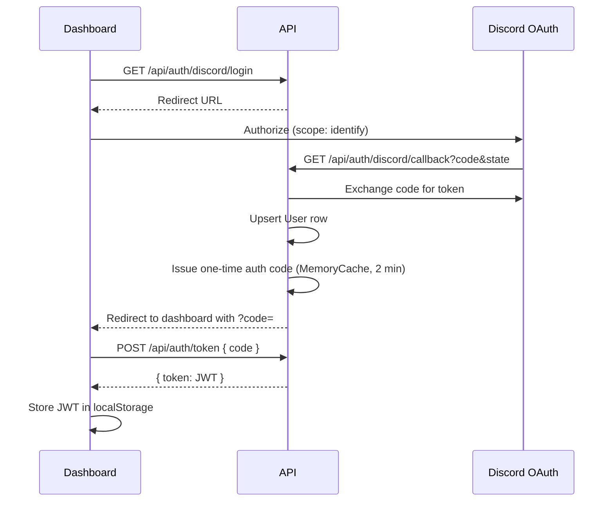

# Authentication

Authentication answers: **"Who is this caller?"**

This platform has three distinct authenticated identities.

## Identity types

| Identity | Mechanism | Used by |
|----------|-----------|---------|
| Dashboard user | Discord OAuth → JWT | Angular SPA |
| Bot worker | Shared API key | DiscordBot.Bot |
| Platform admin | JWT + PlatformAdmins table | Admin dashboard routes |

Authorization (what they can do) is documented in `authorization.md`.

---

## Dashboard user flow (Discord OAuth + JWT)

### Key files

| Component | File |
|-----------|------|
| AuthController | `src/DiscordBot.Api/Controllers/AuthController.cs` |
| DiscordOAuthService | `src/DiscordBot.Infrastructure/Auth/DiscordOAuthService.cs` |
| AuthService | `src/DiscordBot.Infrastructure/Services/AuthService.cs` |
| AuthCodeService | `src/DiscordBot.Infrastructure/Auth/AuthCodeService.cs` |
| JwtTokenService | `src/DiscordBot.Infrastructure/Auth/JwtTokenService.cs` |
| JWT setup | `src/DiscordBot.Api/Extensions/AuthenticationExtensions.cs` |

### OAuth scope

`identify` only — sufficient for Discord user ID, username, avatar. Does not request guild list scope.

### JWT claims

| Claim | Value |
|-------|-------|
| `sub` | Internal `User.Id` (Guid) |
| `discord_id` | Discord snowflake |
| `unique_name` | Discord username |
| optional | `global_name` |

Algorithm: **HMAC-SHA256** symmetric signing.

Configuration: `Jwt:Secret` (min 32 chars), `Jwt:Issuer`, `Jwt:Audience`.

### One-time auth code

JWT is **not** passed in OAuth redirect URL (security). Instead:

1. Callback stores JWT in MemoryCache keyed by one-time code
2. Dashboard exchanges code via `POST /api/auth/token`
3. Code expires in **2 minutes**, single use

### Dashboard storage

- Key: `discord_bot_jwt` in `localStorage`
- `AuthInterceptor` attaches `Authorization: Bearer {token}`
- 401 → logout + redirect `/login`

**Assumption:** localStorage acceptable for beta; httpOnly cookie preferred for hardened production.

---

## Bot authentication (API key)

All `/api/bot/*` endpoints:

- `[AllowAnonymous]` at controller level (no JWT)
- `[BotApiKey]` filter validates `X-Bot-Api-Key` header

**File:** `src/DiscordBot.Api/Filters/BotApiKeyAttribute.cs`

Configuration:

- API: `Bot:ApiKey`
- Bot: `Api:ApiKey`

**Must match exactly.**

---

## Platform admin authentication

Two-step:

1. Valid JWT (same as dashboard user)
2. `[PlatformAdmin]` attribute checks `PlatformAdmins` table for `discord_id` claim

**Seeder:** `PlatformAdminSeeder` inserts admin from `Admin:DiscordUserId` config on startup.

**Exposed on:** `GET /api/auth/me` → `isAdmin: true`

---

## User entity

**Table:** `Users`

| Field | Purpose |
|-------|---------|
| `DiscordUserId` | Unique Discord snowflake |
| `Username`, `GlobalName`, `AvatarUrl` | Profile from OAuth |

Upserted on every OAuth callback.

---

## Configuration reference

| Setting | Location |
|---------|----------|
| Discord OAuth | `Discord:ClientId`, `ClientSecret`, `RedirectUri`, `DashboardUrl` |
| JWT | `Jwt:Secret`, `Issuer`, `Audience` |
| Bot key | `Bot:ApiKey` / `Api:ApiKey` |
| Platform admin | `Admin:DiscordUserId` |

See `docs/step-27-configuration.md`, `environments.md`.

---

## Health check

`GET /api/health` — anonymous, verifies database connectivity. Used by Railway health checks.

---

## Related docs

- `authorization.md`, `security.md`
- `dashboard-architecture.md` (AuthGuard, AuthInterceptor)
