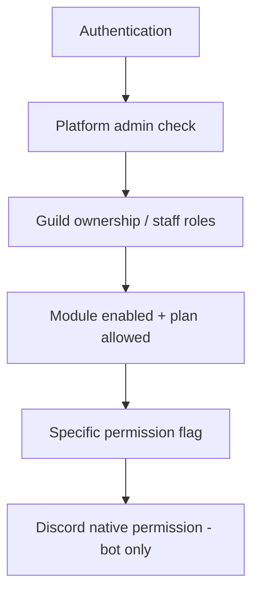

# Authorization

Authorization answers: **"Is this authenticated caller allowed to perform this action?"**

Authentication is covered in `authentication.md`.

## Authorization layers



## Layer 1: Platform admin

**Attribute:** `[PlatformAdmin]` on `AdminController`  
**Check:** JWT `discord_id` exists in `PlatformAdmins` table

Platform admins bypass guild ownership for admin endpoints but still use explicit guild IDs in routes.

## Layer 2: Guild access (dashboard)

**Service:** `IGuildAccessService` → `GuildPermissionResolver`

| Caller | Access |
|--------|--------|
| Guild owner | Full `OwnerPermissions` |
| Platform admin | Full `OwnerPermissions` |
| Staff (mapped Discord role) | OR-merged flags from `GuildPermissionRoles` |
| Other users | No access (null) |

**Endpoint:** `GET /api/guilds/{id}/access` → `GuildAccessDto`

### Dashboard guards

**File:** `dashboard/.../core/guards/guild-access.guard.ts`

| Route data | Required |
|------------|----------|
| `guildAccess: 'owner'` | `canManageSettings` |
| `guildAccess: 'moderation'` | `canAccessModeration` |

**Note:** `canManageSettings` is effectively owner-only today despite `ManageSettings` flag in enum.

### Guild list

`GET /api/guilds` returns guilds where user is owner OR has any non-None permission role match.

## Layer 3: Module + subscription

Before feature operations:

```csharp
await _moduleService.IsModuleAllowedForGuildAsync(guildId, ModuleKeys.Tickets);
// AND GuildModule.IsEnabled
```

Bot: `ModuleGuard` before command execution.

## Layer 4: Permission flags

### Dashboard services

Typical patterns:

| Service method | Check used |
|----------------|------------|
| Settings, profile, modules update | `CanManageSettings` (owner) |
| Tickets, moderation, logs read | `CanAccessModerationPagesAsync` |
| Permission role CRUD | `CanManageStaffAsync` (owner) |
| Clear logs | `CanManageSettings` OR `CanClearLogs` |

**Gap:** Most moderation-area pages share one check (`CanAccessModeration`) rather than per-module flags.

### Bot commands

`POST /api/bot/guilds/{id}/permissions/evaluate` returns:

- `CanWarn`, `CanKick`, `CanClearMessages`, `CanViewWarnings`, etc.

Handlers call predicate on response. See `ModerationCommandHandlers.EnsurePermissionAsync`.

### Ticket close (bot)

Uses dashboard access evaluate — `CanAccessTickets`.

## Layer 5: Discord native permissions (bot only)

Independent of platform permissions:

| Action | Discord permission |
|--------|-------------------|
| Kick | `KickMembers` on moderator and bot |
| Manage roles | `ManageRoles` on bot |
| Ticket panel setup | `ManageGuild` on invoker |

Hierarchy: bot role must be above target role for moderation actions.

## Bot endpoint authorization

All `/api/bot/*` routes: **API key only** — no per-user JWT.

The bot passes `DiscordUserId` and `DiscordRoleIds` in request body; API resolves permissions server-side. **Trust model:** bot is a trusted internal client.

## Permission role management

| Action | Who can do it |
|--------|---------------|
| View permission roles | Owner (or empty list + owner) |
| Create/update/delete roles | `CanManageStaffAsync` → owner/platform admin only |

`ManagePermissionRoles` enum flag exists but is **not enforced** for delegation.

## Admin authorization

Separate from guild permissions. Admin endpoints never use `GuildPermissionResolver`.

## Error response pattern

Access denied often returns **404** ("Guild not found or access denied") rather than 403 — intentional ambiguity.

## Future authorization (Phase 2)

Target: string-key checks (`tickets.reply`) from `PermissionDefinitions` catalog with optional scoped teams.

See `permission-system.md` and scalability review.

## Related docs

- `permission-system.md`, `module-system.md`, `subscription-system.md`
- `security.md`
