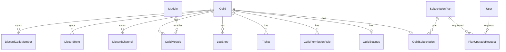

# Database

## Engine

**PostgreSQL 16** via **EF Core 9** + **Npgsql** provider.

Connection string: `ConnectionStrings:DefaultConnection`

Local: Docker Compose (`docker-compose.yml`) — port 5432, database `discordbot`.

## DbContext

**File:** `src/DiscordBot.Infrastructure/Data/AppDbContext.cs`

20 DbSets. Configurations applied via `ApplyConfigurationsFromAssembly`.

**Audit:** `SaveChangesAsync` auto-sets `UpdatedAt` on modified `BaseEntity`.

## Base entity

All entities inherit:

| Column | Type |
|--------|------|
| `Id` | Guid (PK) |
| `CreatedAt` | DateTimeOffset UTC |
| `UpdatedAt` | DateTimeOffset UTC |

## Tables reference

### Core tenant

| Table | Entity | Purpose |
|-------|--------|---------|
| `Guilds` | Guild | Discord server tenant root |
| `GuildSettings` | GuildSettings | 1:1 bot configuration (channels, messages, toggles) |
| `Users` | User | Dashboard users (Discord OAuth) |

**Guild key fields:** `DiscordGuildId` (unique), `OwnerDiscordUserId`, `IsActive`, `ResourceSyncRequested`, profile fields (`DisplayName`, `Description`, etc.)

### Discord mirror (synced from bot)

| Table | Entity | Purpose |
|-------|--------|---------|
| `DiscordChannels` | DiscordChannel | Synced channel list |
| `DiscordRoles` | DiscordRole | Synced role list |
| `DiscordGuildMembers` | DiscordGuildMember | Member display names + **`DiscordRoleIdsJson`** for permission resolution |

### Permissions

| Table | Entity | Purpose |
|-------|--------|---------|
| `GuildPermissionRoles` | GuildPermissionRole | Discord role → permission bitmask |

**Removed (migration UnifyGuildPermissions):** `GuildStaff`, `ModerationPermissionRoles`

### Modules

| Table | Entity | Purpose |
|-------|--------|---------|
| `Modules` | Module | Platform module catalog |
| `GuildModules` | GuildModule | Per-guild enable/disable |

### Features

| Table | Entity | Purpose |
|-------|--------|---------|
| `Tickets` | Ticket | Support tickets |
| `TicketOutboundMessages` | TicketOutboundMessage | Dashboard replies queued for bot delivery |
| `Warnings` | Warning | Moderation warnings |
| `ModerationCases` | ModerationCase | Moderation case log |
| `LogEntries` | LogEntry | Platform activity logs |
| `ReactionRoles` | ReactionRole | Button role panels |
| `AutoReplyRules` | AutoReplyRule | Keyword auto-replies |

### Subscriptions

| Table | Entity | Purpose |
|-------|--------|---------|
| `SubscriptionPlans` | SubscriptionPlan | Plan catalog |
| `GuildSubscriptions` | GuildSubscription | Active guild plan |
| `PlanUpgradeRequests` | PlanUpgradeRequest | Manual upgrade workflow |

### Platform

| Table | Entity | Purpose |
|-------|--------|---------|
| `PlatformAdmins` | PlatformAdmin | Operator Discord IDs |

### Command panel (tickets UI)

Stored via `ReactionRoles`-like pattern and command panel service — ticket setup panels tracked in infrastructure (see `CommandPanelService`, ticket-related migrations).

## Relationships diagram



## Indexes (unique unless noted)

| Table | Index |
|-------|-------|
| Users | `(DiscordUserId)` |
| Guilds | `(DiscordGuildId)` |
| GuildSettings | `(GuildId)` |
| GuildSubscriptions | `(GuildId)` |
| GuildModules | `(GuildId, ModuleId)` |
| GuildPermissionRoles | `(GuildId, DiscordRoleId)` |
| Modules | `(Key)` |
| SubscriptionPlans | `(Key)` |
| PlatformAdmins | `(DiscordUserId)` |
| DiscordChannels | `(GuildId, DiscordChannelId)`; `(GuildId, Type)` |
| DiscordRoles | `(GuildId, DiscordRoleId)` |
| DiscordGuildMembers | `(GuildId, DiscordUserId)` |
| Tickets | `(GuildId, TicketNumber)`; `(ChannelDiscordId)`; `(GuildId, Status)` |
| Warnings | `(GuildId, TargetDiscordUserId)` |
| ModerationCases | `(GuildId, Type, CreatedAt)` |
| LogEntries | `(GuildId, CreatedAt)`; `(GuildId, Type, CreatedAt)` |
| ReactionRoles | `(ButtonCustomId)`; `(GuildId, IsActive, CreatedAt)` |
| AutoReplyRules | `(GuildId, Priority)` |
| TicketOutboundMessages | `(GuildId, IsDelivered, CreatedAt)` |
| PlanUpgradeRequests | `(GuildId, Status)` |

## Migrations

**Location:** `src/DiscordBot.Infrastructure/Migrations/`

**Latest:** `20260702151245_UnifyGuildPermissions`

```bash
dotnet ef migrations add Name \
  --project src/DiscordBot.Infrastructure \
  --startup-project src/DiscordBot.Api

dotnet ef database update \
  --project src/DiscordBot.Infrastructure \
  --startup-project src/DiscordBot.Api
```

Production: `deploy/railway/migrate.sh`

## Seeders (API startup)

| Seeder | Data |
|--------|------|
| ModuleSeeder | 6 modules |
| SubscriptionPlanSeeder | 4 plans |
| PlatformAdminSeeder | Admin from config |
| DevelopmentDataSeeder | Dev sample guild (Development env only) |

## Future planned changes

From architecture reviews:

| Change | Phase |
|--------|-------|
| `PermissionDefinitions` + `GuildRolePermissions` junction | Phase 2 |
| Drop `GuildPermissionRoles.Permissions` int column | Phase 2 |
| `GuildStaffMembers` roster table | Phase 2–3 |
| `GuildTicketTeams` | Phase 3 |
| Permission audit log table | Phase 2 |
| Soft delete on guilds | Future |

## Assumptions

- **No read replicas** configured
- **No row-level security** in PostgreSQL — isolation enforced in application layer
- JSON columns (`DiscordRoleIdsJson`, `AllowedModulesJson`, `MetadataJson`) used for flexible data without schema explosion

## Related docs

- `permission-system.md`, `module-system.md`, `subscription-system.md`
- `backend-architecture.md`
