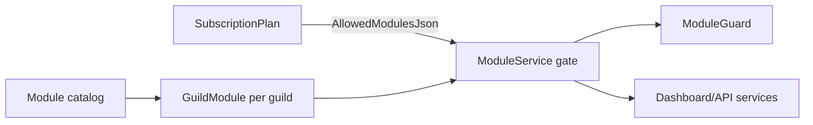

# Module System

## Purpose

The module system controls **which product features are enabled per guild**, gated by **subscription plan**.

Modules answer: *"Can this guild use tickets at all?"*

Permissions answer: *"Can this specific user use tickets?"* (see `permission-system.md`)

## Architecture



## Domain model

### Module (catalog)

**Entity:** `src/DiscordBot.Domain/Entities/Module.cs`  
**Table:** `Modules`

| Field | Purpose |
|-------|---------|
| `Key` | Stable identifier (unique) |
| `Name` | Display name |
| `Description` | Dashboard description |

### GuildModule (per-guild toggle)

**Entity:** `src/DiscordBot.Domain/Entities/GuildModule.cs`  
**Table:** `GuildModules`

| Field | Purpose |
|-------|---------|
| `GuildId` | FK to Guild |
| `ModuleId` | FK to Module |
| `IsEnabled` | Guild owner toggle (default true when created) |

Unique index: `(GuildId, ModuleId)`.

## Module keys

**File:** `src/DiscordBot.Domain/Constants/ModuleKeys.cs`

| Key | Constant | Seeded name |
|-----|----------|-------------|
| `welcome` | `Welcome` | Welcome |
| `tickets` | `Tickets` | Tickets |
| `moderation` | `Moderation` | Moderation |
| `logs` | `Logs` | Logs |
| `auto-role` | `AutoRole` | Auto Role |
| `reaction-roles` | `ReactionRoles` | Reaction Roles |

## Seeding

**File:** `src/DiscordBot.Infrastructure/Data/ModuleSeeder.cs`

`IHostedService` on API startup — inserts 6 modules if missing.

## ModuleService

**File:** `src/DiscordBot.Infrastructure/Services/ModuleService.cs`

| Method | Purpose |
|--------|---------|
| `EnsureGuildModulesAsync` | Creates `GuildModule` row for every catalog module when guild registers |
| `GetGuildModulesAsync` | Dashboard list with effective enabled state |
| `UpdateGuildModuleAsync` | Toggle enabled — throws if module not in subscription plan |
| `GetModuleStatusAsync` | Bot: returns enabled + plan-allowed |
| `IsModuleEnabledAsync` | Bot shorthand check |

### Plan gating

`SubscriptionService.IsModuleAllowedForGuildAsync` checks `SubscriptionPlan.AllowedModulesJson`:

- `"*"` (AllModulesToken) = all modules
- Otherwise JSON array of module keys

Error code: `MODULE_NOT_IN_PLAN` when owner tries to enable disallowed module.

## Bot integration

**File:** `src/DiscordBot.Bot/Services/ModuleGuard.cs`

Before running feature code:

```csharp
await _moduleGuard.EnsureEnabledForInteractionAsync(interaction, guildId, ModuleKeys.Moderation);
```

Calls API: `GET /api/bot/guilds/{discordGuildId}/modules/{moduleKey}`

## Dashboard integration

**Route:** `/guilds/:id/modules` (owner only)

Shows each module with:

- Plan allowed (from subscription)
- Guild enabled toggle
- Effective state = plan allowed AND guild enabled

Overview page also loads modules API for consistent status display.

## Per-module documentation

### Welcome (`welcome`)

| Aspect | Detail |
|--------|--------|
| **Purpose** | Send message when member joins |
| **Bot** | `UserJoined` → `WelcomeMessageService` |
| **Dashboard** | Settings page (welcome channel, message template) |
| **Dependencies** | GuildSettings, DiscordChannels sync |
| **Status** | Implemented |
| **Future** | Embed templates, DM welcome, A/B messages |

### Tickets (`tickets`)

| Aspect | Detail |
|--------|--------|
| **Purpose** | Support ticket channels via panels and commands |
| **Bot** | `/ticket`, panels, buttons, close, outbound messages |
| **Dashboard** | Tickets list, staff replies, close |
| **Dependencies** | CommandPanel, TicketService, resource sync |
| **Status** | Implemented (beta) |
| **Future** | Ticket teams, categories per team, SLA, transcripts export |

### Moderation (`moderation`)

| Aspect | Detail |
|--------|--------|
| **Purpose** | Warn, kick, clear, view warnings/cases |
| **Bot** | `/warn`, `/warnings`, `/clear`, `/kick` |
| **Dashboard** | Moderation pages, permission settings |
| **Dependencies** | Permission system, ModerationService |
| **Status** | Partial — **no `/ban` or `/timeout` commands** |
| **Future** | Ban, timeout, appeals, case notes |

### Logs (`logs`)

| Aspect | Detail |
|--------|--------|
| **Purpose** | Activity log storage + Discord channel delivery |
| **Bot** | `BotLogWriter`, `DiscordLogDeliveryService` |
| **Dashboard** | Logs page, clear all (owner) |
| **Dependencies** | LogEntry, GuildSettings.LogChannelId |
| **Status** | Implemented |
| **Future** | Log retention policies, export, webhooks |

### Auto Role (`auto-role`)

| Aspect | Detail |
|--------|--------|
| **Purpose** | Assign role on member join |
| **Bot** | `UserJoined` handler in `DiscordBotHostedService` |
| **Dashboard** | Settings (auto role ID) |
| **Dependencies** | GuildSettings, bot ManageRoles permission |
| **Status** | Implemented |
| **Future** | Multiple roles, conditional rules |

### Reaction Roles (`reaction-roles`)

| Aspect | Detail |
|--------|--------|
| **Purpose** | Button-based self-assign roles |
| **Bot** | `/reaction-role create`, button interactions |
| **Dashboard** | Panel CRUD |
| **Dependencies** | ReactionRole entity, bot ManageRoles |
| **Status** | Implemented |
| **Future** | Select menus, role limits, temporary roles |

## Adding a new module (checklist)

1. Add key to `ModuleKeys.cs`
2. Add row in `ModuleSeeder`
3. Update plan `AllowedModulesJson` in `SubscriptionPlanSeeder` (decide which plans include it)
4. Add `ModuleGuard` checks in bot handlers
5. Add dashboard page or settings section
6. Add API endpoints if needed
7. Add permissions to `GuildPermissions` enum (temporary) or Phase 2 catalog
8. Update i18n, handbook, module-list.md

## Assumption

Module keys use **kebab-case** strings (`reaction-roles`) matching URL-friendly identifiers.

## Related docs

- `subscription-system.md`, `permission-system.md`
- `/docs/product/module-list.md`
