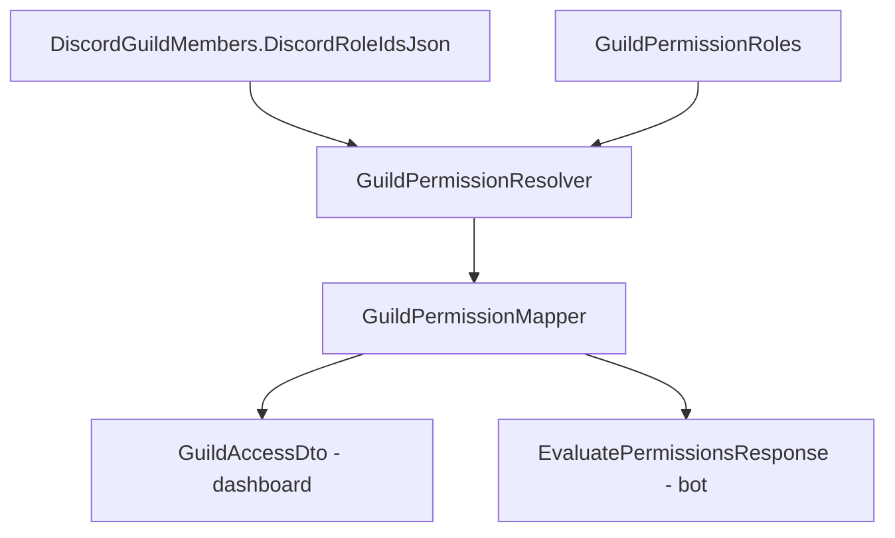

# Permission System

## Purpose

Control **who** (which Discord users) can access dashboard pages and run bot commands in a guild.

Authorization is **Discord role-based**: admins map Discord roles to permission sets in the dashboard.

## Why this system exists

Before unification (July 2026), three overlapping models existed:

| Old model | Problem |
|-----------|---------|
| `GuildStaff` | User-based list, never wired to resolvers |
| `GuildPermissionRoles` | Dashboard access only |
| `ModerationPermissionRoles` | Bot commands only, duplicate config |

Unification merged everything into **`GuildPermissionRoles`** with a single **`GuildPermissions`** flags enum and one resolver.

**Progress report:** `/docs/progress/2026-07-02-unified-permissions.md`  
**Scalability review:** `/docs/architecture/2026-07-02-permissions-scalability-review.md`

## Current architecture



## Data model

### GuildPermissionRole

**Entity:** `src/DiscordBot.Domain/Entities/GuildPermissionRole.cs`  
**Table:** `GuildPermissionRoles`

| Column | Type | Purpose |
|--------|------|---------|
| `GuildId` | Guid | Tenant |
| `Name` | string | Admin label ("Support Team") |
| `DiscordRoleId` | string | Discord snowflake |
| `Permissions` | int | Bitmask of `GuildPermissions` |

Unique: `(GuildId, DiscordRoleId)`.

### GuildPermissions enum

**File:** `src/DiscordBot.Domain/Enums/GuildPermissions.cs`

20 flags (bits 0–19). Stored as OR-merged bitmask when user has multiple mapped roles.

| Category | Flags |
|----------|-------|
| Bot moderation | UseWarn, UseKick, UseTimeout, UseBan, UseClearMessages, ViewWarnings, ViewModerationCases |
| Dashboard modules | ManageModeration, ViewLogs, ViewTickets, ManageReactionRoles |
| General | AccessDashboard, ViewServer, ManageSettings, ManageModules, ManagePermissionRoles |
| Tickets | ReplyToTickets, CloseTickets, ManageTickets |
| Logs | ClearLogs |

**Legacy aliases** accepted on input: `AccessModeration` → `ManageModeration`, `Warn` → `UseWarn`, etc.

## Resolution algorithm

**File:** `src/DiscordBot.Infrastructure/Services/GuildPermissionResolver.cs`

1. Load active guild
2. If `discordUserId == OwnerDiscordUserId` OR platform admin → `OwnerPermissions`
3. Load user's Discord role IDs from synced member row OR live IDs from bot
4. Query `GuildPermissionRoles WHERE DiscordRoleId IN userRoleIds`
5. OR-merge all matched `Permissions` bitmasks
6. Return null if no permissions

## Mapping to dashboard access

**File:** `GuildPermissionMapper.ToAccessDto`

Produces coarse booleans for guards:

| DTO field | Effective rule (simplified) |
|-----------|----------------------------|
| `CanManageSettings` | Owner/admin only today |
| `CanAccessModeration` | Any moderation page OR bot moderation flag |
| `CanAccessLogs` | ViewLogs OR ClearLogs OR moderation page access |
| `CanAccessTickets` | Ticket flags OR moderation page access |
| `CanClearLogs` | Owner OR ClearLogs flag |

**Known gap:** Granular flags exist in enum but guards still use coarse booleans. See technical debt.

## Mapping to bot commands

**File:** `GuildPermissionMapper.ToEvaluatePermissionsResponse`

| Bot check | Flag |
|-----------|------|
| `/warn` | CanWarn ← UseWarn |
| `/kick` | CanKick ← UseKick |
| `/clear` | CanClearMessages |
| `/warnings` | CanViewWarnings (also ManageModeration) |
| Has moderation access | Any bot moderation flag set |

**Endpoint:** `POST /api/bot/guilds/{discordGuildId}/permissions/evaluate`

Ticket close uses dashboard access evaluate: `CanAccessTickets`.

## API endpoints

| Method | Route | Auth | Purpose |
|--------|-------|------|---------|
| GET | `/api/guilds/{id}/access` | JWT | Resolved access for guards |
| GET/POST/PUT/DELETE | `/api/guilds/{id}/permission-roles` | JWT (owner for write) | CRUD |

**Removed:** `/api/guilds/{id}/staff`, `/api/guilds/{id}/moderation/permission-roles`

## Dashboard UI

- **Staff page** (`/guilds/:id/staff`) — full permission checklist
- **Moderation Settings** (`/guilds/:id/moderation/settings`) — bot-focused toggles, same backend via merge adapter in `GuildService`

## Current limitations

From scalability review:

1. **`int` bitmask caps at ~32 flags** — 20 used, ~12 remain
2. **Every new permission requires code + dashboard deploy** — not plugin-friendly
3. **Mapper cross-grants** — e.g. moderation page access implies ticket access
4. **No user-level overrides** — Discord roles only
5. **No ticket teams** — cannot scope ticket permissions per queue
6. **No permission audit log**
7. **Bot hits API every command** — no cache
8. **`ManagePermissionRoles` flag not enforced** — staff CRUD is owner-only

## Future Phase 2 architecture (planned)

**Do not implement without ADR.** Target design from scalability review:

```
PermissionDefinitions     — catalog of string keys (module-scoped)
GuildPermissionRoles      — keep (Discord role assignment header)
GuildRolePermissions      — junction table (replaces int bitmask)
GuildStaffMembers         — roster/profile (NOT authorization source)
Optional: permission cache (Redis)
```

Permission keys example: `tickets.reply`, `moderation.warn`, `logs.clear`

Benefits: unlimited permissions, plugin registration, dynamic dashboard UI, no migration per new flag.

## Migration history

| Migration | Change |
|-----------|--------|
| `20260701141022_AddGuildPermissionRolesAndMemberRoleIds` | Created GuildPermissionRoles |
| `20260701231527_BetaFeedbackFixes` | Added ModerationPermissionRoles (later removed) |
| `20260702151245_UnifyGuildPermissions` | Merged moderation roles into bitmask; dropped GuildStaff and ModerationPermissionRoles |

## Related docs

- `authorization.md`, `authentication.md`
- `docs/architecture/2026-07-02-permissions-scalability-review.md`
