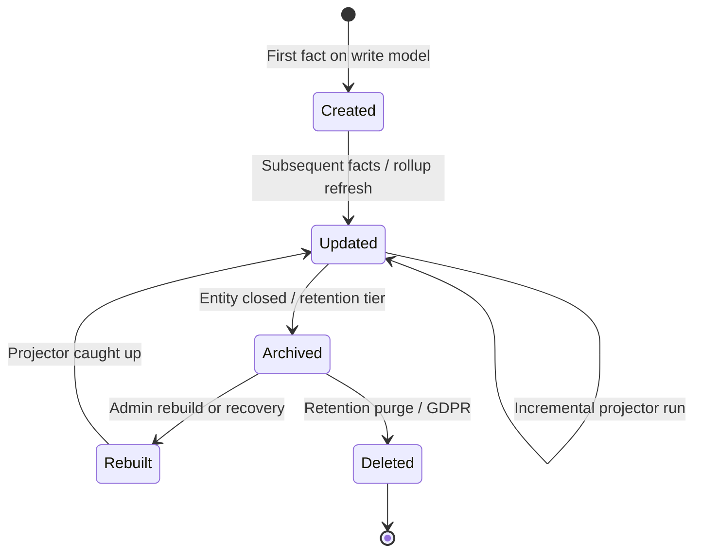
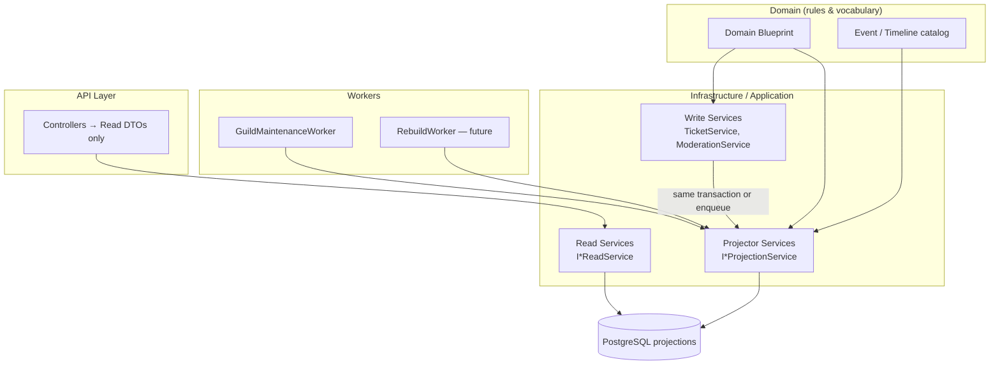
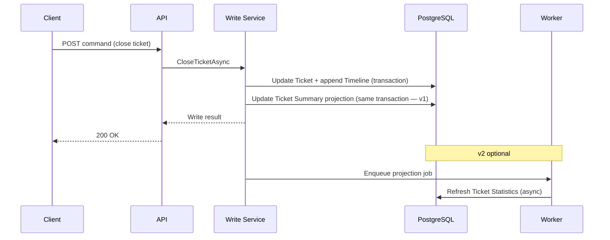
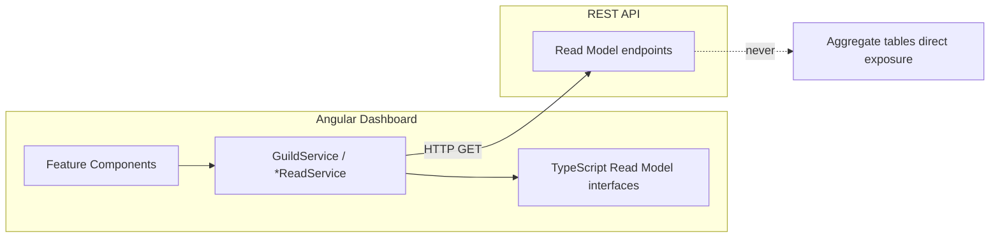
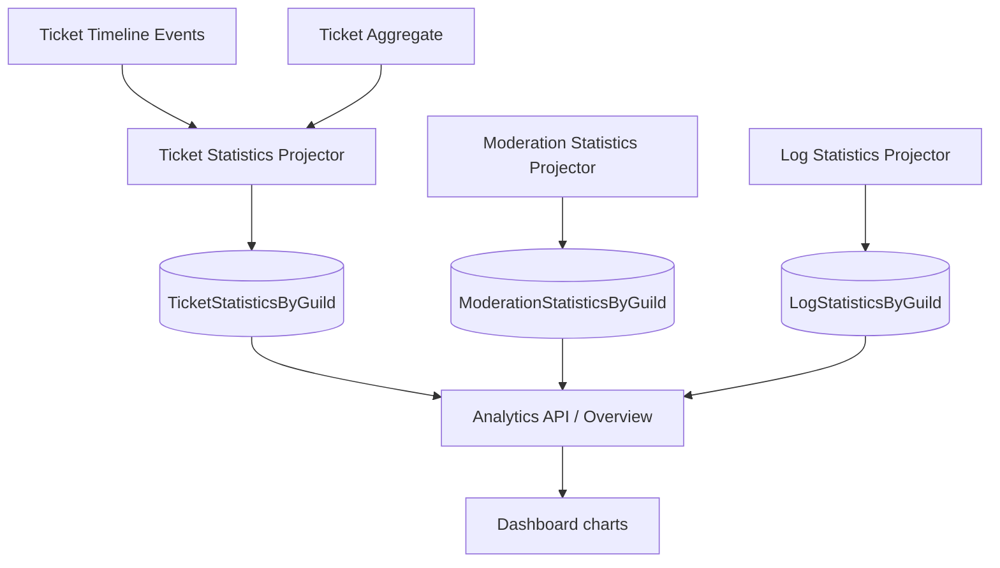
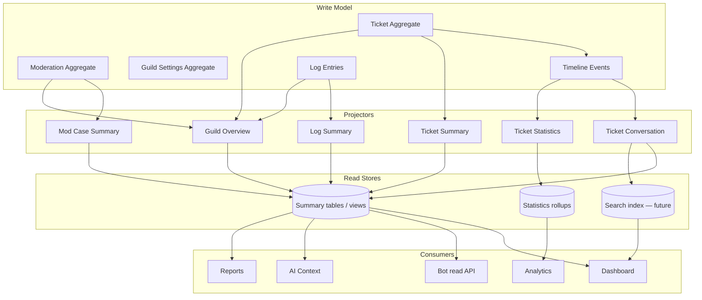

# Read Model Architecture

**Document ID:** AR-001  
**Status:** Official — platform-wide architecture authority  
**Owner:** Platform Architecture  
**Last updated:** 2026-07-02  
**Applies to:** All domains (Tickets, Moderation, Logging, Analytics, Automation, Dashboard, AI, Search, Reporting)

**Related:** [Product Blueprint](../blueprint/product-blueprint.md) · [Ubiquitous Language](../blueprint/ubiquitous-language.md) · [Architecture Principles](./architecture-principles.md) · [Ticket Domain Blueprint](../domains/ticket-management/ticket-domain-blueprint.md) · [CM-002 progress](../progress/2026-07-02-CM-002-ticket-timeline-foundation.md)

---

## Document hierarchy

```
Write Model (Aggregates)          ← Business truth, mutations only through domain rules
        ↓
Domain Events / Facts             ← Timeline Events, Log Entries, side effects
        ↓
Read Models (Projections)         ← Optimized for query, UI, analytics, AI, search
        ↓
Consumers                         ← Dashboard, API, Bot (read paths), Workers, Reports
```

This document defines **how aggregates are exposed for reading**. It does **not** mandate event sourcing or a separate microservice tier. Read Models live inside the layered monolith until scale requires otherwise (ADR).

---

## 1. Why Read Models Exist

### Business reasons (this platform)

| Pain | Why Read Models help |
|------|----------------------|
| **Operators need fast lists and filters** | Guild owners and staff open the dashboard to triage tickets, review moderation, and scan logs. They need paginated tables with status, owner, last activity — not aggregate graphs loaded on every request. |
| **Conversation history must survive Discord** | When a ticket channel is deleted, staff still need the full case narrative. The write model (Ticket Timeline) holds truth; a **Ticket Conversation** read model shapes that truth for UI and export without re-joining ten tables per scroll. |
| **Analytics must not slow operations** | First-response time, open ticket counts, and moderator workload are computed from timestamps and status history. Running heavy aggregations over append-only Timeline rows on every dashboard load would degrade ticket reply latency. |
| **Search and AI need stable inputs** | Full-text search and future AI assistants require denormalized, permission-filtered text bundles — not raw EF navigation properties or Discord API scraping. |
| **Honest product UX (PB-001)** | The platform must not claim "full history in dashboard" unless a read path exists. Read Models make capability promises explicit and testable. |
| **Multi-tenant isolation at scale** | Every read is guild-scoped. Projections carry `GuildId` and are queried with the same authorization gates as writes — but with indexes suited to read patterns. |
| **Automation-ready trajectory** | Triggers and workflows react to **facts** (Timeline Events, Log Entries). Read Models are how automation **reads context** without mutating aggregates. |

### What we are not solving with Read Models

- Replacing the **Write Model** — aggregates still own invariants.
- Replacing **Domain Events** — Timeline Events and Log Entries remain the audit trail; Read Models are derived.
- Event sourcing — we append facts; we do not replay the entire system from events alone.

---

## 2. Read Model Principles

Non-negotiable for every domain.

| # | Principle | Meaning |
|---|-----------|---------|
| P1 | **Aggregates are not dashboard query surfaces** | Dashboard, analytics, search, and AI consume **Read Models** or **Read Model APIs** — not EF aggregate graphs, not lazy-loaded navigations, not "service returns entity." |
| P2 | **One write path** | All mutations go through domain services on aggregates. Read Models are updated by projectors — never written by controllers or Angular directly. |
| P3 | **Projections are disposable** | Read Model storage can be dropped and rebuilt from the Write Model. Losing a projection must not lose business truth. |
| P4 | **Read Models are guild-scoped** | Every projection row or document includes `GuildId`. Cross-guild queries are platform-admin only. |
| P5 | **Authorization before projection** | Permission checks happen at the API boundary using the unified permission model. Read Models do not bypass `GuildPermissionResolver`. |
| P6 | **Stable shapes for clients** | Dashboard TypeScript interfaces map to Read Model DTOs — not to internal entity names. |
| P7 | **Pagination by default** | Lists and conversations are paginated. Unbounded `SELECT *` on Timeline or Log tables is forbidden for user-facing endpoints. |
| P8 | **Analytics reads projections** | Metrics endpoints query summary/statistics read models — not live scans of append-only event tables at request time (except rebuild jobs). |
| P9 | **AI reads projections** | AI context bundles are assembled from Read Models with redaction rules — not raw aggregate dumps. |
| P10 | **Search reads projections** | Search indexes are fed from Read Models or dedicated search projections — not Discord history. |
| P11 | **Reports read projections** | CSV/PDF/compliance exports read materialized report projections or snapshot read models — not ad-hoc joins in report controllers. |
| P12 | **Logging ≠ Timeline ≠ Read Model** | `LogEntry` is an activity audit read surface. Ticket Timeline is write-model history. Ticket Conversation is a read projection. Do not conflate the three. |
| P13 | **Honest staleness** | UI may show "last updated" or tolerate eventual consistency where async projectors exist. Never imply real-time Discord sync when data is projection-based. |

---

## 3. Projection Types

Projections are **named, versioned query models** owned by a domain or platform concern. Below: canonical catalog. Domains add rows here via ADR when introducing new projections.

### Ticket domain

| Projection | Purpose | Primary consumers | Source write model |
|------------|---------|-------------------|-------------------|
| **Ticket Summary** | One row per ticket for list/triage: number, status, owner display, channel label, created/closed, last activity, assignee (future) | Dashboard tickets table, bot status checks | `Ticket` + latest Timeline metadata |
| **Ticket Conversation** | Ordered, paginated message-like entries for staff UI and transcript export; merges MessageSent, staff replies, system lines per policy | Dashboard ticket detail, transcript export, archive preview input | `TicketTimelineEvent` |
| **Ticket Statistics** | Guild-level aggregates: open/closed counts, avg first response, avg resolution, by period | Overview widgets, analytics module | Timeline timestamps + Ticket status |
| **Ticket Search** | Denormalized searchable document: ticket number, owner name/id, message text snippets, tags (future) | Dashboard search, platform admin | Ticket Summary + Conversation excerpts |

### Moderation domain

| Projection | Purpose | Primary consumers | Source write model |
|------------|---------|-------------------|-------------------|
| **Moderation Case Summary** | Case list row: type, target, moderator, reason snippet, created | Dashboard moderation page | `ModerationCase`, `Warning` |
| **Member Moderation Profile** | Per-member warning count, recent cases, active sanctions (future) | Moderation detail, bot ephemeral context | Cases + warnings |
| **Moderation Statistics** | Counts by type, moderator, time range | Overview, analytics | `ModerationCase` |

### Logging domain

| Projection | Purpose | Primary consumers | Source write model |
|------------|---------|-------------------|-------------------|
| **Log Summary** | Paginated activity feed (existing `LogEntry` query pattern) | Dashboard logs page, Discord log delivery | `LogEntry` created from Domain Events |
| **Log Statistics** | Event counts by type over time | Overview, analytics | `LogEntry` rollups (future materialized) |

### Guild / platform

| Projection | Purpose | Primary consumers | Source write model |
|------------|---------|-------------------|-------------------|
| **Guild Overview** | Dashboard home metrics: modules, ticket counts, subscription, onboarding flags | Dashboard overview | Multiple domain statistics |
| **Guild Directory** | Server list for `/servers` with access hints | Dashboard servers page | `Guild` + access resolver |
| **Subscription Summary** | Plan, limits, module entitlements | Subscription page | `GuildSubscription`, plans |
| **Onboarding Checklist** | Setup completion flags | Onboarding widget | Settings + module state |

### Future cross-cutting

| Projection | Purpose |
|------------|---------|
| **Automation Context** | Snapshot of ticket/member state for rule evaluation |
| **Report Snapshot** | Frozen dataset for compliance export at a point in time |
| **AI Context Pack** | Redacted, token-bounded bundle for LLM prompts |
| **Search Index Document** | External or PG full-text document per guild entity |

### Current vs target (transitional)

| Today (July 2026) | Status |
|-------------------|--------|
| `GET /tickets` → `PaginatedTicketSummaryReadModel` | ✅ CM-003 |
| `GET /tickets/{id}/conversation` → paginated conversation projection | ✅ CM-003 |
| `GET /tickets/{id}/timeline` raw Timeline (legacy) | Retained for compatibility |
| `GET /overview` composes counts in service | **Guild Overview** — future |
| `GET /logs` queries `LogEntry` directly | **Log Summary** — acceptable as read model table |

CM-002 established the **Write Model** (Timeline). CM-003 introduced the first official **Read Models** (query projections, no duplicate message store).

---

## 4. Projection Lifecycle



| State | Description |
|-------|-------------|
| **Created** | Projector first writes projection row(s) when the underlying aggregate fact exists (e.g. `TicketCreated` → Ticket Summary row). |
| **Updated** | Incremental refresh on new Domain Events / Timeline Events / aggregate field changes. |
| **Archived** | Closed tickets, expired logs — projection retained but excluded from hot queries; may move to cold storage tier. |
| **Rebuilt** | Full rebuild from Write Model for a guild, ticket, or entire projection type — used after bugs, schema changes, or disaster recovery. |
| **Deleted** | Retention policy or GDPR purge removes projection rows **after** write model purge policy allows — projections are not authoritative for legal hold. |

**Versioning:** Projections include a `ProjectionVersion` or schema version in metadata when shape changes require rebuild (document in domain spec).

---

## 5. Projection Ownership



| Concern | Owner |
|---------|-------|
| **What to project** (fields, redaction, business rules) | Domain blueprint + UL-001 |
| **When to project** (which events trigger update) | Domain service + projector mapping doc |
| **Where stored** (table, view, cache, search index) | Infrastructure — documented per projection |
| **Who invokes projectors** | Write service (sync v1) or background worker (async v2+) |
| **Read API shape** | `Infrastructure/Models/*ReadModel*.cs` DTOs |
| **Dashboard mapping** | `dashboard/.../core/models/*.ts` mirrors Read Model DTOs |

**Bot read paths:** Bot may call Read Model API endpoints (`GET /api/bot/...`) for archive preview, automation — never PostgreSQL.

---

## 6. Consistency Model

### Two consistency tiers

| Tier | When | Example |
|------|------|---------|
| **Immediate (strong)** | Projection updated in same `SaveChanges` transaction as write | Ticket Summary `lastActivityAt` updated when Timeline Event appended |
| **Eventual** | Projection updated by worker within seconds | Ticket Statistics hourly rollups; Search index refresh |

### Platform default (v1 → v2)



### Rebuild strategy

1. **Single ticket** — replay Timeline Events → rebuild Ticket Conversation + Summary for that `TicketId`.
2. **Single guild** — rebuild all projections scoped to `GuildId` (maintenance window).
3. **Platform** — projection-type rebuild job with checkpoint cursor (100k guilds).

Rebuild jobs are **idempotent** and **versioned**. Write Model is source; projectors are deterministic.

### Failure handling

| Failure | Response |
|---------|----------|
| Projector fails mid-transaction | Roll back entire transaction with write (v1 sync) |
| Async projector fails | Retry with backoff; dead-letter log; projection marked stale |
| Projection drift detected | Alert + targeted rebuild; never mutate Write Model to fix projection |
| Read API hit during rebuild | Serve last consistent snapshot or 503 with retry — never partial corrupt pages |

---

## 7. Dashboard Architecture



### Rules

1. **Components never call write endpoints for read concerns** — lists and detail pages use GET Read Model routes.
2. **No aggregate vocabulary in templates** — use Read Model field names (`lastActivityAt`, `previewLine`) not `TicketTimelineEventType` enums unless displaying event type labels.
3. **One feature service method per Read Model** — e.g. `getTicketSummaries()`, `getTicketConversation(ticketId, cursor)`.
4. **Cache in component state only** — no long-lived global cache of guild data without invalidation strategy.
5. **Refresh after write** — after POST reply/close, invalidate or refetch affected Read Models (Ticket Summary + Conversation).
6. **i18n on presentation** — Read Models carry canonical codes; dashboard translates labels.

### Why not read aggregates directly?

| Risk | Consequence |
|------|-------------|
| N+1 queries on Timeline | Slow ticket list → timeout at scale |
| Leaking internal events | Staff sees `StaffReplyQueued` noise unless presentation layer filters |
| Tight coupling | Entity rename breaks Angular |
| Permission mistakes | Accidental exposure of Internal Notes if raw Timeline returned |

CM-002 timeline panel is **transitional** — it exposes raw Timeline Events. Target: **Ticket Conversation** read model with presentation rules (CM-003).

---

## 8. API Design

### Should API expose Aggregates?

**No** — not to dashboard or external consumers.

| Audience | Exposes | Does not expose |
|----------|---------|-----------------|
| Dashboard JWT routes | Read Model DTOs, command DTOs for writes | EF entities, Timeline table shape |
| Bot API key routes | Read Models needed for delivery/archive; write commands | Direct aggregate manipulation without domain service |
| Platform admin | Guild Directory, fleet stats Read Models | Cross-guild aggregate joins in controllers |

### Should API expose Read Models?

**Yes** — this is the primary read contract.

**Naming convention:**

```
GET  /api/guilds/{guildId}/tickets              → TicketSummaryReadModel[]
GET  /api/guilds/{guildId}/tickets/{id}         → TicketDetailReadModel (future)
GET  /api/guilds/{guildId}/tickets/{id}/conversation?cursor=&limit=
GET  /api/guilds/{guildId}/overview               → GuildOverviewReadModel
GET  /api/guilds/{guildId}/moderation/cases       → ModerationCaseSummaryReadModel[]
GET  /api/guilds/{guildId}/logs                   → LogSummaryReadModel[] (existing)
```

**Write endpoints unchanged** — commands return minimal write result or updated Summary Read Model slice.

**Bot read endpoints:**

```
GET /api/bot/tickets/{id}/conversation?limit=   → for archive preview (replaces raw timeline for bot)
```

### Transition policy

Existing endpoints that return aggregate-shaped DTOs (`TicketDto`) are **Read Model v0**. New work adds explicit `*ReadModel` types or OpenAPI tags without breaking routes until CM migration tasks consolidate.

---

## 9. Analytics

Analytics is a **read-only consumer** of statistics projections.



| Rule | Detail |
|------|--------|
| Metrics definitions live in domain blueprints | e.g. first response = first `StaffReplyDelivered` − first `MessageSent` from Owner |
| Rollups updated async | Hourly/daily batches — not per HTTP request |
| Guild isolation | All analytics queries filter `GuildId` |
| Plan gating | Analytics module on subscription plan before exposing advanced metrics |

---

## 10. AI

AI features consume **AI Context Pack** read projections — never raw database exports.

| Input | Source projection | Redaction |
|-------|-------------------|-----------|
| Ticket assist | Ticket Conversation (last N entries) | Strip Internal Notes unless policy |
| Moderation assist | Member Moderation Profile | Staff-only endpoint |
| Server summary | Guild Overview + Log Statistics | No PII beyond guild policy |

**Rules:**

- Context packs are **bounded** (token limits, max events).
- Packs are **generated on demand** from Read Models — not stored prompts with full history.
- AI never writes to aggregates except through existing command APIs.
- Training on customer data is out of scope unless explicit enterprise ADR.

---

## 11. Search

Search consumes **Ticket Search** (and future domain search projections).

```mermaid
flowchart LR
    CONV[Ticket Conversation Projector]
    SRCH[Ticket Search Projector]
    IDX[(Search Index<br/>PG FTS or OpenSearch)]
    API[GET /api/guilds/{id}/search?q=]

    CONV --> SRCH
    SRCH --> IDX
    API --> IDX
```

| Phase | Implementation |
|-------|------------------|
| v1 | PostgreSQL `tsvector` on search projection table |
| v2 | OpenSearch/Elastic per environment |
| Always | Guild-scoped index; permission filter before results returned |

**Never:** Discord message search API as primary source.

---

## 12. Performance

| Concern | Standard |
|---------|----------|
| **Indexes** | Every projection table: `(GuildId, …sort key…)`; partial indexes for open tickets, undelivered messages |
| **Pagination** | Cursor-based for Conversation; offset acceptable for small Summary lists with max page size |
| **Filtering** | Filter columns denormalized on Summary — do not filter Timeline JSON at runtime |
| **Sorting** | Sort keys on Summary (`LastActivityAt DESC`) — not `ORDER BY` on event table for list views |
| **Caching** | Optional Redis for Guild Overview + permission evaluation (see permissions scalability review); invalidate on write |
| **N+1** | Forbidden in Read Services — project in SQL or single query with DTO projection |
| **Payload size** | Conversation page default 50 lines; max 200; Summary excludes message bodies |

---

## 13. Future Scalability

| Scale | Write path | Read path |
|-------|------------|-----------|
| **~1,000 guilds** | Single API + Bot; sync projectors in transaction | PostgreSQL indexes; paginated APIs — **current architecture sufficient** |
| **~10,000 guilds** | Connection pooling; read replicas optional | Redis cache for Overview + permissions; async statistics projectors; dedicated read replica for dashboard |
| **~100,000 guilds** | Bot sharding; write DB optimized | Read replicas mandatory; OpenSearch; projection workers as separate deployable; guild-tier hot/cold storage |

**Horizontal API scaling** remains safe because Read Models are stateless HTTP + PostgreSQL — no in-memory aggregate cache required.

**Projection lag SLA (target):** Summary < 1s; Statistics < 5 min; Search < 30s — document per projection in domain specs.

---

## 14. Anti-patterns

Developers must **never**:

| Anti-pattern | Why forbidden |
|--------------|---------------|
| Return `Ticket`, `TicketTimelineEvent`, or EF entities from controllers | Leaks write model; breaks encapsulation |
| Dashboard queries Timeline directly for list pages | Performance and presentation chaos |
| Use `LogEntry` as ticket message history | Wrong domain — audit ≠ conversation |
| Scrape Discord channels for transcript/search/archive | Violates D-001 BR-X03; data loss on delete |
| Compute analytics from live Timeline scan on each request | Does not scale; blocks OLTP |
| Mutate Read Model tables from Angular or bot without domain service | Bypasses invariants |
| Duplicate message text in three stores without ownership | One write fact (Timeline Event) → many projections |
| Expose Internal Notes in member-facing Read Models | Violates BR-T06 |
| Claim "full transcript" in UI when only Summary or preview exists | Violates PB-001 honesty principle |
| Add a second message table that bypasses Timeline | Violates D-001 aggregate design |
| Skip projection update when append succeeds | Drift — rebuild cost and trust loss |
| Cross-guild Read Model query without platform admin guard | Multi-tenant violation |

---

## 15. Definition of Done (Read Model implementation)

A Read Model task is complete when **all** apply:

1. **Named projection** documented in domain spec with source events/fields.
2. **DTO type** in `Infrastructure/Models/` with stable JSON contract.
3. **Read service** (`I*ReadService`) — no write logic; `AsNoTracking`; guild-scoped.
4. **Projector** implemented — sync or async per consistency tier; idempotent.
5. **API endpoint** returns Read Model DTO; authorized via permission flags.
6. **Dashboard** (if user-facing) uses typed interface matching DTO; i18n complete.
7. **Indexes** on projection store verified in migration.
8. **Pagination** enforced with max limits.
9. **Tests or manual verification** — list, detail, rebuild spot-check documented in progress report.
10. **Handbook / domain docs** updated; traceability to domain blueprint section.

**Not required for v0 migrations:** separate physical table if SQL view or query projection meets performance — but must still satisfy API contract and principles P1–P13.

---

## Architecture diagram (platform)



---

## Relationship to existing principles

| Existing rule | Reconciliation |
|---------------|----------------|
| Architecture Principles §10: "No CQRS" | **Read Models ≠ full CQRS.** We adopt query-side projections inside the monolith without MediatR, event sourcing, or separate write/read databases (until ADR). |
| API-first persistence | Read Models served only via API — unchanged. |
| No event bus (v1) | Projectors run in-process sync or polling workers — not Kafka requirement. |
| CM-002 Timeline | Timeline is **Write Model**; Conversation/Summary are **Read Models** to build next. |

---

## Revision history

| Version | Date | Change |
|---------|------|--------|
| 1.0 | 2026-07-02 | AR-001 initial platform Read Model Architecture |
