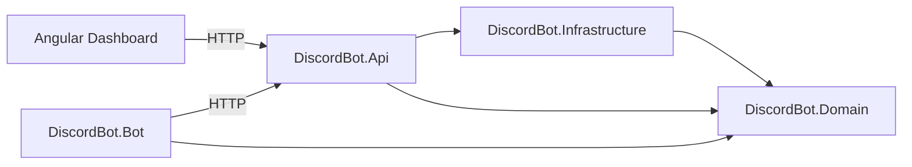

# Solution Structure

## Repository layout

```
discord bots/
├── DiscordBot.sln
├── docker-compose.yml              # Local PostgreSQL 16
├── .env.example
├── README.md
├── deploy/railway/                 # Production Docker + Railway config
├── database/seeds/                 # Manual SQL seeds
├── docs/                           # Documentation (this handbook + step guides)
├── dashboard/DiscordBot.Dashboard/ # Angular 16 SPA
└── src/
    ├── DiscordBot.Domain/
    ├── DiscordBot.Infrastructure/
    ├── DiscordBot.Api/
    └── DiscordBot.Bot/
```

## .NET projects

| Project | Path | Target | References |
|---------|------|--------|------------|
| Domain | `src/DiscordBot.Domain/` | net9.0 | None |
| Infrastructure | `src/DiscordBot.Infrastructure/` | net9.0 | Domain |
| Api | `src/DiscordBot.Api/` | net9.0 Web | Domain, Infrastructure |
| Bot | `src/DiscordBot.Bot/` | net9.0 Worker | Domain only |

## Domain project

```
DiscordBot.Domain/
├── Entities/          # EF entity POCOs (21 classes)
├── Enums/             # GuildPermissions, LogEventType, TicketStatus, etc.
├── Constants/         # ModuleKeys, PlanKeys, GuildPermissionDefaults
├── Extensions/        # Enum helpers
└── Helpers/           # MessageTemplateFormatter
```

**Rule:** No NuGet packages beyond implicit SDK. No EF attributes required but entities are EF-mapped.

## Infrastructure project

```
DiscordBot.Infrastructure/
├── Data/
│   ├── AppDbContext.cs
│   ├── Configurations/    # IEntityTypeConfiguration per entity
│   ├── ModuleSeeder.cs
│   ├── SubscriptionPlanSeeder.cs
│   ├── PlatformAdminSeeder.cs
│   ├── DevelopmentDataSeeder.cs
│   └── Migrations/        # 17 migrations
├── Services/              # ~20 *Service.cs classes
├── Auth/                  # OAuth, JWT, auth codes
├── Options/               # BotOptions, JwtOptions, DiscordOptions, etc.
├── Models/                # DTOs (request/response)
└── DependencyInjection.cs # AddInfrastructure()
```

## Api project

```
DiscordBot.Api/
├── Controllers/           # 12 controllers
├── Extensions/            # Authentication, CORS, validation
├── Filters/               # BotApiKey, PlatformAdmin
├── Middleware/            # ExceptionHandling, RequestLogging
├── Validation/            # GuildSettingsValidator
├── Models/                # Api-specific models (DiscordLoginResponse)
└── Program.cs
```

## Bot project

```
DiscordBot.Bot/
├── Api/                   # BotApiClient, ApiModels
├── Commands/              # Slash + interaction handlers
├── Configuration/         # BotOptions, ApiOptions, PlatformOptions
├── Extensions/            # ConfigurationValidationExtensions
├── Services/              # Hosted services, workers, guards
├── UI/                    # DiscordCustomIds
└── Program.cs
```

## Dashboard project

```
dashboard/DiscordBot.Dashboard/src/app/
├── core/                  # guards, interceptors, models, services
├── features/              # page components
├── shared/                # reusable UI
├── assets/i18n/           # en.json, ar.json
└── environments/          # apiUrl config
```

## Dependency diagram



## What is intentionally missing

| Missing piece | Reason |
|---------------|--------|
| `DiscordBot.Application` | Services live in Infrastructure |
| Test projects | Not yet prioritized |
| Shared contracts package | Bot uses duplicated ApiModels |
| Message queue | HTTP + polling sufficient for beta |

## Build commands

```bash
dotnet build DiscordBot.sln
cd dashboard/DiscordBot.Dashboard && npm run build
```

## Assumption

Solution will remain a **monorepo** with four .NET projects until team size or deployment needs force extraction.
