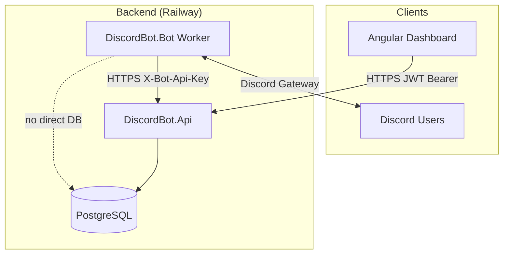

# System Overview

## High-level architecture



## Component responsibilities

| Component | Responsibility | Does NOT |
|-----------|----------------|----------|
| **DiscordBot.Api** | HTTP API, OAuth callback, JWT issuance, bot internal endpoints | Connect to Discord gateway |
| **DiscordBot.Infrastructure** | Business logic, EF Core, auth services, DTOs | Reference Angular or Discord.Net |
| **DiscordBot.Domain** | Entities, enums, constants | Reference EF, HTTP, Discord |
| **DiscordBot.Bot** | Slash commands, interactions, background workers | Access database directly |
| **DiscordBot.Dashboard** | SPA UI, guards, API clients | Store secrets (except JWT in localStorage) |

## Communication patterns

### Dashboard → API

- REST over HTTPS
- `Authorization: Bearer {jwt}` on all guild endpoints
- JSON request/response; enums serialized as strings

### Bot → API

- REST over HTTPS
- `X-Bot-Api-Key: {shared secret}` on all `/api/bot/*` routes
- Bot is the only writer for Discord-triggered events (warnings, tickets, logs)

### Bot ↔ Discord

- Discord.Net `DiscordSocketClient`
- Gateway intents: Guilds, GuildMembers, GuildMessages, MessageContent
- Slash commands registered globally + per-guild on join

### Async coordination (no message queue)

| Pattern | Use case | Interval |
|---------|----------|----------|
| HTTP request/response | Command handlers, dashboard loads | Immediate |
| DB polling workers | Ticket cleanup, outbound messages, resource sync, command panels | 30 seconds |

**Assumption:** At current scale, polling is acceptable. High-volume production may need queues (Redis, RabbitMQ) — not implemented.

## Multi-tenancy model

- **Tenant key:** `Guild.Id` (internal) / `Guild.DiscordGuildId` (Discord snowflake)
- All guild-scoped tables include `GuildId` FK
- Services must filter by guild on every query
- Platform admin endpoints bypass guild ownership but operate on explicit guild IDs

## Authentication summary

| Actor | Mechanism |
|-------|-----------|
| Dashboard user | Discord OAuth 2 → one-time code → JWT |
| Bot worker | Shared API key header |
| Platform admin | JWT + row in `PlatformAdmins` |

See `authentication.md` and `authorization.md`.

## Data flow examples

### Dashboard: view tickets

```
Browser → GET /api/guilds/{id}/tickets (JWT)
       → TicketService (checks CanAccessModerationPagesAsync)
       → PostgreSQL Tickets table
       → JSON TicketDto[]
```

### Bot: /warn command

```
Discord interaction → ModerationCommandHandlers
                   → ModuleGuard (GET /api/bot/guilds/{id}/modules/moderation)
                   → BotApiClient.EvaluatePermissionsAsync
                   → POST /api/bot/guilds/{id}/permissions/evaluate
                   → GuildPermissionResolver
                   → POST /api/bot/moderation/warnings
                   → DB insert Warning + ModerationCase + LogEntry
                   → Ephemeral reply to user
```

### Resource sync

```
Dashboard → POST /api/guilds/{id}/sync-resources (sets ResourceSyncRequested)
         → GuildResourceSyncWorker (30s poll)
         → Bot syncs channels/roles/members
         → POST /api/bot/guilds/{id}/resources
         → GuildResourceService upserts DiscordChannels, DiscordRoles, DiscordGuildMembers
```

## Deployment topology (production)

| Service | Host | Public |
|---------|------|--------|
| API | Railway (Docker) | Yes — `/api/health` |
| Bot | Railway (Docker) | No |
| PostgreSQL | Railway | No |
| Dashboard | Vercel or Railway nginx | Yes |

See `deployment.md`.

## Scalability strategy (current)

| Layer | Strategy today | Future |
|-------|----------------|--------|
| API | Single instance, stateless | Horizontal scale behind load balancer |
| Bot | Single worker | Multiple workers with guild sharding |
| Permissions | DB resolve per request | Redis cache keyed by guild+user |
| Database | Single PostgreSQL | Read replicas, connection pooling |

Reference: `docs/architecture/2026-07-02-permissions-scalability-review.md`
