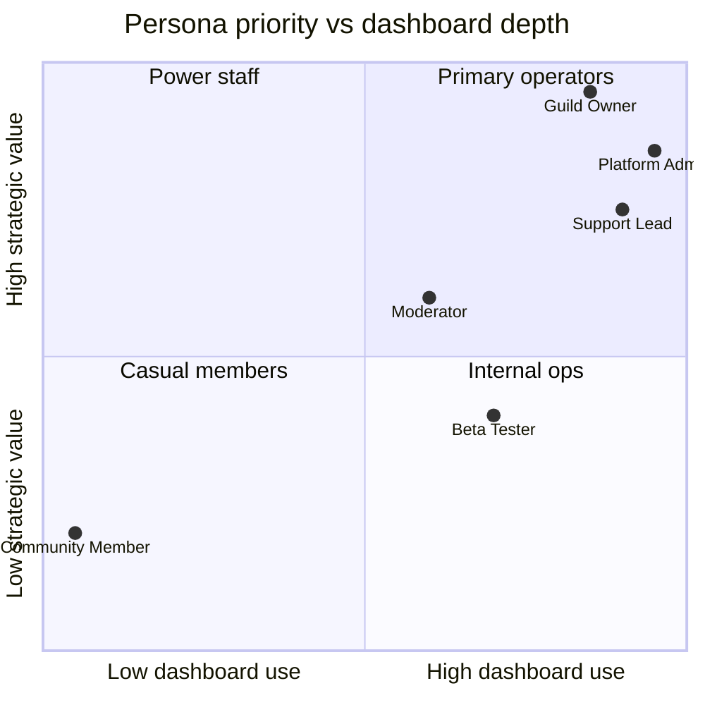
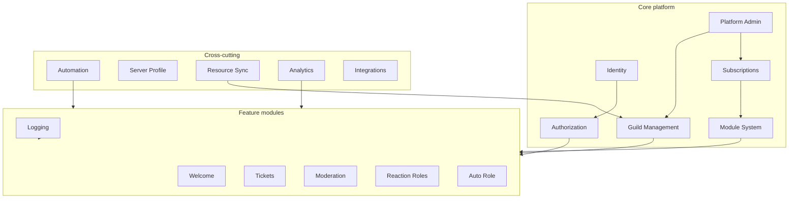
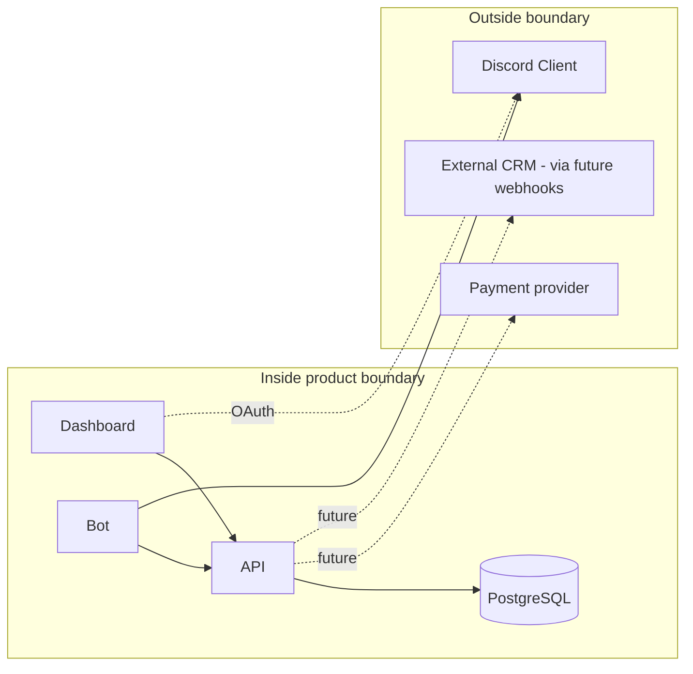
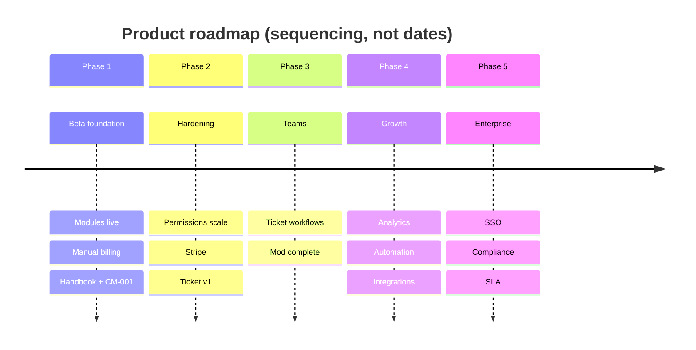

# Discord Bot Platform — Product Blueprint

**Document ID:** PB-001  
**Status:** Official — highest-level product authority  
**Owner:** Product Architecture  
**Last updated:** 2026-07-02  
**Supersedes:** Fragmented product docs in `/docs/product/` (those remain as detail; this document is canonical)

---

## Document hierarchy

```
Product Blueprint (this document)     ← What & why
    ├── Ubiquitous Language           ← Official business vocabulary (UL-001)
    ├── Architecture Handbook         ← How (system design)
    ├── Domain specs (e.g. /docs/tickets/)  ← Feature depth
    ├── ADRs                          ← Significant decisions
    └── Progress reports              ← Task completion
```

If product intent conflicts with implementation, **this blueprint wins** until explicitly revised via ADR.

All domain terms (**Guild**, **Ticket**, **Capability**, **Module**, etc.) are defined in [Ubiquitous Language](./ubiquitous-language.md). Use that document for naming in ADRs, APIs, UI, and code comments.

---

## 1. Product Vision

### Destination (3–5 years)

The Discord Bot Platform becomes the **default operations control plane for professional Discord communities** — the place where owners configure policy, staff execute workflows, and operators prove compliance, without assembling five separate bots and spreadsheets.

In five years, a guild with 50,000 members should be able to:

- Onboard members, run support, moderate safely, and audit actions from **one integrated product**
- Delegate work to **role-based teams** (support, moderation, community management) with least-privilege dashboard access
- Extend behavior through **automation and approved integrations**, not custom bot code
- Pay for **capabilities by module**, not by bot count or seat count
- Operate in **English, Arabic, and additional locales** from the same deployment

This is not a general-purpose Discord bot. It is a **modular community operations platform** delivered as a managed SaaS: one bot, one dashboard, one API, many guilds.

### What we are not optimizing for

We are not trying to be the bot with the most memes, the richest music queue, or the deepest game integration. We optimize for **trust, configurability, and team workflows** at scale.

---

## 2. Mission

### Problem

Discord server operators outgrow default Discord tooling quickly. They install multiple single-purpose bots (tickets, moderation, roles, logging), each with its own dashboard or none at all. Configuration diverges. Staff permissions are unclear. Audit trails are incomplete. Paid tiers are opaque. Non-English communities lack usable admin UIs.

### Solution

Ship a **reliable, multi-tenant SaaS** where:

1. A **Discord bot** executes native interactions (slash commands, buttons, panels)
2. A **web dashboard** is the primary configuration and operations surface
3. A **shared API and database** keep bot and dashboard in sync
4. **Subscription plans** gate modules honestly
5. **Discord roles map once** to dashboard and bot permissions

### Why communities choose us

| Pain today | Our answer |
|------------|------------|
| Too many bots | One bot, modular features |
| No real dashboard | Full guild-scoped admin UI (EN/AR) |
| Permission chaos | Unified role → permission flags |
| Support in Discord only | Tickets + dashboard staff replies + future transcripts |
| Unclear pricing | Published plans; module list per tier |
| MENA / bilingual admins | Arabic dashboard from day one |

### Current phase

**Closed beta → operational hardening.** Core stack is deployable (Railway API/Bot/DB, Vercel dashboard). We are proving value with welcome, logs, tickets, partial moderation, reaction roles, and manual billing — not yet claiming enterprise or full competitor parity.

---

## 3. Product Principles

Non-negotiable. Every feature proposal is evaluated against these.

| # | Principle | Meaning for this platform |
|---|-----------|---------------------------|
| 1 | **Dashboard-first operations** | Configuration, audit, and team workflows live in the web UI. Discord is where members and staff act; the dashboard is where policy is set and reviewed. |
| 2 | **Discord-native execution** | Commands, buttons, modals, and embeds follow Discord interaction patterns. We do not fight the platform UI. |
| 3 | **API-first persistence** | Bot never touches PostgreSQL. Dashboard never bypasses the API. All state changes are auditable HTTP flows. |
| 4 | **Multi-tenant by design** | Every query is guild-scoped. No cross-guild data leakage. One deployment serves many customers. |
| 5 | **Modular product surface** | Features ship as named modules (`welcome`, `tickets`, `moderation`, etc.) with explicit plan gates. No hidden entitlements. |
| 6 | **Module before permission** | A feature must be enabled for the guild *and* allowed by plan *before* user permission is evaluated. |
| 7 | **Single permission model** | Discord role → `GuildPermissionRoles` → capability flags. No parallel staff-auth tables. |
| 8 | **Secure by default** | Guild isolation, bot API key, JWT auth, owner/admin bypass centralized. Fail closed on authorization. |
| 9 | **Reliable over flashy** | Correct permissions and uptime beat feature count. Do not ship misleading UX (e.g. "full transcript in dashboard" without storage). |
| 10 | **Self-serve setup** | Invite bot → `/setup` → onboarding checklist → settings. Minimize operator hand-holding for standard paths. |
| 11 | **Automation-ready architecture** | Logs, modules, and permissions are structured so triggers/workflows can attach later without rewrites. |
| 12 | **Enterprise-capable trajectory** | Audit trails, export, retention, and SSO are planned constraints — even when not shipped yet. |
| 13 | **International product** | Dashboard strings are i18n-first (EN + AR today). Product decisions must not assume English-only admins. |
| 14 | **Honest monetization** | Free tier is useful. Paid tiers unlock operational modules. Billing state is visible to owners. |

---

## 4. Non-Goals

What this platform **intentionally will not become** (unless this blueprint is formally revised):

| Non-goal | Rationale |
|----------|-----------|
| **Music / media bot** | Commodity market; unrelated to operations mission |
| **Meme, image-gen, or entertainment bot** | Dilutes brand; no dashboard value |
| **Game stats / RPG / economy bot** | Different persona and architecture |
| **No-code bot scripting platform** | BotGhost-style builders compete on flexibility; we compete on opinionated modules |
| **Full Discord server mirror / forensic logging** | We provide **activity audit** for bot actions, not replacement for Discord's own audit log |
| **Multi-chat-platform (Slack, Telegram)** | Discord-only until scale justifies otherwise |
| **Native mobile admin app** | Responsive dashboard suffices until enterprise demand |
| **Multiple bots per guild** | Operational complexity; one bot identity |
| **Per-seat dashboard pricing** | Per-guild subscription model is fixed |
| **Leveling / XP as core product** | May exist as optional future module; not Phase 1–3 focus |
| **Crypto / NFT / token-gated features** | Out of scope |

**Deferred, not rejected:** Plugin marketplace, white-label, Stripe automation, advanced analytics — see roadmap.

---

## 5. Target Users

### Persona map



---

### Community Owner (Primary buyer)

**Who:** Discord server owner or equivalent head admin.  
**Goals:** Protect community, reduce admin workload, present a professional server, control cost.  
**Problems:** Tool sprawl, unclear staff access, no audit trail, bilingual staff struggle with English-only tools.  
**Expectations:** Setup in under 30 minutes, clear plan limits, staff delegation without sharing owner account, upgrade path when server grows.

---

### Support Team / Help Desk Staff

**Who:** Volunteers or paid agents handling member issues.  
**Goals:** Resolve tickets quickly, see context, reply from dashboard when not in Discord.  
**Problems:** Today: no transcript in dashboard, no claim/queue, Discord admin role required to see ticket channels.  
**Expectations:** Ticket queue, conversation history, reply/close permissions separated, notifications on new tickets (future).

---

### Moderator

**Who:** Trusted members enforcing rules.  
**Goals:** Warn, kick, review cases, purge spam — without owner-level dashboard access.  
**Problems:** Moderation commands vs dashboard permissions still partially split; no ban/timeout yet.  
**Expectations:** Discord commands work with configured mod roles; dashboard shows cases read-only today, actions tomorrow.

---

### Community Manager / Engagement Lead

**Who:** Runs onboarding, roles, welcome experience.  
**Goals:** Welcome messages, reaction roles, command panel, server profile embed.  
**Problems:** Reaction role creation still Discord-first; no scheduled announcements.  
**Expectations:** Configure engagement modules from dashboard without developer help.

---

### Platform Admin (Internal operator)

**Who:** Product owner / business operator running the SaaS.  
**Goals:** Approve upgrades, manage plans, monitor fleet health, support customers.  
**Problems:** Manual billing does not scale; limited fleet analytics.  
**Expectations:** Admin panel (guilds, users, plans, upgrade requests), eventual revenue metrics and health dashboards.

---

### Developer / Integrator (Future secondary)

**Who:** Technical admin wanting webhooks or API access.  
**Goals:** Connect CRM, external ticket systems, custom dashboards.  
**Problems:** No public API product or webhooks today.  
**Expectations:** Documented REST, outbound events, API keys per guild (Phase 4+).

---

### Enterprise / Professional Community (Future)

**Who:** Brand communities, esports orgs, paid membership servers (500–100k members).  
**Goals:** SLA, compliance export, SSO, retention policies, dedicated support.  
**Problems:** No Stripe, no SSO, no SLA, permission scale limits (~32 enum flags).  
**Expectations:** Audit export, data deletion, status page, contractual uptime.

---

### Educational Community

**Who:** Schools, courses, study groups on Discord.  
**Goals:** Safe onboarding, moderation, structured support, clear staff roles.  
**Expectations:** Simple setup, moderation without complexity, tickets for student help — aligns with core modules.

---

### Gaming Community

**Who:** Game clans, LFG servers, indie studios.  
**Goals:** Member onboarding, role self-selection, moderation, support for bans/appeals.  
**Expectations:** Reaction roles + moderation + tickets; **not** game stat tracking from us.

---

### Open Source / Dev Community

**Who:** OSS projects using Discord for support.  
**Goals:** Public support tickets, moderator rotation, audit trail.  
**Expectations:** Ticket transcripts, staff permissions, future GitHub integration — not core today.

---

### Content Creator Community

**Who:** Streamers, creators with fan Discord servers.  
**Goals:** Welcome funnel, role perks, moderation at scale, optional paid tier gating via Discord roles.  
**Expectations:** Welcome + auto-role + reaction roles; may upgrade to Pro for tickets/moderation.

---

### Beta Tester (Transient)

**Who:** Early adopters in closed beta.  
**Goals:** Validate flows, report gaps.  
**Reference:** `docs/beta-tester-guide.md`

---

## 6. Product Domains

High-level business capabilities. Technical mapping in `/docs/architecture/`.

### Domain map



---

### Guild Management

| | |
|--|--|
| **Purpose** | Register, configure, and isolate each Discord server as a tenant |
| **Responsibilities** | Guild registration (`/setup`), resource sync (channels/roles/members), settings, onboarding checklist, overview stats |
| **Dependencies** | Identity, Bot connectivity |
| **Future expansion** | Config export/import, guild templates, multi-admin transfer |
| **Maturity** | **85%** — registration and sync solid; guided wizard partial |

---

### Identity

| | |
|--|--|
| **Purpose** | Authenticate humans and the bot to the API |
| **Responsibilities** | Discord OAuth, JWT issuance, bot API key, platform admin flag |
| **Dependencies** | None (foundation) |
| **Future expansion** | Refresh tokens, httpOnly cookies, SSO, MFA |
| **Maturity** | **85%** — OAuth works; no session revoke/MFA |

---

### Authorization

| | |
|--|--|
| **Purpose** | Control who can do what per guild |
| **Responsibilities** | `GuildPermissionRoles`, permission resolver, dashboard guards, bot evaluate endpoints, Discord native permission checks |
| **Dependencies** | Identity, Guild Management, Resource Sync |
| **Future expansion** | Permission catalog + junction tables (Phase 2), ticket team scopes, audit log |
| **Maturity** | **70%** — unified model merged July 2026; coarse guards in API/dashboard |

---

### Subscriptions

| | |
|--|--|
| **Purpose** | Monetize and gate modules per guild |
| **Responsibilities** | Plans (Free/Basic/Pro/Premium), upgrade requests, admin approval, expiry → downgrade |
| **Dependencies** | Guild Management, Platform Admin |
| **Future expansion** | Stripe, trials, usage limits, annual billing |
| **Maturity** | **75%** — manual workflow works; no payment automation |

---

### Module System

| | |
|--|--|
| **Purpose** | Package features as enable/disable units tied to plans |
| **Responsibilities** | Module catalog, `GuildModule` toggles, bot `ModuleGuard`, dashboard modules page |
| **Dependencies** | Subscriptions |
| **Future expansion** | New modules (analytics, automation), plugin registry |
| **Maturity** | **85%** — six modules live |

---

### Tickets

| | |
|--|--|
| **Purpose** | Structured member support via private channels + dashboard ops |
| **Responsibilities** | Open/close, panels, staff reply queue, archive preview, logging |
| **Dependencies** | Module System, Authorization, Resource Sync, Logging |
| **Future expansion** | Message persistence, transcripts, claim/assign, categories, SLA (see `/docs/tickets/`) |
| **Maturity** | **~52% toward v1** — MVP works; not a full help desk |

---

### Moderation

| | |
|--|--|
| **Purpose** | Enforce community rules with accountability |
| **Responsibilities** | Warn, kick, clear, warnings view; dashboard cases (read-only); mod role → command permissions |
| **Dependencies** | Module System, Authorization, Logging |
| **Future expansion** | Ban, timeout, appeals, case notes, auto-mod |
| **Maturity** | **~65%** — core commands; missing ban/timeout/auto-mod |

---

### Logging & Audit

| | |
|--|--|
| **Purpose** | Record bot/platform actions for review and optional Discord mirror |
| **Responsibilities** | `LogEntries`, 17 event types, dashboard viewer, `DiscordLogDeliveryService` |
| **Dependencies** | Module System |
| **Future expansion** | Retention by plan, export, permission change audit |
| **Maturity** | **70%** — not full Discord event logging (intentionally) |

---

### Welcome & Onboarding

| | |
|--|--|
| **Purpose** | First impression and owner setup path |
| **Responsibilities** | Welcome messages, onboarding checklist, join handler |
| **Dependencies** | Module System, Guild settings |
| **Future expansion** | Leave messages, DM welcome, images |
| **Maturity** | **80%** — welcome live; leave/DM missing |

---

### Reaction Roles

| | |
|--|--|
| **Purpose** | Self-service role assignment via buttons |
| **Responsibilities** | Panel create in Discord, dashboard deactivate, toggle handler |
| **Dependencies** | Module System, Resource Sync, bot ManageRoles |
| **Future expansion** | Full dashboard create/edit, dropdown menus |
| **Maturity** | **70%** |

---

### Auto Role

| | |
|--|--|
| **Purpose** | Assign role on member join |
| **Responsibilities** | Settings toggle, join handler |
| **Dependencies** | Module System (Premium plan in default seed) |
| **Future expansion** | Delayed assign, conditional rules |
| **Maturity** | **75%** |

---

### Automation

| | |
|--|--|
| **Purpose** | Reduce repetitive staff work |
| **Responsibilities** | Auto-reply rules (keyword, scope), command button panel |
| **Dependencies** | Module System, Tickets (scope), Guild settings |
| **Future expansion** | Workflow builder, scheduled actions, triggers on log events |
| **Maturity** | **40%** — rules exist; no workflow engine |

---

### Server Profile

| | |
|--|--|
| **Purpose** | Present guild identity via bot (`/server` embed) |
| **Responsibilities** | Profile fields, dashboard editor, bot embed builder |
| **Dependencies** | Guild Management |
| **Future expansion** | Public profile page, SEO landing |
| **Maturity** | **75%** |

---

### Resource Sync

| | |
|--|--|
| **Purpose** | Keep Discord structure available to dashboard dropdowns |
| **Responsibilities** | `/sync`, worker poll, channels/roles/members cache |
| **Dependencies** | Bot gateway, Guild Management |
| **Future expansion** | Real-time sync webhooks, diff-based updates |
| **Maturity** | **80%** |

---

### Analytics

| | |
|--|--|
| **Purpose** | Insight into community and product usage |
| **Responsibilities** | Overview counts, admin fleet stats only today |
| **Dependencies** | All modules (data sources) |
| **Future expansion** | Dedicated analytics module, ticket/mod metrics, trends |
| **Maturity** | **15%** |

---

### Platform Administration

| | |
|--|--|
| **Purpose** | Operate the SaaS business |
| **Responsibilities** | Admin home, guilds, users, plans CRUD, upgrade approval |
| **Dependencies** | Identity, Subscriptions |
| **Future expansion** | Revenue dashboard, impersonation (support), feature flags |
| **Maturity** | **80%** |

---

### Integrations & Marketplace (Future)

| | |
|--|--|
| **Purpose** | Extend platform without core deploys |
| **Responsibilities** | None shipped |
| **Dependencies** | Authorization Phase 2, public API |
| **Future expansion** | Webhooks out, plugin permissions `plugin.{id}.{action}`, partner modules |
| **Maturity** | **0%** |

---

### Notifications (Future)

| | |
|--|--|
| **Purpose** | Alert staff to actionable events |
| **Responsibilities** | Dashboard bell is stub |
| **Dependencies** | Tickets, Logging |
| **Future expansion** | In-app, email, DM to staff on ticket assign |
| **Maturity** | **5%** |

---

## 7. Product Boundaries

### Inside the platform

| Category | Examples |
|----------|----------|
| Bot interactions | Slash commands, buttons, modals, embeds, panels |
| Dashboard | Guild config, staff ops, subscription, admin |
| Persistence | Guild settings, tickets, logs, moderation cases, permissions |
| Business logic | Plan gating, permission evaluation, module enablement |
| Operator tools | Upgrade approval, plan pricing, fleet view |

### Outside the platform (customer or Discord responsibility)

| Category | Examples |
|----------|----------|
| Discord client UX | Voice, threads UI, native audit log |
| Payment processors | Stripe/PayPal (we integrate later, do not rebuild) |
| Identity provider beyond Discord | SSO IdP (future integration) |
| Full message logging | Every edit/delete in server |
| Bot hosting infra | Railway/Vercel — operational concern, not product feature |
| Custom bot code per guild | Use integrations/marketplace instead |

### Feature creep prevention rules

1. **New capability → new or existing module** with plan assignment documented.
2. **No one-off guild hacks** in production code.
3. **Dashboard feature requires API endpoint** — no bot-only hidden state.
4. **Competitor feature parity is not automatic** — must map to persona and principle.
5. **"Logging" means bot activity audit** — label Discord event features differently if ever added.



---

## 8. Competitive Position

Reference set: **Ticket Tool**, **Carl-bot**, **MEE6**, **Dyno**. Comparison is directional — we do not copy UX or feature lists.

### Positioning statement

**Integrated modular operations platform for Discord communities** — dashboard + bot + subscription-controlled modules. Best for owners who want one control plane for support, moderation, onboarding, and audit — especially bilingual (EN/AR) teams.

### Where we compete

| Battleground | Our play |
|--------------|----------|
| **Ticket + dashboard** | Bundled with moderation and logs; SaaS upgrade path |
| **Owner self-serve config** | Onboarding checklist, settings tabs, module toggles |
| **Staff permissions** | Unified role model vs ad-hoc support roles in Discord |
| **MENA / Arabic admins** | Full dashboard i18n — rare among competitors |
| **Transparent module pricing** | Published plan → module matrix |

### Where we differentiate (deliberately)

| Dimension | Us | Typical competitor |
|-----------|-----|-------------------|
| Product shape | Opinionated modules + API | Single-feature bot or no-code builder |
| Admin surface | First-class web dashboard | Discord-only or minimal web |
| Billing | Per-guild module tiers (manual → Stripe) | Per-bot premium or opaque |
| Architecture | Multi-tenant SaaS, self-hostable stack | Closed bot hosting |
| Scope | Operations (support, mod, onboarding) | Entertainment (levels, music) |

### Where competitors are stronger today

| Area | Leaders | Our status |
|------|---------|------------|
| Ticket transcripts & forms | Ticket Tool | Preview only; CM-001 gap analysis |
| Auto-mod (spam, links) | Dyno, Carl-bot | Not implemented |
| Ban / timeout | Dyno, MEE6 | Not implemented |
| Leveling / engagement | MEE6 | Non-goal for core |
| Brand / install base | MEE6 | Early stage |
| Payment self-serve | Most SaaS bots | Manual approval |

**Strategy:** Win **integrated operations + dashboard + i18n** first. Do not chase MEE6 on engagement or Ticket Tool on every ticket feature until Phase 3 ticket v1 is complete.

---

## 9. Product Roadmap

High-level phases. Task-level detail: `/docs/architecture/roadmap.md`, `/docs/tickets/`, `/docs/project-management/backlog.md`.

### Phase 1 — Closed Beta Foundation *(current, ~75% beta ready)*

**Outcome:** Prove core loop with real guilds.

- Guild setup, OAuth dashboard, six modules, manual subscriptions
- Tickets MVP, partial moderation, logs, welcome, reaction roles, auto-role
- Unified permissions, EN/AR dashboard, platform admin
- Deploy path: Railway + Vercel
- Documentation: Architecture Handbook, Ticket CM-001 review

**Exit:** Beta testers operational; critical permission/ticket honesty fixes in flight.

---

### Phase 2 — Operational Hardening *(post-beta)*

**Outcome:** Safe to charge money and onboard tens of guilds weekly.

- Permission scale (catalog + junction tables)
- Granular dashboard/API guards per capability
- Stripe self-serve billing
- CI/CD, staging, structured logging, rate limiting
- Ticket System v1 (messages, transcripts, detail UX) — CM-002+
- `/ban`, `/timeout`

**Exit:** Self-serve upgrade; no misleading ticket UX; p95 API healthy under load.

---

### Phase 3 — Team Operations *(commercial launch candidate)*

**Outcome:** Support and mod teams run daily work in product.

- Ticket claim/assign, notes, reopen, categories
- Moderation case notes, appeals
- Staff roster profiles (non-auth)
- Log retention/export by plan
- Real-time or near-real-time dashboard updates

**Exit:** Moderation parity with mid-tier bots; ticket workflow credible vs Ticket Tool for SMB communities.

---

### Phase 4 — Growth & Extensibility

**Outcome:** Scale to 1,000+ guilds; partners can extend.

- Analytics module
- Automation / workflow builder
- Outbound webhooks, public integration API
- Bot worker scaling / sharding
- Plugin permission namespace

**Exit:** Third-party integration without core deploy; automation reduces support burden.

---

### Phase 5 — Enterprise & Platform Maturity

**Outcome:** Enterprise contracts and compliance sales enabled.

- GDPR export/deletion, DPA-ready processes
- SSO, optional white-label dashboard
- SLA, status page, multi-region
- SOC 2 preparation, full test coverage on critical paths

**Exit:** 99.9% uptime achievable; enterprise pilot customer signed.

---



---

## 10. Success Metrics

Metrics chosen for **this** product stage. Review quarterly.

### Adoption & activation

| Metric | Definition | Phase 1 target direction |
|--------|------------|----------------------------|
| **Registered guilds** | Guilds with bot + DB row | Growth week-over-week in beta |
| **Activated guilds** | Completed onboarding checklist | > 60% of registered |
| **Module adoption rate** | % guilds with ≥2 modules enabled | Track per module |
| **Dashboard MAU** | Unique Discord users logging into dashboard / month | Correlates with staff engagement |

### Operational value

| Metric | Definition | Target direction |
|--------|------------|------------------|
| **Tickets opened / closed** | Per guild and fleet-wide | Growth with Pro plan adoption |
| **Median ticket close time** | Open → closed | Decrease after ticket v1 |
| **Moderation actions** | Warn + kick + clear count | Stable per active mod guild |
| **Log events written** | `LogEntries` created | Proportional to activity |

### Product quality

| Metric | Definition | Target direction |
|--------|------------|------------------|
| **API p95 latency** | Guild-scoped reads | < 500ms (Phase 2) |
| **Bot command success rate** | Non-error interactions | > 99% |
| **Outbound ticket delivery time** | Queue → Discord message | < 10s (Phase 2; today ~30s poll) |
| **Setup completion time** | Invite → first module enabled | < 30 min median |

### Business

| Metric | Definition | Target direction |
|--------|------------|------------------|
| **Paid guilds** | Active subscription not free | Growth post-Stripe |
| **Upgrade conversion** | Upgrade requests approved / submitted | > 70% approval (operational) |
| **MRR** | Sum of plan prices × paid guilds | Track after Stripe |
| **Churn** | Guilds downgrading or bot removed | < 5% monthly (Phase 3+) |
| **Support tickets to platform** | Operator burden | Decrease as self-serve improves |

### Retention proxy

| Metric | Definition |
|--------|------------|
| **30-day guild retention** | Bot still in guild 30 days after setup |
| **Dashboard return rate** | Staff logging in weekly on active ticket guilds |

---

## 11. Risks

### Product & business

| Risk | Impact | Mitigation |
|------|--------|------------|
| **Positioning confusion** | Users expect MEE6-style levels or Ticket Tool parity on day one | Clear marketing: operations platform; blueprint non-goals |
| **Manual billing bottleneck** | Cannot scale past handful of paid customers | Phase 2 Stripe priority |
| **Misleading ticket UX** | Trust loss if archive promises full dashboard history | CM-002+; principle #9 |
| **Free tier too weak or too strong** | No conversion or unsustainable cost | Monitor module adoption; adjust plan matrix via admin |
| **Arabic-only admins, English bot** | Partial experience | Roadmap bot i18n; document current limit |

### Competition

| Risk | Impact | Mitigation |
|------|--------|------------|
| **Incumbent bot already installed** | Hard displacement | Bundle + dashboard differentiation; migration guides later |
| **Discord native features** | Reduces need for some modules | Focus on dashboard ops and audit |
| **Race to feature parity** | Scope explosion | Blueprint boundaries + module discipline |

### Scaling & complexity

| Risk | Impact | Mitigation |
|------|--------|------------|
| **Permission enum ceiling** | Cannot add capabilities | Phase 2 permission catalog (documented) |
| **Polling workers** | Latency and DB load at scale | Phase 4 worker redesign |
| **Monolith deploy** | All features ship together | Module boundaries; future extraction candidates identified |
| **Doc drift** | Team builds against stale specs | Blueprint hierarchy; progress reports |

### Adoption & pricing

| Risk | Impact | Mitigation |
|------|--------|------------|
| **Pro plan value unclear** | Tickets incomplete | Ticket v1 before heavy Pro marketing |
| **Discord permission setup friction** | Bot missing Manage Roles | Onboarding checklist + permission diagnostics (future) |
| **Owner-only settings** | Staff cannot configure | Intentional; `ManageTickets` future |

### External dependency

| Risk | Impact | Mitigation |
|------|--------|------------|
| **Discord API policy / breaking changes** | Bot features break | Pin Discord.Net versions; monitor changelog; minimal privileged intents |
| **Discord OAuth changes** | Dashboard login fails | Monitor developer news; abstraction in `DiscordOAuthService` |
| **Railway/Vercel pricing** | Margin pressure | Cost monitoring; self-host docs exist |

---

## 12. Long-Term Vision (Five Years)

By **2031**, the Discord Bot Platform should be:

1. **The operations hub** for mid-size and large Discord communities (1k–100k members) who pay for reliability, not gimmicks.
2. **Module-complete** for support, moderation, onboarding, roles, logging, analytics, and automation — each sellable and permission-scoped.
3. **Integration-connected** via webhooks and approved plugins, without becoming a no-code scripting free-for-all.
4. **Commercially mature** with self-serve billing, optional enterprise contracts, and published status/SLA.
5. **Globally usable** with dashboard and bot localization beyond EN/AR where demand exists.
6. **Architecturally scaled** to 10k+ guilds on managed infrastructure with observable health, without rewriting tenant isolation.

We will **not** require five years to be useful — Phase 2–3 deliver real revenue and retention. Year five is **destination clarity**, not a deadline for MVP.

---

## 13. Product Philosophy

*Read this before writing code, designing UI, or prioritizing backlog.*

### We build a control plane, not a bag of commands

Every feature must answer: **"What does the owner or staff see and control in the dashboard?"** Discord commands are the execution layer. If a feature exists only in Discord with no persistent state or dashboard visibility, it is incomplete.

### Tenancy is sacred

Guild `A` must never see guild `B`'s data. This is not only security — it is product trust. Multi-tenant shortcuts are unacceptable even in beta.

### Modules are contracts

A module promises:
- A plan tier that includes it
- An enable toggle
- Permission flags for staff
- Bot behavior when enabled
- Dashboard surfaces for config and ops

Adding a feature without module/plan assignment is technical debt.

### Permissions are product, not an implementation detail

Staff experience is defined by what their Discord role allows in **both** bot and dashboard. Split models (dashboard staff vs mod roles) exist today for historical reasons — convergence is the direction. Never add a third permission system.

### Honesty beats demo magic

Do not ship UI copy or embeds that promise capabilities we do not store or display. A preview transcript is a preview — not "full history in dashboard." Violations erode beta trust faster than missing features.

### Discord is the member surface; the dashboard is the operator surface

Members open tickets and receive welcome messages in Discord. Operators configure policy, review logs, and manage subscriptions in the browser. Do not force members into the dashboard for core flows.

### Billing follows value, not vanity metrics

We charge per guild for modules that reduce operational cost (tickets, moderation, automation). We do not charge per dashboard login or per message sent in Phase 1–3.

### International is not a translation afterthought

New dashboard strings require EN and AR keys the same PR. Layout must tolerate RTL. Product specs that assume English-only admin workflows are incomplete.

### Automation comes after observability

Workflows trigger on things we can log and measure. Expand `LogEventType` and structured metadata before building visual workflow editors.

### Enterprise is a trajectory, not a day-one customer

Design for audit export and data deletion even when no enterprise customer exists. Do not block beta shipping on SSO.

### When in doubt, check this blueprint

Architecture handbook says **how**. This document says **what and why**. Ticket specs say **depth for tickets**. If a proposal violates non-goals or principles, reject or escalate to ADR.

---

## Appendix A — Module catalog (current)

| Module key | Plan (default seed) | Maturity |
|------------|---------------------|----------|
| `welcome` | Free+ | 80% |
| `logs` | Free+ | 70% |
| `reaction-roles` | Basic+ | 70% |
| `tickets` | Pro+ | ~52% toward v1 |
| `moderation` | Pro+ | ~65% |
| `auto-role` | Premium | 75% |

Source: `ModuleKeys.cs`, `SubscriptionPlanSeeder.cs`, step-30 audit, CM-001.

---

## Appendix B — Related documents

| Document | Path |
|----------|------|
| **Ubiquitous Language (UL-001)** | `/docs/blueprint/ubiquitous-language.md` |
| Architecture Handbook | `/docs/architecture/README.md` |
| Ticket domain spec | `/docs/tickets/ticket-system-review.md` |
| Permission scalability | `/docs/architecture/2026-07-02-permissions-scalability-review.md` |
| Architecture audit | `/docs/step-30-architecture-audit.md` |
| Product detail (legacy) | `/docs/product/` |
| Backlog | `/docs/project-management/backlog.md` |

---

## Revision history

| Version | Date | Change |
|---------|------|--------|
| 1.0 | 2026-07-02 | PB-001 initial official blueprint |
| 1.1 | 2026-07-02 | UL-001: linked Ubiquitous Language as canonical vocabulary |
