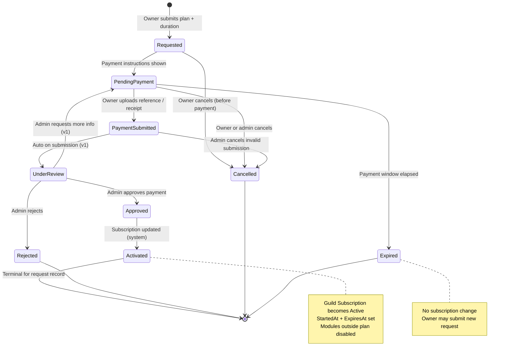
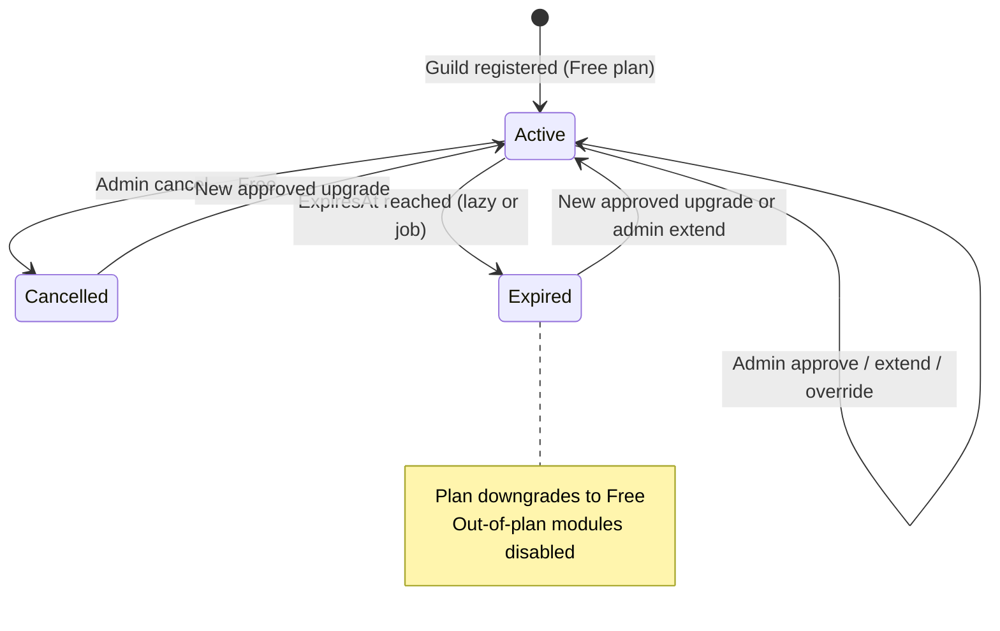
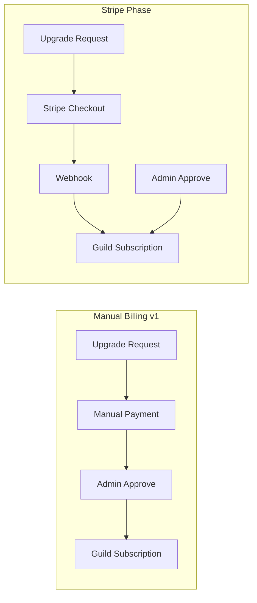

# Manual Subscription Billing Domain Blueprint

**Document ID:** SB-001  
**Status:** Official — domain authority for Manual Subscription Billing  
**Owner:** Domain Architecture  
**Last updated:** 2026-07-03  
**Vocabulary:** [Ubiquitous Language (UL-001)](/docs/blueprint/ubiquitous-language.md) — all terms used here are defined there  
**Product alignment:** [Product Blueprint (PB-001)](/docs/blueprint/product-blueprint.md)  
**Implementation baseline:** [Subscription System](/docs/architecture/subscription-system.md) · [Pricing](/docs/product/pricing.md)  
**Release posture:** [Release 0.1 Readiness](/docs/releases/release-0.1-readiness.md) — manual billing acceptable for closed beta

---

## How to use this document

This blueprint models the **business** of manual subscription billing on the Discord Bot Platform. It does not specify databases, APIs, UI components, payment gateways, or frameworks.

Every future design for persistence, HTTP, Dashboard, notifications, admin operations, and Stripe migration **must trace back to a concept, rule, or workflow defined here**.

**Legend for maturity markers:**

| Marker | Meaning |
|--------|---------|
| **Live** | Behavior exists in production code today (may be incomplete vs this blueprint) |
| **v1** | Required for Manual Billing v1 (see §13) |
| **Future** | Official domain concept; not required for v1 |

When Live behavior contradicts this blueprint, **this blueprint is the target**; gaps are tracked in SB-001 progress report and backlog.

---

## 1. Domain Purpose

### Why manual billing exists now

Release 0.1 targets a **closed, coached beta** — a small cohort of guilds (5–15) where platform operators can personally verify each payment before enabling paid modules. Manual billing:

- **Reduces launch risk** — no payment gateway credentials, webhooks, PCI scope, or tax compliance in Phase 1.
- **Matches sales motion** — beta customers are onboarded with expectations documented in `beta-known-limitations.md`; operators can clarify pricing, duration, and payment method in conversation.
- **Preserves product honesty** — owners see plan limits and module gates before paying; activation happens only after human verification.
- **Unblocks module monetization** — `GuildSubscription` + `PlanUpgradeRequest` already gate modules; manual billing completes the operational loop around those entities.

Manual billing is not a workaround for missing product value. It is an **intentional Phase 1 operating model** until self-serve volume justifies Stripe (Phase 2).

### Why Stripe is intentionally out of scope (v1)

| Reason | Detail |
|--------|--------|
| **Beta scale** | Handful of paid guilds; operator review is feasible and builds trust |
| **Compliance deferral** | Card data, refunds, chargebacks, invoicing, and regional tax are Phase 2 concerns |
| **Architecture readiness** | Module gating and subscription entities exist; payment capture does not |
| **Product Blueprint Phase 2** | Self-serve upgrade via Stripe is the documented next monetization step |
| **Commercial readiness score** | Release 0.1 commercial readiness ~4/10 — acceptable when billing expectations are explicit |

Stripe, card payments, and payment webhooks are **Future** (§11). This domain defines manual workflows that **migrate forward** without redesign (§12).

### Domain boundary

| Inside Manual Billing | Outside (adjacent domains) |
|----------------------|----------------------------|
| Upgrade request lifecycle | Module enablement rules → Module System |
| Payment reference / receipt capture | Whether a module is allowed → Subscriptions + Module System |
| Admin review and activation | Guild registration, owner identity → Guild Management |
| Subscription period (start, expiry, grace) | Authorization for dashboard pages → Authorization |
| Plan catalog pricing display | Platform activity logs → Logging |
| Owner notifications about billing state | Discord bot command behavior → Bot layer |

**Subscription Plan** and **Guild Subscription** are shared with the broader Subscriptions domain. **Upgrade Request** is the workflow aggregate for manual billing v1.

---

## 2. Business Workflow

### End-to-end narrative

1. **Guild Owner** opens the subscription page and compares **Subscription Plans**.
2. Owner selects a paid plan and duration, then **submits an Upgrade Request** (plan + duration snapshot).
3. Platform shows **Payment Instructions** (bank transfer or other configured manual method).
4. Owner pays **off-platform** (bank transfer, cash, regional method — not in-app).
5. Owner **uploads Payment Reference** and optionally **Payment Receipt**.
6. Request moves to **Under Review**; **Platform Administrator** verifies payment.
7. Admin **Approves** → **Guild Subscription** is **Activated** for the requested period, or **Rejects** with optional reason.
8. On **Expiry** (and after optional **Grace Period**), subscription **downgrades to Free** and out-of-plan modules are disabled.

### Upgrade Request state machine (v1 target)



### Live vs v1 mapping

| Blueprint state | Live today (`PlanUpgradeRequestStatus`) | v1 gap |
|-----------------|----------------------------------------|--------|
| Requested / PendingPayment | `Pending` (combined) | Split states; show payment instructions step |
| PaymentSubmitted | — | New — reference/receipt upload |
| UnderReview | — (implicit in Pending) | Explicit state after payment proof |
| Approved | `Approved` | Same terminal for request |
| Activated | Side effect on `GuildSubscription` | Explicit in UX copy |
| Rejected | `Rejected` | Add optional structured rejection reason |
| Cancelled | — | Owner/admin cancel in-flight request |
| Expired | — | Request timeout without payment |

### Guild Subscription lifecycle (parallel)



**Live:** Lazy expiration on read (`GetGuildSubscriptionAsync`). **v1 recommendation:** optional scheduled job + owner notification before expiry.

---

## 3. Core Concepts

### Subscription Plan

**Catalog tier** that defines which **Modules** a **Guild** may enable and the reference **Monthly Price**.

- One row per tier (`free`, `basic`, `pro`, `premium` seeded).
- `AllowedModulesJson` gates module toggles.
- **Live:** `SubscriptionPlan` entity with `MonthlyPrice`, `IsActive`.
- **v1:** Add display **Payment Instructions** per plan or platform-wide; **Currency Code** for honest pricing display.

### Guild Subscription

**Active entitlement** for one **Guild** — exactly one row per guild.

- Links guild to **Subscription Plan**, **Status**, **Start Date**, **Expiry Date**.
- **Live:** `GuildSubscription` with `Active` / `Expired` / `Cancelled`.
- **v1:** Optional **Grace Period** end date; link to approving **Upgrade Request**.

### Upgrade Request

**Workflow record** capturing owner intent to move from **Current Plan** to **Requested Plan** for a fixed **Activation Period** (duration in months).

- Not the same as **Guild Subscription** — request is process; subscription is outcome.
- **Live:** `PlanUpgradeRequest` with plan snapshots and `DurationMonths`.
- **v1:** Payment fields and expanded status enum (§8).

### Payment Reference

Identifier the owner supplies after off-platform payment — e.g. bank transfer reference number, transaction ID, sender name + date.

- **v1:** Required before admin review (configurable — see §4).
- Stored on **Upgrade Request**; not a separate aggregate in v1.

### Payment Receipt

Optional file or image uploaded as proof of payment (PDF, screenshot, photo).

- **v1:** Optional or required per platform config.
- Stored as secure object reference (URL/key) — not embedded in Discord messages.

### Review

**Platform Administrator** action verifying payment reference/receipt against bank records before approval.

- Outcome: Approve, Reject, or Request More Info.
- **Live:** Approve/Reject with optional `AdminNote`.
- **v1:** Structured **Rejection Reason** + audit fields.

### Approval

Admin decision that payment is valid and the **Upgrade Request** may activate **Guild Subscription**.

- Sets request to **Approved** → system **Activates** subscription for **DurationMonths**.
- **Live:** `ApproveAsync` → `ActivateSubscriptionFromRequestAsync`.

### Rejection Reason

Human-readable explanation shown to **Guild Owner** when request is **Rejected**.

- **Live:** Reuses `AdminNote` on reject.
- **v1:** Dedicated field or typed reason enum + free text.

### Activation Period

Paid window granted on approval — `DurationMonths` × calendar months from approval time (or explicit **Start Date** if admin overrides).

- **Live:** `ExpiresAt = now + DurationMonths` on approve.
- **v1:** Display estimated expiry at request time (already in DTO).

### Start Date

When paid entitlement begins (`StartedAt` on **Guild Subscription**).

- **Live:** Set on approval and admin paid assign.
- **v1:** Immutable snapshot on subscription row; audit on change.

### Expiry Date

When paid entitlement ends (`ExpiresAt`). After expiry, subscription moves to **Expired** and plan **downgrades to Free**.

- **Live:** Lazy check on subscription read.
- **v1:** Notification before expiry; optional grace (below).

### Grace Period

Optional short extension after **Expiry Date** before downgrade — e.g. 3 days for bank settlement delays.

- **Future / v1 optional:** `GracePeriodEndsAt` on subscription or config-driven.
- **Default v1:** Zero grace (immediate downgrade on expiry) unless beta config enables 3-day grace.

### Manual Payment Method

Off-platform payment channel configured by platform operator — bank transfer (IBAN), mobile wallet, cash-in, etc.

- **v1:** Platform-level **Payment Instructions** text (markdown), not a payment processor.
- Owner selects method from listed options or follows single default instructions.

---

## 4. Business Rules

Rules use IDs for traceability. **Live** = enforced in code today. **v1** = target for Manual Billing v1.

### Request creation

| ID | Rule | Status |
|----|------|--------|
| BR-R01 | Only **Guild Owner** may create an **Upgrade Request** for that guild | Live |
| BR-R02 | Target plan must be **active** and **not Free** | Live |
| BR-R03 | **DurationMonths** must be one of **1, 3, 6, 12** | Live |
| BR-R04 | At most **one in-flight Upgrade Request** per guild (Requested, PendingPayment, PaymentSubmitted, or UnderReview) | Live (Pending only) · v1 expands statuses |
| BR-R05 | Request must snapshot **Current Plan** and **Requested Plan** at submission time | Live (`CurrentPlanId`, `RequestedPlanId`) |
| BR-R06 | **Estimated total price** = `MonthlyPrice × DurationMonths` at request time (informational snapshot) | Live (DTO) · v1 persist on request |
| BR-R07 | Owner cannot `PUT` subscription directly — must use upgrade workflow | Live (403) |

### Payment submission

| ID | Rule | Status |
|----|------|--------|
| BR-P01 | **Payment Reference** required before request enters **Under Review** (config: `RequirePaymentReference`) | v1 |
| BR-P02 | **Payment Receipt** required if config `RequirePaymentReceipt = true`; otherwise optional | v1 |
| BR-P03 | Owner may update payment fields only while request is **PendingPayment** or **PaymentSubmitted** (before approval) | v1 |
| BR-P04 | Payment instructions must be visible before owner is asked to pay | v1 |
| BR-P05 | Invalid or fraudulent reference → admin **Rejects**; subscription unchanged | v1 |

### Admin review

| ID | Rule | Status |
|----|------|--------|
| BR-A01 | Only **Platform Administrator** may approve, reject, cancel, or request more info | Live |
| BR-A02 | **Approval** activates **Requested Plan** for **DurationMonths** on **Guild Subscription** | Live |
| BR-A03 | **Rejection** must not change **Guild Subscription** | Live |
| BR-A04 | **Rejection** should include optional **Rejection Reason** visible to owner | Live (AdminNote) · v1 improve UX |
| BR-A05 | **Approve** only from **UnderReview** (or **Pending** in Live shortcut) | v1 |
| BR-A06 | Admin **Request More Info** returns request to **PendingPayment**; owner notified | v1 |
| BR-A07 | Admin **Cancel** closes in-flight request without subscription change | v1 |
| BR-A08 | Admin direct plan assign (override) is allowed but must be **audited** separately from upgrade workflow | Live (API) · v1 audit log |

### Subscription lifecycle

| ID | Rule | Status |
|----|------|--------|
| BR-S01 | One **Guild Subscription** per guild | Live |
| BR-S02 | New guilds start on **Free** plan, **Active** | Live |
| BR-S03 | On **Expiry Date**, status → **Expired**, plan → **Free**, disable modules not in Free plan | Live (lazy) |
| BR-S04 | **Grace Period** — if configured, downgrade occurs at `GracePeriodEndsAt`, not `ExpiresAt` | v1 optional |
| BR-S05 | **Cancelled** admin action → Free plan, clear paid dates | Live |
| BR-S06 | Plan change (any path) disables enabled modules outside new plan | Live |
| BR-S07 | **Free** plan has no **Expiry Date** | Live |
| BR-S08 | Extending subscription adds months to **Expiry Date** (from max(now, ExpiresAt)) | Live (API) |

### Catalog

| ID | Rule | Status |
|----|------|--------|
| BR-C01 | Cannot delete plan if guilds subscribed or referenced by requests | Live |
| BR-C02 | Cannot delete **Free** plan | Live |
| BR-C03 | Inactive plans not available for new requests | Live |
| BR-C04 | Plan **Key** immutable after create | Live |

---

## 5. Admin Workflow

### Admin queue — required columns (v1)

| Column | Source |
|--------|--------|
| **Guild** | Guild name + ID |
| **Owner** | Owner username + Discord ID |
| **Current Plan** | Snapshot at request (`CurrentPlan`) |
| **Requested Plan** | `RequestedPlan` |
| **Price** | Estimated total (monthly × duration) + currency |
| **Duration** | `DurationMonths` |
| **Payment Reference** | Owner-submitted reference |
| **Receipt** | Link/thumbnail if uploaded |
| **Status** | Upgrade request state |
| **CreatedAt** | Request timestamp |
| **Actions** | Approve · Reject · Request More Info · Cancel · Activate* |

\* **Activate** on Live is merged into **Approve** (approval activates subscription). Separate **Activate** action applies only if approval and activation are split in future Stripe flow; for manual v1, **Approve = Activate**.

### Admin actions

| Action | Preconditions | Effect |
|--------|---------------|--------|
| **Approve** | UnderReview (or Pending Live) | Request → Approved; subscription → Active, plan + dates set |
| **Reject** | UnderReview / Pending | Request → Rejected; optional reason; subscription unchanged |
| **Request More Info** | UnderReview | Request → PendingPayment; notify owner |
| **Cancel** | In-flight request | Request → Cancelled; subscription unchanged |
| **Activate** | Approved (if split) | Idempotent subscription activation — v1 same as Approve |

### Admin secondary paths (Live — document for operators)

| Path | UI | Risk |
|------|-----|------|
| Direct plan dropdown on **Admin Guilds** | Live | Clears **Expiry Date** — inconsistent with upgrade approval |
| **Extend** / **Cancel** subscription API | API only | Operators must use API or gain UI in v1 |

**v1 recommendation:** Admin guild page shows subscription status, expiry, extend/cancel; direct plan change requires confirmation + optional expiry input.

### Filters and sorting (v1)

- Default queue: **UnderReview** + **PaymentSubmitted** first, then **PendingPayment**.
- Sort: oldest unpaid first (SLA fairness).
- Search: guild name, owner Discord ID, payment reference.

---

## 6. User Workflow

### Subscription page — owner view (v1)

| Section | Content |
|---------|---------|
| **Current Plan** | Name, modules, status, start/expiry, expired banner |
| **Available Plans** | Paid tiers with monthly price, module list, comparison |
| **Request Upgrade** | Plan select + duration + estimated total + estimated expiry preview |
| **Request Status** | In-flight request state machine with clear labels |
| **Payment Instructions** | Bank details / manual methods (platform config) |
| **Upload Reference / Receipt** | Form when status is PendingPayment |
| **Rejection Reason** | Shown on rejected requests in history |
| **History** | Past requests with status, dates, admin notes |

### Owner actions by state

| State | Owner can |
|-------|-----------|
| Requested / PendingPayment | Cancel request; submit payment reference/receipt |
| PaymentSubmitted / UnderReview | View only; optional cancel if policy allows |
| Approved / Activated | View confirmation; use paid modules |
| Rejected | Submit **new** request (no duplicate in-flight) |
| Expired (request) | Submit new request |

### Empty states

| State | Message |
|-------|---------|
| No paid plans configured | "No upgrade plans available — contact support." |
| No request history | "You have not submitted any upgrade requests." |
| Free plan active | "You are on the Free plan. Upgrade to unlock more modules." |

### Error states

| Error | Owner message |
|-------|---------------|
| Duplicate in-flight request | "You already have an open upgrade request." |
| Plan no longer active | "This plan is no longer available. Choose another." |
| Payment reference required | "Enter your bank transfer reference before submitting." |
| Upload failed | "Could not upload receipt. Try again or contact support." |
| Subscription expired | "Your subscription expired. Modules outside Free are disabled." |

---

## 7. Notifications

v1 requires **in-dashboard** notifications minimum. Email/Discord are **v1 recommended**, not blocking.

| Event | Audience | Channel (v1 target) | Live |
|-------|----------|---------------------|------|
| Request submitted | Owner | Dashboard toast + status banner | Live (toast) |
| Payment submitted | Admin | Admin queue badge / optional email | v1 |
| Approved | Owner | Dashboard banner + history update | Partial |
| Rejected | Owner | Dashboard + rejection reason in history | Partial (note in table) |
| Subscription activated | Owner | Dashboard current plan refresh | Live on reload |
| Subscription expiring soon | Owner | Dashboard banner 7d / 3d / 1d | v1 |
| Subscription expired | Owner | Dashboard expired banner + module lock messages | Live (banner) |

**Future:** Discord DM to owner, email via SendGrid, admin Slack/webhook for new PaymentSubmitted.

**Notification content rules:**

- Never include full bank account numbers in notifications — link to dashboard payment instructions.
- Include: guild name, plan name, duration, amount, reference (owner notifications only), status, next action.

---

## 8. Data Model Proposal

**Do not implement in SB-001.** Proposals below extend Live schema toward Manual Billing v1.

### PlanUpgradeRequests (extend)

| Field | Type | Purpose | Status |
|-------|------|---------|--------|
| `Id`, `GuildId`, `RequestedPlanId`, `CurrentPlanId` | existing | Core identity | Live |
| `RequestedByUserId`, `DurationMonths` | existing | Owner + period | Live |
| `Status` | enum (expanded) | See §2 state machine | v1 |
| `AdminNote` | string? | Admin internal + owner-visible note | Live |
| `ReviewedAt`, `ReviewedByAdminId` | existing | Audit | Live |
| `EstimatedTotalAmount` | decimal | Snapshot at request | v1 |
| `CurrencyCode` | string(3) | e.g. `USD`, `SAR` | v1 |
| `PaymentReference` | string? | Owner transfer reference | v1 |
| `PaymentReceiptStorageKey` | string? | Secure file reference | v1 |
| `PaymentSubmittedAt` | DateTimeOffset? | When owner submitted proof | v1 |
| `PaymentMethodKey` | string? | e.g. `bank_transfer` | v1 |
| `RejectionReason` | string? | Owner-facing reject explanation | v1 |
| `RequestExpiresAt` | DateTimeOffset? | Auto-expire unpaid requests | v1 |
| `CancelledAt`, `CancelledByUserId` | nullable | Cancel audit | v1 |

**Proposed `PlanUpgradeRequestStatus` enum (v1):**

```
Requested = 0
PendingPayment = 1
PaymentSubmitted = 2
UnderReview = 3
Approved = 4
Rejected = 5
Cancelled = 6
Expired = 7
```

**Migration note:** Map Live `Pending` → `PendingPayment` or `UnderReview` depending on whether payment fields populated.

### GuildSubscriptions (extend)

| Field | Type | Purpose | Status |
|-------|------|---------|--------|
| Existing fields | — | Plan, status, dates, ApprovedRequestId | Live |
| `GracePeriodEndsAt` | DateTimeOffset? | Delay downgrade | v1 optional |
| `CurrencyCode` | string(3)? | Snapshot at activation | v1 optional |
| `ActivatedTotalAmount` | decimal? | Amount approved for period | v1 optional |
| `ActivationSource` | enum | `UpgradeRequest`, `AdminOverride`, `Stripe` (future) | v1 |
| `LastNotifiedExpiryAt` | DateTimeOffset? | Idempotent expiry reminders | v1 |

### SubscriptionPlans (extend)

| Field | Type | Purpose | Status |
|-------|------|---------|--------|
| Existing fields | — | Key, modules, price, active | Live |
| `CurrencyCode` | string(3) | Default `USD` | v1 |
| `SortOrder` | int | Display order on subscription page | v1 |
| `IsListed` | bool | Show on owner upgrade page | v1 |
| `PaymentInstructionsMarkdown` | string? | Override per plan; null = platform default | v1 optional |

### Platform billing config (new — v1)

Store in configuration table or `appsettings` (not migrations in SB-001):

| Setting | Purpose |
|---------|---------|
| `ManualBilling:DefaultPaymentInstructionsMarkdown` | Bank details shown to owners |
| `ManualBilling:RequirePaymentReference` | bool |
| `ManualBilling:RequirePaymentReceipt` | bool |
| `ManualBilling:RequestExpiryDays` | Auto-expire unpaid requests |
| `ManualBilling:GracePeriodDays` | Post-expiry downgrade delay |
| `ManualBilling:ExpiryReminderDays` | e.g. `[7,3,1]` |

### New entity (Future — not v1)

**SubscriptionAuditLog** — append-only record of plan changes, approvals, overrides, extensions (compliance and support).

---

## 9. API Proposal

**Proposal only — do not implement in SB-001.**

### User APIs (Guild Owner, JWT + owner guard)

| Method | Route | Purpose |
|--------|-------|---------|
| `GET` | `/api/plans` | List active listed plans | Live |
| `GET` | `/api/guilds/{guildId}/subscription` | Current subscription + entitlements | Live |
| `GET` | `/api/guilds/{guildId}/subscription/billing-config` | Payment instructions + requirements | v1 |
| `GET` | `/api/guilds/{guildId}/subscription/upgrade-requests` | Request history | Live |
| `GET` | `/api/guilds/{guildId}/subscription/upgrade-requests/{requestId}` | Single request detail | v1 |
| `POST` | `/api/guilds/{guildId}/subscription/upgrade-requests` | Create request `{ planKey, durationMonths }` | Live |
| `PUT` | `/api/guilds/{guildId}/subscription/upgrade-requests/{requestId}/payment` | Submit `{ paymentReference, paymentMethodKey? }` | v1 |
| `POST` | `/api/guilds/{guildId}/subscription/upgrade-requests/{requestId}/receipt` | Multipart receipt upload | v1 |
| `POST` | `/api/guilds/{guildId}/subscription/upgrade-requests/{requestId}/cancel` | Owner cancel in-flight | v1 |
| `PUT` | `/api/guilds/{guildId}/subscription` | **403** — use upgrade workflow | Live |

### Admin APIs (Platform Admin)

| Method | Route | Purpose |
|--------|-------|---------|
| `GET` | `/api/admin/upgrade-requests` | Queue with filters `?status=&q=` | Live · v1 filters |
| `GET` | `/api/admin/upgrade-requests/{id}` | Detail incl. receipt URL | v1 |
| `POST` | `/api/admin/upgrade-requests/{id}/approve` | Approve + activate `{ adminNote? }` | Live |
| `POST` | `/api/admin/upgrade-requests/{id}/reject` | Reject `{ rejectionReason?, adminNote? }` | Live |
| `POST` | `/api/admin/upgrade-requests/{id}/request-info` | Return to PendingPayment `{ message }` | v1 |
| `POST` | `/api/admin/upgrade-requests/{id}/cancel` | Admin cancel | v1 |
| `GET` | `/api/admin/guilds/{id}/subscription` | Subscription detail for guild | v1 |
| `PUT` | `/api/admin/guilds/{id}/subscription` | Override plan `{ planKey, expiresAt?, note? }` | Live · v1 expiry |
| `POST` | `/api/admin/guilds/{id}/subscription/extend` | `{ months, note? }` | Live |
| `POST` | `/api/admin/guilds/{id}/subscription/cancel` | Downgrade to Free | Live |
| `GET/POST/PUT/DELETE` | `/api/admin/plans` | Plan CRUD | Live |
| `GET/PUT` | `/api/admin/billing-config` | Manual payment settings | v1 |

### Response conventions (v1)

- All upgrade DTOs include `status`, `estimatedTotalAmount`, `currencyCode`, `paymentReference` (masked for admin list if needed), `canOwnerCancel`, `availableActions`.
- Receipt download: short-lived signed URL from admin detail endpoint.

---

## 10. Dashboard UX Proposal

### User dashboard pages

| Page | Route | v1 content |
|------|-------|------------|
| **Subscription** | `/guilds/:id/subscription` | Current plan, upgrade form, payment instructions panel, upload panel, pending banner, history table | Live partial |
| **Upgrade request detail** (optional) | `/guilds/:id/subscription/requests/:requestId` | Full timeline of request states | v1 optional |

**UX principles:**

- Show **progress stepper**: Request → Pay → Submit proof → Review → Active.
- Block second request when in-flight (Live).
- Estimated price and expiry before submit (Live).
- After submit, replace form with **payment instructions CTA** until proof submitted.

### Admin dashboard pages

| Page | Route | v1 content |
|------|-------|------------|
| **Upgrade requests queue** | `/admin/upgrade-requests` | Filterable table, receipt preview, bulk pending count | Live partial |
| **Upgrade request detail** | `/admin/upgrade-requests/:id` | Full context + action bar | v1 |
| **Plans** | `/admin/plans` | CRUD + currency + listed flag | Live |
| **Guilds** | `/admin/guilds` | Plan, status, expiry, extend/cancel | Live partial |
| **Billing settings** | `/admin/billing` | Payment instructions markdown, require reference/receipt toggles | v1 |
| **Admin home** | `/admin` | Pending review count, MRR estimate (manual) | Live stats partial |

### Empty states

| Page | Empty |
|------|-------|
| Admin upgrade queue (filtered) | "No requests match this filter." |
| Admin upgrade queue (none ever) | "No upgrade requests yet." |
| User history | "No upgrade requests yet." |

### Error states

| Page | Error |
|------|-------|
| Subscription load fail | Retry + contact support |
| Upload too large | Max size message (e.g. 5 MB) |
| Approve fail | Toast + remain on row |
| Concurrent approve | "Request already reviewed." |

---

## 11. Out of Scope

Explicitly **excluded** from Manual Billing v1 and this blueprint's implementation scope:

| Excluded | Notes |
|----------|-------|
| **Stripe** | Phase 2 — see §12 |
| **Online card payments** | No Checkout, no card element |
| **Automatic invoices** | No PDF invoice generation |
| **Tax invoices / VAT** | No tax IDs, line items, or e-invoicing |
| **Payment gateway webhooks** | No Stripe/PayPal hooks |
| **Apple Pay** | — |
| **Mada** | Regional card network — Future with Stripe |
| **PayPal** | — |
| **Cryptocurrency** | — |
| **Owner self-cancel paid subscription mid-period** | Admin cancel only v1 |
| **Automatic renewal charges** | Owner submits new request or admin extends |
| **Multi-seat / per-user pricing** | Per-guild only (Product Blueprint) |
| **Usage-based billing** | Future |
| **Chargebacks / refunds automation** | Manual operator handling |

---

## 12. Future Migration to Stripe

Manual billing v1 deliberately mirrors concepts Stripe will need so migration is **evolution, not rewrite**.

### Stable concepts (keep)

| Manual billing concept | Stripe-era equivalent |
|------------------------|----------------------|
| **Upgrade Request** | Checkout Session / Payment Intent metadata |
| **Payment Reference** | Stripe `payment_intent.id` or charge ID |
| **Payment Receipt** | Stripe receipt URL + optional upload |
| **Approval** | Webhook `checkout.session.completed` → auto-approve |
| **Guild Subscription** | Same entitlement row — update source |
| **Activation Period** | Subscription period from Stripe billing cycle |
| **Plan catalog** | Stripe Products/Prices linked by `PlanKey` |

### Migration strategy

1. **Add** `StripePriceId` on `SubscriptionPlan` (nullable).
2. **Add** `ActivationSource = Stripe` and external IDs on `GuildSubscription`.
3. **Introduce** `PaymentRecorded` event from webhook handler that calls existing `ActivateSubscriptionFromRequestAsync` or shared `ActivateSubscriptionCommand`.
4. **Keep** manual path for enterprise/offline customers — admin approve never removed.
5. **Owner flow:** "Pay with card" creates Stripe Checkout; "Pay by bank" keeps manual path.
6. **Admin queue:** Filter `ActivationSource = Manual` vs `Stripe`; same columns plus `ExternalPaymentId`.



**Product continuity:** Owners still see plan, duration, expiry, and module gates identically. Only the **payment capture** branch changes.

---

## 13. Definition of Done — Manual Billing v1

Manual Billing v1 is **complete** when all of the following are true:

### Workflow

- [ ] Owner can submit upgrade request with plan + duration (Live ✅).
- [ ] Owner sees **payment instructions** before submitting proof (v1).
- [ ] Owner can submit **payment reference** and optional **receipt** (v1).
- [ ] Request progresses through documented states through **Under Review** (v1).
- [ ] Admin can **approve**, **reject** (with reason), **request more info**, and **cancel** (v1).
- [ ] Approval **activates** subscription with correct **Start Date** and **Expiry Date** (Live ✅).
- [ ] Expired subscription **downgrades to Free** and disables out-of-plan modules (Live ✅).
- [ ] At most one in-flight request per guild (Live ✅).

### Admin & operator

- [ ] Admin queue shows all required columns (§5) including payment reference and receipt (v1).
- [ ] Admin can extend and cancel subscription from dashboard (v1 — API Live).
- [ ] Direct plan override documents expiry behavior or requires expiry input (v1).
- [ ] Beta limitations doc updated for manual payment steps.

### User experience

- [ ] Subscription page stepper and status labels match state machine (v1).
- [ ] Rejection reason visible in owner history (v1).
- [ ] Expiring-soon banner on dashboard (v1).
- [ ] Empty and error states implemented (§10).

### Documentation & honesty

- [ ] `subscription-system.md` and `pricing.md` aligned with this blueprint.
- [ ] No UI implies card payment or Stripe.
- [ ] Estimated price displays currency code.

### Explicitly not required for v1 Done

- Stripe integration
- Email/Discord notifications (recommended but not blocking)
- Subscription audit log entity
- Scheduled expiry job (lazy expiry acceptable for beta)
- Grace period (optional config)

---

## Related documents

| Document | Relationship |
|----------|--------------|
| [Ubiquitous Language (UL-001)](/docs/blueprint/ubiquitous-language.md) | Canonical terms |
| [Product Blueprint (PB-001)](/docs/blueprint/product-blueprint.md) | Phase 1 manual billing |
| [Subscription System](/docs/architecture/subscription-system.md) | Implementation SSOT (update after v1) |
| [Pricing](/docs/product/pricing.md) | Business pricing |
| [Module System](/docs/architecture/module-system.md) | Plan gating |
| [Release 0.1 Readiness](/docs/releases/release-0.1-readiness.md) | Beta posture |
| [Beta Known Limitations](/docs/releases/beta-known-limitations.md) | Customer expectations |

---

*SB-001 — documentation only. No code, migrations, or UI in this deliverable.*
