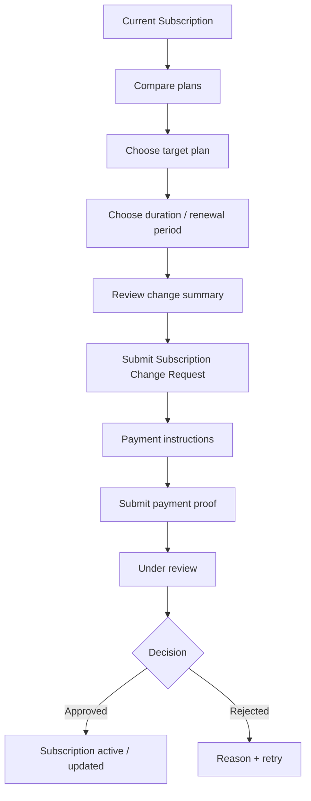
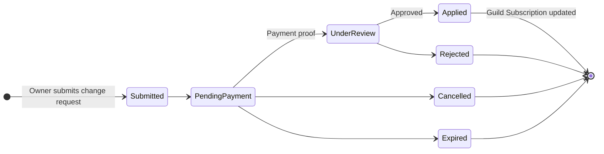
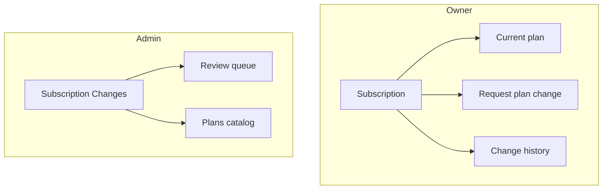
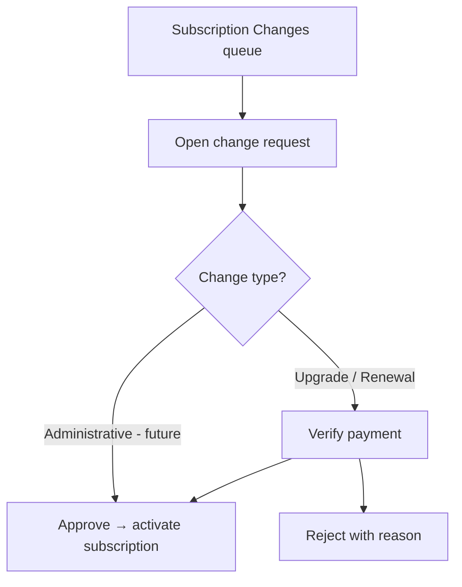

# Subscription Domain Refactoring — D-002

**Document ID:** D-002  
**Status:** Official — domain architecture decision record  
**Owner:** Chief Domain Architect  
**Last updated:** 2026-07-03  
**Depends on:** SB-001 · SB-002 · UX-001 · UL-001 · PB-001  
**Decision deadline:** Before SB-003 (payment proof implementation)

---

## Executive summary

The platform’s workflow entity **`PlanUpgradeRequest`** correctly models **paid plan acquisition and renewal under manual billing**, but the name **Upgrade Request** is **too narrow** for the full subscription lifecycle. Admin paths (direct plan assign, extend, cancel) already bypass the request aggregate, creating **split brain** in language and operations.

**Recommendation (Option C + phased extension):** Adopt **Subscription Change Request** as the **canonical business term** immediately in UL, UX, and API-facing copy. **Keep the physical entity/table name** `PlanUpgradeRequest` through Closed Beta and SB-003–005. **Extend** the model with `ChangeType` and optional `EffectiveAt` in Release 0.2 — do **not** perform a full rename/migration before real customers stabilize.

**Do not block SB-003** on a rename. Do **update ubiquitous language and UX** before SB-003 ships user-facing payment flows.

---

## 1. Current Domain Review

### Current entity: `PlanUpgradeRequest`

**Table:** `PlanUpgradeRequests`  
**Companion entitlement:** `GuildSubscription` (one per guild)  
**Catalog:** `SubscriptionPlan`

### Responsibilities (today)

| Responsibility | Owner |
|----------------|-------|
| Capture owner intent to move to a **paid** plan for **N months** | `PlanUpgradeRequest` |
| Snapshot current plan, target plan, price, duration | Request row |
| Manual billing workflow (payment → review → activate) | Request status machine |
| Link activation to entitlement (`ApprovedRequestId`) | `GuildSubscription` |
| One in-flight request per guild | Business rule |
| Admin approve / reject / cancel request | `PlanUpgradeRequestService` |

**Not owned by `PlanUpgradeRequest` (today):**

| Operation | Actual implementation |
|-----------|----------------------|
| Admin direct plan change | `SubscriptionService.UpdateGuildSubscriptionAsAdminAsync` |
| Extend paid period | `SubscriptionService.ExtendSubscriptionAsync` |
| Cancel subscription (downgrade to Free) | `SubscriptionService.CancelSubscriptionAsync` |
| Lazy expiry → Free | `SubscriptionService.ApplyExpirationIfNeededAsync` |
| Owner self-serve plan PATCH | Blocked (403) |

### Strengths

1. **Clear workflow aggregate** — separates *intent + payment + review* from *active entitlement*.
2. **Snapshots** — plan and price at request time (SB-002); audit-friendly.
3. **Rich status machine** — SB-002 states support manual billing and future payment proof.
4. **Proven in beta path** — approve activates subscription; module gating unchanged.
5. **Stripe-ready shape** — request → payment proof → activate maps to Checkout → webhook.

### Weaknesses

1. **Name implies direction** — “Upgrade” excludes renewal, downgrade, lateral change, reactivation in language.
2. **Split operations model** — owner changes go through requests; many admin changes bypass them.
3. **No `ChangeType`** — renewal and first-time upgrade are indistinguishable in data.
4. **No scheduled effective date** — activation is always “on approve now”.
5. **Downgrade not modeled** — expiry and admin cancel mutate `GuildSubscription` without request history.
6. **UL drift** — UL-001 still lists `Pending | Approved | Rejected`; SB-002 expanded to nine states.

### Scalability concerns

| Concern | When it hurts |
|---------|---------------|
| Renewal labeled “upgrade” confuses owners | Every renewal cycle post-beta |
| Scheduled changes (Phase 2) need new entity or overload | Self-serve + Stripe |
| Downgrade requests / retention flows | Commercial launch |
| Reporting (“upgrades vs renewals”) | Revenue analytics |
| Admin override without request record | Compliance / disputes |
| API route `/upgrade-requests` forever | Public API consumers |

---

## 2. Business Reality

Every subscription operation a customer or operator may perform:

| Operation | Description | “Upgrade Request” models naturally? | Why |
|-----------|-------------|-------------------------------------|-----|
| **Upgrade** | Move to higher paid tier | **Yes** | Core use case today |
| **Downgrade** | Move to lower tier before/at expiry | **No** | Not owner-initiated; admin cancel or expiry only |
| **Renew** | Extend same or paid tier for new period | **Partial** | Same form/API, wrong name; no `Renewal` type |
| **Reactivate** | Return to paid after lapse | **Partial** | Same as new upgrade request; language wrong |
| **Cancel pending change** | Abort in-flight request | **Yes** (SB-002) | Cancel on request aggregate |
| **Schedule future change** | Pro → Basic on date X | **No** | No `EffectiveAt`; no scheduled state on subscription |
| **Immediate change (admin)** | Operator sets plan now | **No** | Bypasses request; clears expiry |
| **Extend (admin)** | Add months to current paid plan | **No** | Separate API on entitlement |
| **Cancel subscription (admin)** | Force Free | **No** | Direct entitlement mutation |
| **Automatic downgrade (expiry)** | Free at `ExpiresAt` | **No** | System on `GuildSubscription`; no request |
| **Administrative override** | Approve without payment proof | **Partial** | `AdminOverrideReason` on request; admin direct assign unlogged |

**Conclusion:** The **workflow pattern** is general; the **name and type system** are not.

---

## 3. Domain Language Review

| Term | Fit | Issue |
|------|-----|-------|
| **Upgrade Request** | Narrow | Wrong for renewal, downgrade, schedule |
| **Subscription Request** | Ambiguous | Could mean “request a subscription” (existence) vs “change” |
| **Subscription Change** | Good noun | Needs “Request” suffix for workflow vs applied change |
| **Subscription Change Request** | **Best** | Covers all directed changes pending approval/payment |
| **Subscription Operation** | Technical | Too generic; overlaps with admin CRUD |
| **Subscription Transaction** | Financial | Implies payment ledger (Phase 2+) |

### Recommended canonical term

## **Subscription Change Request**

**Definition:** A Guild Owner–initiated (or admin-initiated) **workflow record** requesting a **change to Guild Subscription** — plan, period, or effective timing — pending payment and/or platform approval.

**Aliases (deprecated in new docs):**

| Deprecated | Use instead |
|------------|-------------|
| Upgrade Request | Subscription Change Request |
| Plan upgrade request | Plan change request |
| Upgrade approval | Change approval |

**Keep unchanged (already correct):**

- **Subscription** → `GuildSubscription` (entitlement)
- **Subscription Plan** → catalog tier
- **Activation** → entitlement updated after approval

**Five-year test:** Works for manual billing, Stripe, scheduled downgrades, renewals, and admin-initiated changes with a `ChangeType` discriminator.

---

## 4. Domain Model Options

### Option A — Keep `PlanUpgradeRequest` (name + model)

| | |
|--|--|
| **Pros** | Zero migration; SB-003 proceeds immediately; no doc churn |
| **Cons** | Permanent language debt; renewal/downgrade hacks; split admin model |
| **Migration cost** | None |
| **Long-term impact** | **High friction** at Phase 2 commercial scale |

### Option B — Rename to `SubscriptionChangeRequest` (entity + API + UI)

| | |
|--|--|
| **Pros** | Aligned language end-to-end; cleaner public API; one concept |
| **Cons** | EF migration rename; breaking API routes; dashboard/i18n sweep; delays SB-003 |
| **Migration cost** | **High** (table, FK, DTOs, routes, tests, docs) |
| **Long-term impact** | **Best** if done once, cleanly |

### Option C — Keep DB entity; adopt business language + extend model

| | |
|--|--|
| **Pros** | SB-003 unblocked; UL/UX/API **display names** fixed now; add `ChangeType` / `EffectiveAt` incrementally |
| **Cons** | Temporary code/UL mismatch (`PlanUpgradeRequest` class, “change request” in UI) |
| **Migration cost** | **Low now**; optional table rename in 0.2 |
| **Compatibility** | API aliases (`/upgrade-requests` → `/subscription-change-requests`) optional |

### Recommendation

**Option C now**, with a **documented path to Option B** in Release 0.2 if table rename is still desired after Stripe/manual v1 stabilize.

**Rationale:** Closed Beta has **~0 external API consumers** and **SB-002 just landed**. Correct **language and type extension** deliver 80% of value; physical rename is **not urgent** before SB-003.

---

## 5. Request Types

If **Subscription Change Request** is adopted, introduce **`ChangeType`** (business enum; physical column in 0.2 or SB-003 if cheap).

| ChangeType | Owner-initiated? | Payment? | Approve activates? | v1 needed? |
|------------|------------------|----------|-------------------|------------|
| **Upgrade** | Yes | Yes (manual) | Yes — new paid plan + period | ✅ (default today) |
| **Renewal** | Yes | Yes | Yes — extend/replace period | ✅ (same flow; label differs) |
| **Reactivation** | Yes | Yes | Yes — after lapse | ✅ (alias of Renewal UX) |
| **Downgrade** | Future | Maybe | Yes — at effective date | ⏳ 0.2+ |
| **PlanChange** | Yes | If paid | Lateral tier change | ⏳ When lateral paid tiers exist |
| **Administrative** | Admin | Optional | Yes — audit required | ⏳ Unify admin bypass into request |

**v1 recommendation (SB-003–005):**

- Add `ChangeType` with values **`Upgrade` | `Renewal`** only (default `Upgrade`).
- Map existing rows → `Upgrade` (or infer `Renewal` when `CurrentPlanId == RequestedPlanId` once downgrade to same tier allowed).
- **Do not** implement Downgrade or Scheduled types until effective-date strategy exists.

**Administrative changes:** Long-term, admin direct assign/extend should **create** an `Administrative` change request (auto-approved) for audit — not replace owner workflow.

---

## 6. Effective Date Strategy

| Strategy | Use case | v1 | 0.2+ |
|----------|----------|-----|------|
| **Immediate** | Manual beta approve → activate now | ✅ Default | ✅ |
| **At renewal** | Downgrade at `ExpiresAt` | ❌ | ✅ |
| **Scheduled date** | Change on specific date | ❌ | ✅ |

### Recommendations

1. **v1:** All approved changes are **immediate** (current behavior). UI copy: “If approved today, expires on {{date}}.”
2. **0.2:** Add optional `EffectiveAt` on request:
   - `null` → immediate on approve
   - `ExpiresAt` of current sub → “at renewal”
   - Specific date → scheduled
3. **User choice:** Offer **immediate vs at renewal** when downgrades launch — not before.
4. **Admin override:** Admin may set `EffectiveAt` + `AdminOverrideReason`; logged and owner-visible.

---

## 7. User Experience (Conceptual)

### Standard change flow (replaces “upgrade-only” copy)



**Copy change:** Primary button **“Request plan change”** (not “Request upgrade”). Renewal pre-selects current paid plan.

### Scheduled change view (0.2 — conceptual)

```
┌─────────────────────────────────────────┐
│ Current plan: Enterprise  (until 1 Aug) │
├─────────────────────────────────────────┤
│ Scheduled change: Pro                   │
│ Effective: 1 September 2026             │
│ Status: Approved — pending effective    │
│ [ Cancel scheduled change ]             │
│ [ Replace with different plan ]         │
└─────────────────────────────────────────┘
```

**v1:** Hide scheduled block — only show **active change request stepper** (UX-001).

---

## 8. Admin Experience

### Should “Upgrade Requests” become “Subscription Changes”?

**Yes — in UI and docs immediately.**

| Today | Target |
|-------|--------|
| `/admin/upgrade-requests` | **Subscription Changes** (nav label); route alias optional |
| Approve upgrade | **Approve change** |
| Queue columns | Add **Change type** when enum exists |

### Review queue columns (target)

| Column | Purpose |
|--------|---------|
| Guild / Owner | Identity |
| **Current plan** | Snapshot |
| **Target plan** | Snapshot |
| **Change type** | Upgrade / Renewal / … |
| **Effective** | Immediate / date |
| Amount / duration | Billing |
| Status | Workflow |
| Payment reference | Verification |
| Override | Admin bypass flag |
| History link | Past changes |

Admin **extend/cancel** on guild row should eventually appear as **completed administrative changes** in the same history — not a separate invisible path.

---

## 9. Database Strategy (Recommendation only — no migrations)

| Artifact | Recommendation | Justification |
|----------|----------------|---------------|
| **Table `PlanUpgradeRequests`** | **Keep name** through beta | Avoid migration churn mid-SB-003 |
| **Entity class `PlanUpgradeRequest`** | **Keep** short term; add `[Obsolete]` alias class optional | Code stability |
| **Extend with `ChangeType`** | **Add column** in SB-003 or 0.2 | Low-risk additive |
| **Extend with `EffectiveAt`** | **Add** in 0.2 | Scheduled changes |
| **Rename table → `SubscriptionChangeRequests`** | **Defer to 0.2** | One coordinated migration with Stripe |
| **Wrap / deprecate** | **No wrapper entity** | YAGNI — extend in place |
| **`ApprovedRequestId` on GuildSubscription** | **Keep**; rename FK column later if table renames | Still valid |

**Do not rename** before SB-003 payment proof ships.

---

## 10. API Strategy (Recommendation only)

| Endpoint pattern | Recommendation |
|------------------|----------------|
| `GET/POST .../subscription/upgrade-requests` | **Remain** (v1); add **`.../subscription/change-requests`** as alias in 0.2 |
| `POST .../upgrade-requests/{id}/approve` | **Remain**; document as “approve change request” |
| Admin `PUT .../subscription` | **Remain**; document as legacy admin path; future: create admin change request |
| Public API versioning | **`/api/v1/`** prefix when external integrators exist — not beta |

**Deprecation plan:**

1. **Now:** OpenAPI/description strings use “subscription change request”.
2. **0.2:** Add alias routes; mark `upgrade-requests` deprecated in docs.
3. **1.0:** Remove `upgrade-requests` aliases if any external clients exist.

---

## 11. Migration Strategy

### Principles

- No data loss  
- No beta interruption  
- Backward compatibility  
- Minimal code churn  
- Clear deprecation  

### Phased plan

| Phase | When | Actions |
|-------|------|---------|
| **D-002** | Now | UL + UX-001 + SB-001 glossary → **Subscription Change Request**; CTO decision recorded |
| **SB-003–005** | Next sprints | Payment UI uses new language; optional `ChangeType` column default `Upgrade` |
| **0.2** | Post-beta | `EffectiveAt`, Downgrade/Renewal types; admin audit requests; API route aliases |
| **1.0** | Stripe GA | Optional table rename migration; webhook maps to same aggregate |

### Data mapping (when `ChangeType` added)

```text
Existing rows → ChangeType = Upgrade
Future: CurrentPlanId == RequestedPlanId && Status activated → Renewal (backfill optional)
```

### Beta customers

No breaking URL changes during coached beta. Nav label updates only.

---

## 12. Risks

| Risk | Likelihood | Impact | Mitigation |
|------|------------|--------|------------|
| Breaking existing clients | Low (beta) | Medium | Keep routes; add aliases later |
| Documentation drift | **High** | Medium | D-002 + UL patch list; single glossary |
| Migration complexity (rename) | Medium if early | **High** | Defer physical rename |
| Confusing users (“upgrade” vs “change”) | **High** | Medium | UX-001 copy pass before SB-003 |
| Delayed beta (rename now) | **High** if Option B now | **High** | Option C — language only |
| Split admin/owner model persists | Medium | High | 0.2 admin-as-request audit |
| Engineers ignore UL | Medium | Medium | PR checklist; API descriptions |
| Stripe webhook wrong aggregate | Low | High | Map PaymentIntent → same request entity |

---

## 13. CTO Recommendation

### Should we change now?

**Yes — business language and domain concept.**  
**No — physical entity/table/API route rename.**

Adopt **Subscription Change Request** in UL, product copy, admin nav, and SB-003 UX **before** payment proof ships. Extend model with **`ChangeType`** when SB-003 or SB-004 adds payment fields (additive column, default `Upgrade`).

### Should we wait until Release 0.2?

**Wait for:** table rename, scheduled effective dates, downgrade requests, admin unified audit.  
**Do not wait for:** terminology fix and UX copy — that should land **now**.

### Keep database entity but change business language?

**Yes — recommended (Option C).** This is the highest leverage / lowest risk path before SB-003.

### Fully rename everything?

**Not before Closed Beta stabilizes.** Revisit full rename (`SubscriptionChangeRequest` table + routes) in **Release 0.2** alongside Stripe if analytics and external API justify it.

### Final decision

| Decision | Choice |
|----------|--------|
| Canonical term | **Subscription Change Request** |
| Physical entity (beta) | **Keep `PlanUpgradeRequest`** |
| SB-003 blocker? | **No** |
| UL update required? | **Yes** (Upgrade Request → primary alias) |
| UX-001 update required? | **Yes** (copy: “plan change”, “renewal”) |
| New enum `ChangeType` | **Add in SB-003 or 0.2** (`Upgrade`, `Renewal` first) |
| `EffectiveAt` | **Release 0.2** |

---

## Diagrams

### Request lifecycle (conceptual — language-neutral)



### Navigation (target labels)



### Admin review flow (unchanged mechanics, new language)



---

## Related documents

- [Manual Billing Domain Blueprint (SB-001)](manual-billing-domain-blueprint.md)
- [SB-002 Manual Billing Foundation](/docs/progress/2026-07-03-SB-002-manual-billing-foundation.md)
- [Subscription Experience (UX-001)](/docs/ux/subscription-experience.md)
- [Ubiquitous Language (UL-001)](/docs/blueprint/ubiquitous-language.md)
- [Subscription System](/docs/architecture/subscription-system.md)

---

*D-002 — documentation only. No code, migrations, or entity renames in this deliverable.*
