# Ticket Management Domain Blueprint

**Document ID:** D-001  
**Status:** Official — domain authority for Ticket Management  
**Owner:** Domain Architecture  
**Last updated:** 2026-07-02  
**Vocabulary:** [Ubiquitous Language (UL-001)](/docs/blueprint/ubiquitous-language.md) — all terms used here are defined there  
**Product alignment:** [Product Blueprint (PB-001)](/docs/blueprint/product-blueprint.md)  
**Implementation baseline:** [Ticket Review (CM-001)](/docs/tickets/ticket-system-review.md)

---

## How to use this document

This blueprint models the **business** of ticket management on the Discord Bot Platform. It does not specify databases, APIs, UI components, or frameworks.

Every future design for persistence, HTTP, Discord behavior, workers, analytics, automation, and enterprise features **must trace back to a concept, rule, or event defined here**.

**Legend for maturity markers:**

| Marker | Meaning |
|--------|---------|
| **Live** | Behavior exists in production code today (may be incomplete vs this blueprint) |
| **v1** | Required for Ticket Domain v1 (see §15) |
| **Future** | Official domain concept; not required for v1 |

When Live behavior contradicts this blueprint, **this blueprint is the target**; gaps are documented in CM-001.

---

## 1. Domain Purpose

### Why this domain exists

The Ticket Management domain exists so a **Guild** can run **structured member support** — turning informal Discord DMs and public channel noise into accountable, reviewable support cases with a clear **Owner**, staff involvement, and a durable **Ticket Timeline**.

Members experience support in Discord (native to where they already are). **Guild Staff Members** — especially the **Support Team** — operate cases from the **Dashboard** with the same authorization rules as the **Bot**. The **Guild Owner** retains oversight and configuration control.

### Business problem solved

| Problem | Domain answer |
|---------|---------------|
| "Help me" messages scattered across channels | One **Ticket** per issue with a dedicated Discord channel |
| No record after channel deletion | **Ticket Timeline** and **Transcript** persist independently of Discord |
| Unclear who is handling a case | **Ticket Assignment** and **Support Team** workflows |
| Staff cannot work from dashboard | Dashboard replies become **Timeline Events** delivered by **Bot** |
| No accountability | Every material action is a **Timeline Event** and platform **Log Entry** |
| Support mixed with moderation | Separate domain boundary (see §13) |

### What is outside this domain

| Outside | Owned by |
|---------|----------|
| Whether Tickets **Module** is enabled or allowed by **Subscription** | Module System + Subscriptions |
| Whether a user may view/reply/close tickets | Authorization (Capabilities on **Permission Role**) |
| Discord channel creation mechanics (permissions, naming) | Bot execution layer — driven by ticket policies |
| Keyword **Auto Reply** in ticket channels | Automation domain — may *react* to tickets but does not own ticket lifecycle |
| Platform **Activity Log** module infrastructure | Logging domain — consumes ticket **Domain Events** |
| Ban/kick/warn of ticket owner during dispute | Moderation domain |
| Guild registration, resource **Synchronization** | Guild Management |
| Payment and plan upgrades | Subscriptions |
| Future **Workflow** engine orchestration | Automation domain — triggers on ticket events |

The Ticket domain **requests** channel creation and message delivery from the Bot; it **does not** own Discord infrastructure.

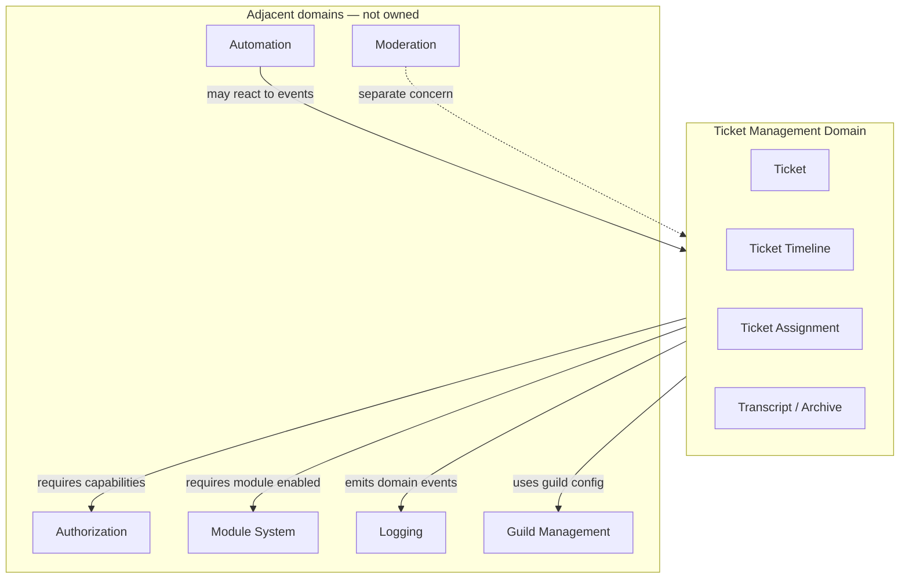

---

## 2. Domain Responsibilities

### Core responsibilities

| Responsibility | Description |
|----------------|-------------|
| **Case creation** | Register a new **Ticket** when a **Guild Member** opens support through approved entry points |
| **Case identity** | Assign immutable **Ticket Number** per **Guild**; identify **Owner** |
| **Conversation capture** | Record all support communication as **Timeline Events** on the **Ticket Timeline** |
| **Staff outbound communication** | Accept staff replies from Dashboard; deliver to Discord as timeline + delivery lifecycle |
| **Lifecycle management** | Enforce **Ticket Status** transitions (open, close, reopen) |
| **Access coordination** | Express who may participate (Owner, staff) — enforcement delegated to Authorization + Bot |
| **Closure** | Close tickets with actor attribution; initiate channel teardown policy |
| **Archive notification** | Produce **Archive** artifact for Discord archive channel on close |
| **Transcript integrity** | Maintain **Transcript** as durable business record after Discord channel gone |
| **Concurrency rules** | Enforce one-open-ticket-per-owner (default policy) |
| **Configuration consumption** | Apply guild ticket templates, category, archive channel from **Guild Settings** |

### Supporting responsibilities

| Responsibility | Description | Maturity |
|----------------|-------------|----------|
| **Sequential numbering** | Monotonic ticket numbers per guild | Live |
| **Open entry via Command Panel** | Create ticket from panel button | Live |
| **Close confirmation** | Require explicit confirmation before close | Live |
| **Dashboard list view** | Surface ticket roster for staff | Live (minimal) |
| **Delivery queue** | Reliable dashboard-to-Discord reply delivery | Live |
| **Channel cleanup orchestration** | Remove Discord channel after dashboard close | Live |
| **Activity log correlation** | Emit TicketOpened / TicketClosed / TicketArchived for Logging domain | Live |
| **Template messages** | Welcome, closed, staff reply prefix from configuration | Live |
| **Ticket detail presentation** | Staff reads full **Ticket Timeline** in Dashboard | v1 |
| **Granular capability enforcement** | View / Reply / Close / Manage tickets | v1 |
| **Staff Discord visibility** | Support roles see ticket channels | v1 |
| **Ticket Assignment** | Claim, assign, unassign | v1 |
| **Internal Note** | Staff-only timeline entries | v1 |
| **Reopen** | Return closed ticket to active handling | v1 |
| **Unified close pipeline** | Same business outcome regardless of close origin | v1 |

### Future responsibilities

| Responsibility | Description |
|----------------|-------------|
| **Ticket Category** | Route tickets to category-specific config and queues |
| **Opening form / custom fields** | Structured intake at creation |
| **Priority & tags** | Queue ordering and classification |
| **Queue** | Team-scoped ticket backlog |
| **Waiting states** | Waiting Customer / Waiting Staff |
| **SLA & Escalation** | Time-bound obligations and escalation paths |
| **Auto-close on inactivity** | Policy-driven closure |
| **Merge / Split** | Combine or divide cases |
| **Observer / Watcher** | Subscribe to ticket updates without assignment |
| **Attachment persistence** | Durable **Attachment** metadata on timeline |
| **Analytics** | Metrics derived from timeline timestamps |
| **Automation hooks** | **Automation Event** execution records |
| **AI assistance** | Suggested replies, summarization — advisory only |
| **External Integration** | Webhooks, CRM sync |
| **Enterprise retention & legal hold** | **Retention Policy** extensions |
| **Transcript export** | **Report** generation for compliance |

---

## 3. Aggregate Design

### Aggregate root: **Ticket**

The **Ticket** is the aggregate root. All business operations that change the meaning of a support case must go through the Ticket aggregate boundary.

**Why Ticket — not Timeline, Channel, or Message?**

- The ticket is the **business identifier** staff and owners reference ("ticket #42").
- **Ticket Timeline** events have no meaning without the ticket they belong to.
- The Discord channel is an **execution artifact** — replaceable on reopen, deletable on close — not the case itself.
- Invariants (one open ticket per owner, status transitions, assignment rules) apply to the **case**, not to individual messages.

### Concept map

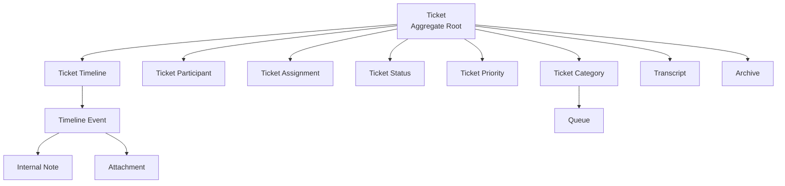

### Entities and value objects inside the aggregate

| Concept | Type | Role in aggregate |
|---------|------|-------------------|
| **Ticket** | Aggregate root | Case identity, status, assignment, priority, category ref, owner, channel ref, lifecycle timestamps |
| **Ticket Timeline** | Entity (collection) | Ordered sequence of **Timeline Events** — the narrative of the case |
| **Timeline Event** | Entity | One immutable fact: message, status change, assignment, note, system action |
| **Ticket Participant** | Entity / ref | Link between ticket and **Guild Member** with participation role |
| **Ticket Assignment** | Value object / embedded state | Who owns handling; may include queue ref |
| **Ticket Status** | Value object | Lifecycle phase |
| **Ticket Priority** | Value object | Urgency classification |
| **Internal Note** | Specialized Timeline Event | Staff-only content |
| **Attachment** | Value object on event | Reference to uploaded/stored media metadata |
| **Transcript** | Derived artifact | Materialized read model of timeline for export/immutability at close |
| **Archive** | External notification artifact | Discord-channel summary — not source of truth |

### Consistency boundary rules

1. A **Timeline Event** cannot exist without a Ticket.
2. **Ticket Status** changes must produce a **Timeline Event** (System Event).
3. **Ticket Assignment** changes must produce a **Timeline Event**.
4. Closing a Ticket must finalize timeline appends except Reopen and post-close admin actions defined by policy.
5. **Ticket Number** is assigned at creation and never reused within a Guild.
6. Cross-ticket operations (**Merge**, **Split**) involve multiple Ticket aggregates — orchestrated by domain service with explicit events on each ticket.

### What is NOT inside the aggregate

| Concept | Why outside |
|---------|-------------|
| **Guild Settings** (templates, category) | Configuration aggregate — ticket consumes |
| **Permission Role** | Authorization domain |
| **Command Panel** | Automation / Guild configuration |
| **Log Entry** | Logging domain — downstream of domain events |
| **Discord Channel** | Infrastructure — referenced by ID only |
| **Support Team** | Organizational mapping — Authorization |
| **Workflow** definition | Automation domain |

---

## 4. Business Concepts

Definitions follow UL-001. Extended domain nuance added where needed.

### Ticket

The central support **case**. Identified by **Ticket Number** within a **Guild**. Has exactly one **Owner** (the member who opened it). Has one current **Ticket Status**. May have zero or one active **Ticket Assignment**.

**Live today:** Ticket exists with Owner, Status (Open/Closed), channel reference, sequential number.  
**v1 target:** Ticket owns Timeline; assignment; transcript reference.

---

### Ticket Number

Human-friendly sequential identifier per Guild (e.g. 42 → "ticket #42"). Assigned at creation. Never reassigned. Never reused.

---

### Owner

The **Guild Member** who opened the ticket. Exactly one Owner per ticket for the ticket's lifetime. Owner retains close rights unless policy restricts. Owner is always a **Ticket Participant**.

---

### Ticket Participant

Any **Guild Member** (or system actor represented on behalf of the platform) who is party to the case. Includes Owner, assigned staff, added helpers. Distinct from **Observer**.

| Participation role | Meaning |
|--------------------|---------|
| **Owner** | Member requesting support |
| **Staff** | Guild Staff Member acting in support capacity |
| **System** | Platform/Bot acting per policy (welcome message, auto-close notice) |

**Future:** explicit add/remove participant with audit trail.

---

### Ticket Timeline

The authoritative, ordered history of everything that happened on a ticket for business and compliance purposes. **Not** synonymous with Discord message list.

The Timeline is the **heart of the domain** (see §8). If Timeline is wrong, Transcript, Analytics, SLA, and Automation are wrong.

---

### Timeline Event

One indivisible fact recorded on the Timeline. Immutable after creation (corrections append new events, never mutate history).

Categories:

| Category | Examples |
|----------|----------|
| **Message** | Member message (Discord), Staff reply (Discord or Dashboard) |
| **System Event** | TicketCreated, StatusChanged, ChannelLinked |
| **Assignment Event** | AssignmentChanged, Claimed, Unassigned |
| **Staff-only Event** | InternalNoteAdded |
| **Automation Event** | AutomationExecuted, AutoReplySent |
| **Attachment Event** | AttachmentUploaded |
| **Escalation Event** | EscalationTriggered, SlaBreached |

---

### Ticket Status

The ticket's phase in its lifecycle. Drives what actions are permitted.

| Status | Meaning | Maturity |
|--------|---------|----------|
| **Open** | Active case; channel may exist | Live |
| **Closed** | Case resolved; no active handling | Live |
| **Reopened** | Semantic flag or re-entry to Open after close | v1 (as transition) |
| **Waiting Customer** | Staff responded; awaiting member | Future |
| **Waiting Staff** | Member responded; awaiting staff | Future |
| **Resolved** | Work complete; pending formal close | Future |

*v1 uses Open + Closed; Reopen transitions Closed → Open with audit.*

---

### Ticket Priority

Classification of urgency (e.g. Low, Normal, High, Urgent). Influences queue ordering and **Escalation** policies. Default at creation.

**Future** for v1 — domain reserves concept.

---

### Ticket Assignment

Persisted state: who (which Guild Staff Member) or which **Queue** is responsible for the ticket. Distinct from **Claim** action.

May be **Unassigned** — valid state for triage queues.

---

### Claim

**Action** (not state): a staff member assigns the ticket to themselves. Produces AssignmentChanged timeline event.

---

### Support Team

Organizational concept: Guild Staff Members whose **Permission Role** includes ticket Capabilities. Not a ticket aggregate entity. Defines who *may* be assigned — not assignment itself.

---

### Queue

**Future:** named backlog (e.g. Billing Queue) within a Guild. Tickets may be assigned to Queue without named individual. Category may map to default Queue.

---

### Ticket Category

**Future:** business classification at creation (Billing, Technical, Appeals). Determines welcome template, default queue, staff role overwrites, opening form.

**Live partial:** single implicit category via one Discord category in Guild Settings.

---

### Internal Note

Staff-only **Timeline Event** visible in Dashboard, never delivered to Discord, never visible to Owner in member-facing surfaces.

---

### Transcript

Complete durable representation of the **Ticket Timeline** suitable for review after close and for export. **Source of truth** for "what was said."

Distinct from **Archive** (notification digest in Discord).

**v1:** Transcript derived from persisted Timeline Events.

---

### Archive

Notification artifact posted to configured Discord archive channel when ticket closes. Summarizes key metadata and preview. **Must not claim completeness** unless Transcript is linked and available.

**Live:** preview-only embed — domain target requires honesty per Archive Policy.

---

### Attachment

Media or file reference attached to a message event. Stored as metadata (URL, filename, type) on Timeline Event. Discord-native uploads captured into timeline.

**Future** for persistence — Live allows Discord attach without domain record.

---

### Discord Channel (ticket channel)

**Execution artifact** — private Discord text channel where conversation happens. Referenced by ticket; not the ticket itself. May be deleted on close while ticket and Timeline remain.

---

### Ticket Outbound Message

**Live implementation artifact** — delivery intent for Dashboard staff reply. Domain target: every outbound message becomes a Timeline Event; delivery state is part of event lifecycle (pending → delivered → failed).

---

### Escalation

**Future:** policy-driven elevation when SLA breached or manually triggered. Produces Escalation Event; may reassign, raise Priority, notify watchers.

---

### SLA (Service Level Agreement)

**Future:** time targets (first response, resolution). Computed from Timeline Event timestamps. Breach produces SlaBreached event and may trigger Escalation.

---

### Observer / Watcher

**Future:** Guild Staff Member subscribed to ticket updates without being assignee. Receives **Notification**; does not imply reply/close rights.

---

### Merge

**Future:** combine two tickets into one continued case. Loser ticket closed with MergedInto reference; winner receives merged timeline segment event.

---

### Split

**Future:** divide one ticket into two cases with lineage reference on timeline.

---

### Automation Event

Record on Timeline when **Automation** or **Workflow** acts on ticket (auto-close warning, auto-assign rule). Distinguishes machine actions from human staff.

---

### System Event

Timeline Event recording platform lifecycle facts not authored by a person (channel created, channel deleted, ticket registered).

---

## 5. Lifecycle

### Business lifecycle (full domain vision)

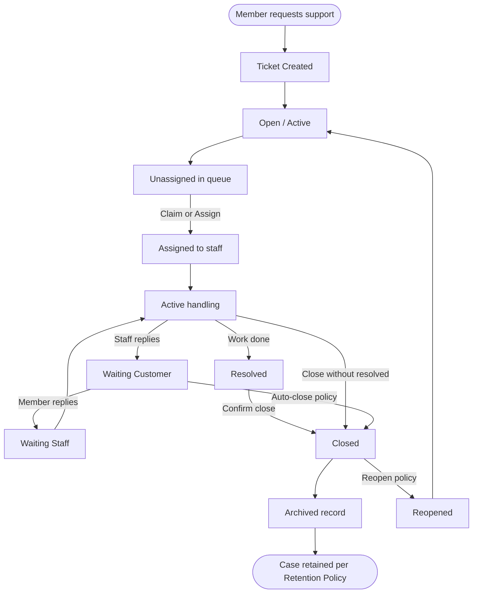

### v1 lifecycle (minimum shippable)

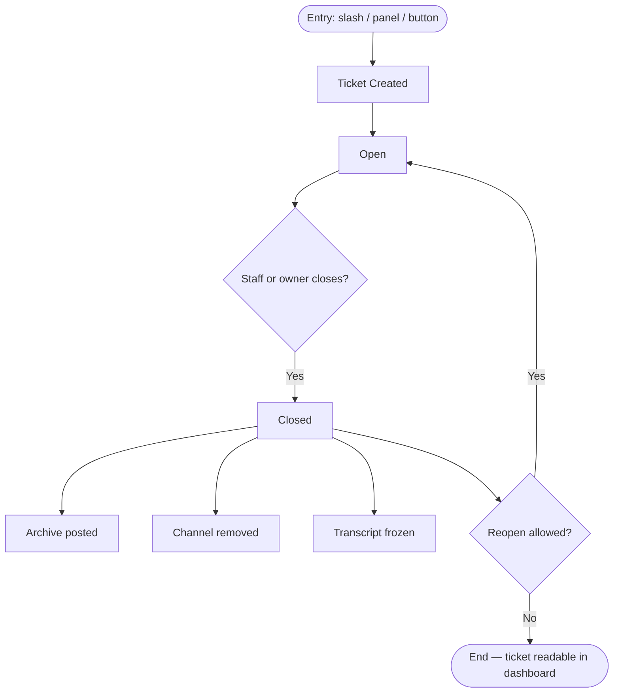

### Lifecycle phases explained

| Phase | Business meaning |
|-------|------------------|
| **Created** | Ticket registered; Owner bound; Ticket Number assigned; welcome communicated |
| **Open** | Case accepts messages, replies, assignment |
| **Assigned** | Specific staff or queue responsible (v1: assignment optional) |
| **Waiting *** | *Future* — indicates ball-in-court for SLA |
| **Resolved** | *Future* — soft completion before channel teardown |
| **Closed** | Case closed; no new member/staff conversation in channel |
| **Archived** | Archive notification dispatched; channel teardown initiated or complete |
| **Reopened** | Previously closed case reactivated; may link new Discord channel |

---

## 6. State Machine

### Ticket Status state machine (v1)

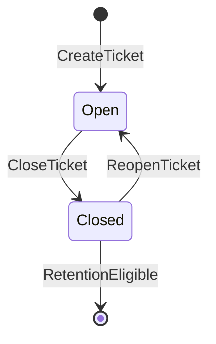

### Ticket Status state machine (future extension)

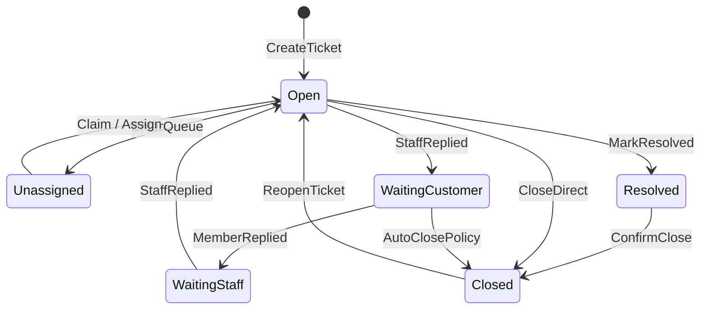

### Allowed transitions (v1)

| From | To | Trigger | Actor |
|------|-----|---------|-------|
| — | Open | Create | Owner (member) |
| Open | Closed | Close | Owner, authorized staff |
| Closed | Open | Reopen | Authorized staff |

### Forbidden transitions (v1)

| Transition | Reason |
|------------|--------|
| Closed → Deleted (hard) | Tickets retained for audit; use Retention Policy instead |
| Open → Open (no-op status) | Status change must produce Timeline Event with reason |
| Closed → Assigned | Must reopen first |
| Any | Create second Open ticket same Owner same Guild | One-open policy (default) |

### Recovery transitions

| Situation | Recovery |
|-----------|------------|
| Discord channel deleted manually while Open | Ticket remains Open; record ChannelUnlinked event; staff works from Dashboard Timeline; optional recreate channel policy |
| Dashboard close but cleanup fails | Ticket Closed; retry channel cleanup; Timeline records cleanup failure |
| Outbound reply delivery fails | Event remains failed; retry policy; staff sees delivery state |
| Archive post fails | Close still valid; Transcript intact; retry archive optional |
| Bot/API disagree on status | Reconciliation job compares channel existence vs status — append System Event |

---

## 7. Business Rules

Rules grouped by concern. **Invariant** = must always hold. **Policy** = configurable per guild (defaults provided).

### Identity & creation

| ID | Rule | Type |
|----|------|------|
| BR-C01 | A Ticket belongs to exactly one Guild | Invariant |
| BR-C02 | A Ticket has exactly one Owner for its entire life | Invariant |
| BR-C03 | Ticket Number is unique per Guild and monotonic | Invariant |
| BR-C04 | A Ticket is created only when Tickets Module is enabled and allowed by Subscription | Policy (Module) |
| BR-C05 | Default: at most one Open ticket per Owner per Guild | Policy (default on; future configurable limit) |
| BR-C06 | Creation must produce TicketCreated Timeline Event | Invariant |
| BR-C07 | Creation must communicate welcome message to Owner per Guild Settings templates | Policy |

### Participants

| ID | Rule | Type |
|----|------|------|
| BR-P01 | Owner is always a Participant | Invariant |
| BR-P02 | Staff become Participants when they send a visible message or are Assigned | Invariant |
| BR-P03 | Internal Note authors are Participants in staff context only | Invariant |
| BR-P04 | *Future:* adding Participant requires ManageTickets or assignment | Policy |

### Timeline & messages

| ID | Rule | Type |
|----|------|------|
| BR-T01 | Every visible Discord message in ticket channel becomes Message Timeline Event | Invariant (v1) |
| BR-T02 | Every Dashboard staff reply becomes Timeline Event before or when delivery starts | Invariant (v1) |
| BR-T03 | Timeline Events are append-only; no deletion except GDPR retention purge | Invariant |
| BR-T04 | Timeline ordering is by business timestamp (occurred-at), not database insert order | Invariant |
| BR-T05 | System Events must not impersonate a human Participant | Invariant |
| BR-T06 | Internal Notes never appear in Discord or Owner-facing transcript export unless policy explicitly includes | Policy (default: exclude) |
| BR-T07 | Message content respects platform length limits; overflow rejected at boundary | Policy |

### Assignment

| ID | Rule | Type |
|----|------|------|
| BR-A01 | A ticket has zero or one primary Assignment at a time | Invariant (v1) |
| BR-A02 | Claim assigns to acting staff member if unassigned or policy allows steal | Policy |
| BR-A03 | Assign may target another staff member only with appropriate Capability | Policy |
| BR-A04 | Assignment change always produces AssignmentChanged Timeline Event | Invariant |
| BR-A05 | Unassign returns ticket to queue state if queues enabled | Future |

### Status & close

| ID | Rule | Type |
|----|------|------|
| BR-S01 | Only Open tickets accept new member messages and staff replies in Discord channel | Invariant |
| BR-S02 | Close requires CloseTickets Capability (or Owner) | Policy |
| BR-S03 | Close must record closing actor and timestamp on Ticket and Timeline | Invariant |
| BR-S04 | Close is idempotent: closing Closed ticket is no-op or error — never double-close | Invariant |
| BR-S05 | Close triggers Archive Policy and channel teardown policy | Policy |
| BR-S06 | Close does not delete Ticket or Timeline | Invariant |
| BR-S07 | Owner may close own ticket unless guild disables via policy | Policy (default: allow) |

### Reopen

| ID | Rule | Type |
|----|------|------|
| BR-R01 | Reopen permitted only from Closed | Invariant |
| BR-R02 | Reopen requires authorized staff (not Owner-only by default — policy configurable) | Policy |
| BR-R03 | Reopen produces Reopened Timeline Event and returns Status to Open | Invariant |
| BR-R04 | Reopen may create new Discord channel linked to same Ticket | Policy (v1 default) |
| BR-R05 | Reopen does not assign new Ticket Number | Invariant |

### Archive & transcript

| ID | Rule | Type |
|----|------|------|
| BR-X01 | Archive is notification; Transcript is truth | Invariant |
| BR-X02 | Archive must not claim full history unless Transcript accessible | Invariant (v1 fix) |
| BR-X03 | Transcript must be reconstructable from Timeline after channel deletion | Invariant (v1) |
| BR-X04 | Optional Transcript snapshot at close freezes export version | Policy |
| BR-X05 | Archive failure must not block Close | Invariant (Live) |

### Priority, category, queue (future)

| ID | Rule | Type |
|----|------|------|
| BR-F01 | Priority change produces Timeline Event | Future invariant |
| BR-F02 | Category selected at creation; change requires staff and event | Future policy |
| BR-F03 | Queue assignment is part of Assignment value | Future |

### Merge & split (future)

| ID | Rule | Type |
|----|------|------|
| BR-M01 | Merge closes source ticket with reference to target | Future |
| BR-M02 | Split creates new ticket with new Number and SplitFrom reference | Future |

### Permissions (enforced with Authorization domain)

| ID | Rule | Type |
|----|------|------|
| BR-Z01 | ViewTickets required to read ticket list, detail, Timeline | Policy |
| BR-Z02 | ReplyToTickets required to add staff message events | Policy |
| BR-Z03 | CloseTickets required to close | Policy |
| BR-Z04 | ManageTickets required to change ticket configuration | Policy |
| BR-Z05 | Guild Owner and Platform Administrator bypass per platform policy | Policy |
| BR-Z06 | Module enabled check precedes all ticket operations | Invariant (platform) |

### Deletion & retention

| ID | Rule | Type |
|----|------|------|
| BR-D01 | Tickets are not hard-deleted in normal operations | Invariant |
| BR-D02 | GDPR/export purge deletes ticket aggregate per data policy — rare | Future policy |
| BR-D03 | Retention Policy may purge Closed tickets older than N days | Future policy |

---

## 8. Timeline Model

### Why Timeline is the heart of the domain

The **Ticket Timeline** is the authoritative narrative of support. Everything else is derived or ancillary:

| Derived concern | Source |
|-----------------|--------|
| **Transcript** | Projection of Timeline |
| **Analytics** (first response time, resolution time) | Timestamps on Timeline Events |
| **SLA** | Elapsed time between event types |
| **Audit** | Timeline + platform Log Entries |
| **Automation** | Reacts to Timeline Events |
| **AI context** | Timeline content (future) |

If messages live only in Discord, the domain **ceases to exist** when channels are deleted. The business cannot accept that.

### Timeline structure

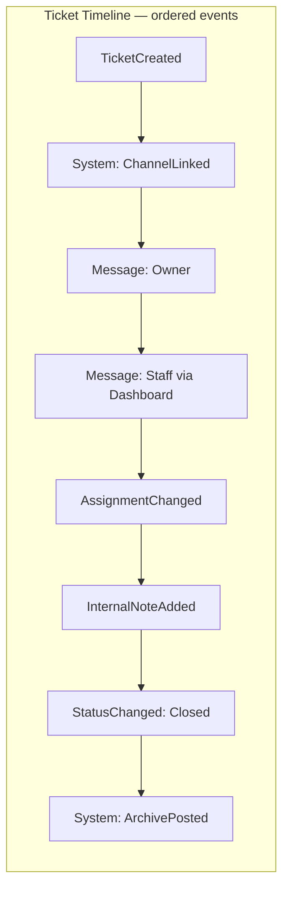

### Event catalog

| Event type | Producer | Visible to Owner | Business meaning |
|------------|----------|----------------|------------------|
| **TicketCreated** | Ticket domain | Yes (embed) | Case registered |
| **ChannelLinked** | System | No | Discord channel bound |
| **ChannelUnlinked** | System | No | Channel gone; case remains |
| **MessageSent** | Owner, Staff, Bot | Yes (except internal) | Conversation content |
| **StaffReplyQueued** | Dashboard | No | Delivery pending |
| **StaffReplyDelivered** | Worker/Bot | Yes | Dashboard reply reached Discord |
| **StaffReplyFailed** | Worker | No | Delivery failed |
| **AssignmentChanged** | Staff action | Optional | Responsibility shifted |
| **Claimed** | Staff action | Optional | Self-assignment |
| **PriorityChanged** | Staff | Optional | Urgency updated |
| **CategoryChanged** | Staff | Optional | Routing updated |
| **InternalNoteAdded** | Staff | **No** | Staff coordination |
| **StatusChanged** | Close/Reopen | Yes | Lifecycle transition |
| **ArchivePosted** | Archive policy | No | Archive channel notified |
| **TranscriptSnapshotCreated** | Close policy | No | Immutable export captured |
| **AttachmentUploaded** | Owner/Staff | Yes | File attached |
| **AutomationExecuted** | Automation | Optional | Rule acted on ticket |
| **AutoReplySent** | Auto Reply | Yes | Keyword response |
| **EscalationTriggered** | SLA/Escalation | Staff | Escalation path invoked |
| **SlaBreached** | SLA monitor | Staff | Target missed |
| **Merged** / **Split** | Staff | Optional | Case lineage changed |
| **Reopened** | Staff | Yes | Case reactivated |

### Event immutability & correction

- Events are **never updated or deleted** in normal operation.
- Corrections append a new event (e.g. `DeliveryRetried`, `NoteAmended` referencing prior event id conceptually).
- GDPR purge is exceptional — outside normal domain operations.

### Live gap

Today: Discord messages are **not** Timeline Events. Outbound dashboard replies exist as delivery queue only. **v1 requires full Timeline capture.**

---

## 9. Actors

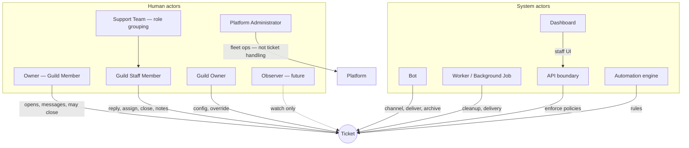

| Actor | Responsibilities in this domain |
|-------|----------------------------------|
| **Owner** | Open ticket (default one open); send messages; may close own ticket; receives support in Discord |
| **Guild Staff Member** | View, reply, assign, close, note, reopen per Capabilities |
| **Support Team** | Organizational label for staff with ticket Capabilities — not a separate actor type |
| **Guild Owner** | Configure ticket policies; full access; not default assignee |
| **Platform Administrator** | Operates SaaS; does not normally participate in guild tickets |
| **Observer** | *Future* — notified; read-only |
| **Bot** | Creates Discord artifacts; delivers messages; posts Archive; captures Discord messages into Timeline |
| **Worker** | Executes deferred delivery and channel cleanup; reports success/failure as events |
| **Dashboard** | Presents Timeline; captures staff intent (reply, close, assign) |
| **API** | Enforces invariants at application boundary; orchestrates aggregate changes |
| **Automation** | Reacts to domain events per Workflow — never bypasses Timeline |

---

## 10. Policies

Policies are configurable rules with domain defaults. Guild Owner sets via **Guild Settings** / ticket configuration (ManageTickets).

### Assignment Policy

| Setting | Default |
|---------|---------|
| Allow self-claim | Yes (v1) |
| Allow assign to others | Yes with ManageTickets or lead role |
| Require assignment before first staff reply | No (v1) |
| Default queue | Unassigned pool |

### Close Policy

| Setting | Default |
|---------|---------|
| Owner may close | Yes |
| Require CLOSE confirmation text in Discord | Yes (Live) |
| Close from Dashboard allowed | Yes |
| Delete Discord channel on close | Yes |
| Delay before channel delete | Short (Live: ~seconds) |

### Archive Policy

| Setting | Default |
|---------|---------|
| Post to archive channel on close | If archive channel configured |
| Archive content source | Transcript summary (v1) — not live scrape only |
| Include link to Dashboard transcript | Yes (v1) |
| Archive failure blocks close | **No** |

### Transcript Policy

| Setting | Default |
|---------|---------|
| Persist all messages | Yes (v1) |
| Include Internal Notes in staff transcript | Yes |
| Include Internal Notes in owner export | No |
| Snapshot at close | Recommended |

### Reopen Policy

| Setting | Default |
|---------|---------|
| Allow reopen | Yes (v1) |
| Who may reopen | Staff with CloseTickets or ManageTickets |
| Create new channel on reopen | Yes (v1 default) |

### Retention Policy

| Setting | Default |
|---------|---------|
| Retain closed tickets | Indefinite (v1) |
| Purge after N days | Future — plan-tier |

### Escalation Policy (future)

| Setting | Default |
|---------|---------|
| SLA targets | Off until configured |
| Escalate on breach | Notify watchers + lead |

### Notification Policy (future)

| Setting | Default |
|---------|---------|
| Notify assignee on new message | Optional |
| Notify queue on new unassigned ticket | Optional |

### One-open-ticket Policy

| Setting | Default |
|---------|---------|
| Max open tickets per Owner | 1 |

### Permission Policy

Ticket operations require Module enabled + Capabilities as defined in §7 BR-Z series. Guild Owner bypass centralized in Authorization domain.

---

## 11. Future Growth

The aggregate design supports extension **without redefining Ticket**:

| Extension | How it attaches |
|-----------|-----------------|
| **AI summarization** | Read-only consumer of Timeline; produces advisory Timeline Event or external artifact — never auto-closes without Automation policy |
| **Automation / Workflow** | Subscribes to Domain Events; Actions append Automation Events |
| **Enterprise compliance** | Retention Policy + Transcript export + legal hold flag on Ticket |
| **Marketplace plugins** | Integration emits/consumes events via API — no direct aggregate mutation without policy |
| **Analytics** | Read models from Timeline timestamps and status history |
| **Multi-team / Queue** | Assignment value gains Queue reference; Category maps to Queue |
| **External CRM** | Integration maps Ticket Number ↔ external case id on Timeline |
| **SLA** | Parallel policy engine reading Timeline; breach events |

**Core invariant preserved:** Ticket + Timeline remain the center; extensions are projections, policies, or reactions.

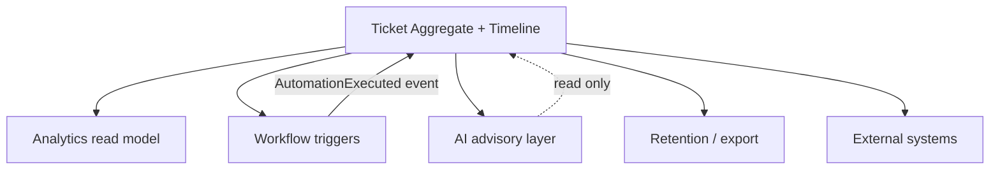

---

## 12. Domain Events

Domain Events notify **other domains** and **automation**. They may also produce **Log Entries** in the Logging domain. They are not the same as **Timeline Events** — though one business action may produce both.

| Domain Event | Producer | Typical consumers | Business meaning |
|--------------|----------|-------------------|------------------|
| **TicketOpened** | Ticket created | Logging, Analytics, Automation | New case exists |
| **TicketClosed** | Ticket closed | Logging, Analytics, Automation, Archive | Case finished |
| **TicketReopened** | Reopen | Logging, Analytics | Case reactivated |
| **TicketArchived** | Archive posted | Logging | Archive channel notified |
| **TicketAssigned** | Assignment changed | Notification (future), Analytics | Ownership changed |
| **TicketMessageRecorded** | Timeline message | Analytics (response time) | Conversation progressed |
| **TicketDeliveryFailed** | Outbound failure | Notification, ops | Staff reply not delivered |
| **TicketSlaBreached** | SLA monitor | Escalation, Notification | Target missed |
| **TicketEscalated** | Escalation policy | Notification, Assignment | Urgency increased |
| **TicketMerged** | Merge action | Logging, Analytics | Cases combined |

**Live today:** TicketOpened, TicketClosed, TicketArchived as LogEntry types — partial mapping to domain events.

**v1 target:** Domain events explicitly defined; Logging domain subscribes; Timeline remains superset of detail.

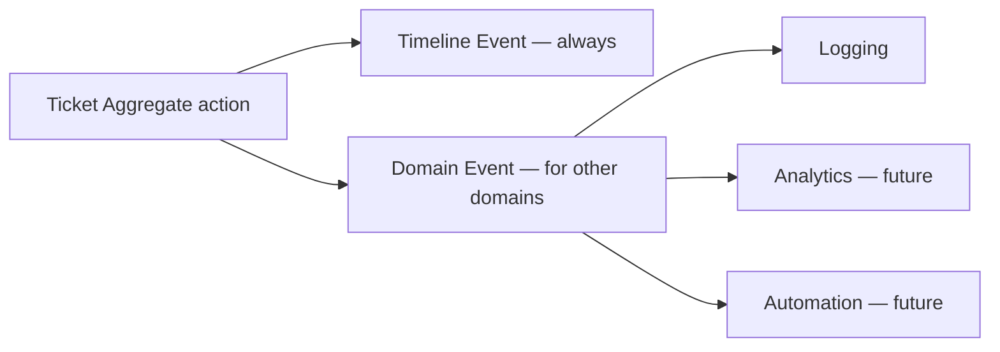

---

## 13. Domain Boundaries

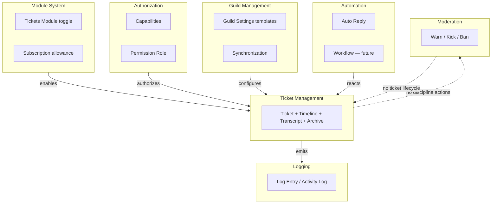

| Question | Owner |
|----------|-------|
| Can user reply to ticket? | Authorization — ReplyToTickets |
| Is ticket feature on? | Module System |
| Welcome message template text? | Guild Settings (configuration) |
| Record "ticket closed" in activity log? | Logging — via domain event |
| Auto-reply "hours" in ticket channel? | Automation — may create Message event if configured |
| Kick ticket owner? | Moderation — separate case, not ticket close |
| Discord channel permission overwrites? | Bot execution — instructed by Ticket policies + Authorization |

**Overlap avoidance:** Ticket domain does not issue warnings or bans. Moderation domain does not own support timelines. Logging domain does not replace Timeline.

---

## 14. Anti-Patterns

Developers and designers must avoid:

| Anti-pattern | Why wrong | Correct model |
|--------------|-----------|---------------|
| **Ticket = Discord Channel** | Channel deleted on close; ticket must survive | Ticket is case; channel is linked artifact |
| **Timeline = Discord messages** | Dashboard replies, notes, system events missing | Timeline is superset |
| **Archive = Transcript** | Archive is digest; transcript is complete | Separate concepts (UL-001) |
| **Claim as stored field name** | Claim is action | Persist **Ticket Assignment**; event Claimed |
| **Conversation** in specs | Forbidden term | **Ticket Timeline** |
| **Business rules in Bot handlers only** | Bot is one actor; rules must hold at API boundary too | Enforce at aggregate/application layer |
| **Business rules in Dashboard UI only** | Bypass via API | Server-side policy enforcement |
| **Skip Timeline for "simple" messages** | Breaks transcript and analytics | Every message → Timeline Event |
| **Close without Timeline event** | Audit gap | StatusChanged always recorded |
| **Mutable message history** | Compliance failure | Append-only events |
| **Staff page as auth source** | Permission Role maps Discord Role | Authorization domain |
| **Feature flag for tickets on** | Wrong vocabulary | Module enabled |
| **Scrape channel for transcript on close** | Loses history if scrape partial | Transcript from Timeline |
| **Imply dashboard has full history without Timeline** | Trust violation (Live bug) | Honest Archive + Transcript |
| **Two close pipelines with different meaning** | Inconsistent business outcome | One Close policy, multiple adapters |
| **Moderation permission table for tickets** | Removed model | Unified Permission Role |

---

## 15. Definition of Done — Ticket Domain v1

Ticket Domain v1 is complete when the **business capabilities** below hold — independent of UI polish beyond stated requirements.

### Case & lifecycle

- [ ] Member can open ticket via approved entry points (slash, panel, button)
- [ ] One-open-ticket-per-owner policy enforced (default)
- [ ] Ticket Number assigned uniquely per Guild
- [ ] Owner may close; staff may close with CloseTickets
- [ ] Reopen returns Closed → Open with full audit on Timeline
- [ ] Close produces consistent outcome from Discord and Dashboard origins

### Timeline & transcript

- [ ] Every Discord message in ticket channel → Message Timeline Event
- [ ] Every Dashboard staff reply → Timeline Event with delivery lifecycle
- [ ] Staff can read full Ticket Timeline in Dashboard for Open and Closed tickets
- [ ] Transcript reconstructable after Discord channel deleted
- [ ] Archive honest — links or points to Transcript, no false claims

### Assignment & notes

- [ ] Ticket Assignment: claim and assign with Timeline events
- [ ] Internal Note on Timeline, invisible to Owner in Discord

### Authorization & participation

- [ ] ViewTickets / ReplyToTickets / CloseTickets / ManageTickets enforced
- [ ] Support staff receive Discord channel access per policy (not admin-only)

### Operations

- [ ] Open ticket queue with filter and pagination
- [ ] Failed delivery visible and retryable
- [ ] TicketOpened / TicketClosed / TicketArchived visible in Activity Log

### Domain integrity

- [ ] No business rule exists only in Bot or only in Dashboard
- [ ] Timeline append-only
- [ ] Ticket aggregate survives channel deletion

**Explicitly not required for Domain v1:** Categories, SLA, Merge, Split, Analytics module, Automation builder, AI, external integrations, HTML export (Phase 3+).

---

## Diagram: Actor interaction on close

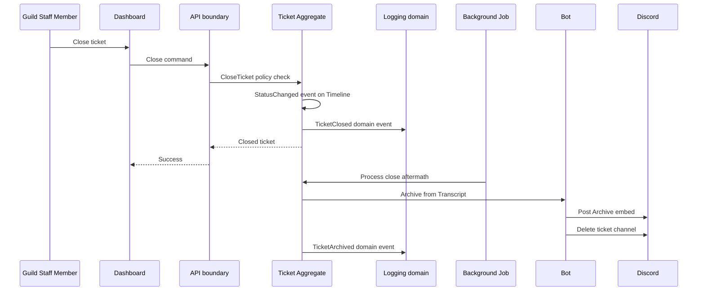

---

## Related documents

| Document | Purpose |
|----------|---------|
| [UL-001 Ubiquitous Language](/docs/blueprint/ubiquitous-language.md) | Term definitions |
| [PB-001 Product Blueprint](/docs/blueprint/product-blueprint.md) | Product scope |
| [CM-001 Ticket Review](/docs/tickets/ticket-system-review.md) | Live gaps |
| [CM backlog](/docs/tickets/ticket-system-future.md) | Implementation tasks |

---

## Revision history

| Version | Date | Change |
|---------|------|--------|
| 1.0 | 2026-07-02 | D-001 initial Ticket Management Domain Blueprint |
