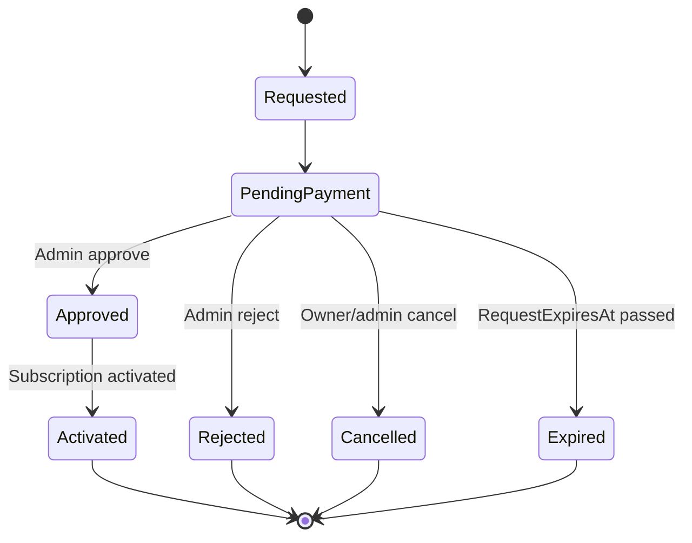

# SB-002 — Manual Billing Foundation (Final Report)

**Date:** 2026-07-03  
**Task:** SB-002 — Manual Billing Foundation  
**Depends on:** SB-001 Manual Billing Domain Blueprint  
**Type:** Backend foundation + minimal dashboard compatibility

---

## Summary

Implemented the **Manual Billing workflow foundation** by extending the existing `PlanUpgradeRequest` model and service — no subscription system redesign, no payment uploads, no admin UI redesign.

Upgrade requests now use a **9-state lifecycle** with validated transitions, **price/plan snapshots**, **request expiry** (`RequestExpiresAt`), **admin override logging**, and **owner/admin cancel** APIs. Existing `Pending` rows migrate to `PendingPayment`; completed approvals migrate to `Activated`.

---

## Files Changed

### Domain

| File | Change |
|------|--------|
| `src/DiscordBot.Domain/Enums/PlanUpgradeRequestStatus.cs` | Expanded enum (9 states) |
| `src/DiscordBot.Domain/Entities/PlanUpgradeRequest.cs` | Snapshots, expiry, override, cancel audit fields |
| `src/DiscordBot.Domain/Constants/ManualBillingDefaults.cs` | **New** — `RequestExpiryDays = 14` |
| `src/DiscordBot.Domain/SubscriptionBilling/PlanUpgradeRequestWorkflow.cs` | **New** — transition rules + validation |

### Infrastructure

| File | Change |
|------|--------|
| `src/DiscordBot.Infrastructure/Services/PlanUpgradeRequestService.cs` | Workflow, validation, expiry, cancel, override logging |
| `src/DiscordBot.Infrastructure/Data/Configurations/PlanUpgradeRequestConfiguration.cs` | New column config + `CancelledByUser` FK |
| `src/DiscordBot.Infrastructure/Models/UpgradeRequestDtos.cs` | `RequestExpiresAt`, `AdminOverrideReason`, review DTO |
| `src/DiscordBot.Infrastructure/Migrations/20260703003456_ManualBillingWorkflowFoundation.cs` | **New** migration + data remap SQL |
| `src/DiscordBot.Infrastructure/Migrations/20260703003456_ManualBillingWorkflowFoundation.Designer.cs` | **New** |
| `src/DiscordBot.Infrastructure/Migrations/AppDbContextModelSnapshot.cs` | Updated |

### API

| File | Change |
|------|--------|
| `src/DiscordBot.Api/Controllers/AdminController.cs` | Approve accepts override; cancel endpoint; BadRequest on invalid transitions |
| `src/DiscordBot.Api/Controllers/GuildsController.cs` | Owner cancel endpoint |

### Dashboard (compatibility only — not admin UI sprint)

| File | Change |
|------|--------|
| `dashboard/.../upgrade-request.models.ts` | New status union + active/reviewable helpers |
| `dashboard/.../subscription.component.ts` | Active request detection |
| `dashboard/.../admin-upgrade-requests.component.ts/html` | Reviewable status checks (not Pending) |
| `dashboard/.../i18n/en.json`, `ar.json` | New status labels |

### Documentation

| File | Change |
|------|--------|
| `docs/architecture/subscription-system.md` | Workflow, statuses, fields, API routes |

---

## Migration

**Name:** `20260703003456_ManualBillingWorkflowFoundation`

### Schema additions (`PlanUpgradeRequests`)

| Column | Type | Purpose |
|--------|------|---------|
| `RequestedPlanMonthlyPrice` | numeric(10,2) | Price snapshot |
| `EstimatedTotalAmount` | numeric(10,2) | Total snapshot |
| `RequestExpiresAt` | timestamptz? | Request expiry |
| `AdminOverrideReason` | varchar(2000)? | Admin bypass audit |
| `CancelledAt` | timestamptz? | Cancel timestamp |
| `CancelledByUserId` | uuid? | Cancel actor FK |

### Data migration (SQL in `Up()`)

| Old `Status` | Old meaning | New `Status` | New meaning |
|--------------|-------------|--------------|-------------|
| `0` | Pending | `1` | PendingPayment |
| `1` | Approved | `5` | Activated |
| `2` | Rejected | `6` | Rejected |

Additional SQL:

- Backfill `RequestedPlanMonthlyPrice` and `EstimatedTotalAmount` from `SubscriptionPlans`
- Set `RequestExpiresAt = CreatedAt + 14 days` for migrated `PendingPayment` rows

### Apply locally

```bash
dotnet ef database update \
  --project src/DiscordBot.Infrastructure \
  --startup-project src/DiscordBot.Api
```

Local apply failed in dev environment (design-time connection `ef` user auth) — migration compiles; apply on Railway/deploy with production connection string.

---

## Workflow Implemented



**Also defined (transitions ready; APIs deferred):** `PaymentSubmitted`, `UnderReview`, request-more-info loop.

### Transitions enforced

`PlanUpgradeRequestWorkflow.EnsureTransition` validates every status change. Invalid transitions throw `InvalidOperationException` → API `400 Bad Request`.

---

## Business Rules

| ID | Rule | Status |
|----|------|--------|
| BR-R04 | One active (non-terminal) request per guild | ✅ |
| BR-R05 | Snapshot current + requested plan at create | ✅ (existing + enforced) |
| BR-R06 | Snapshot price at create | ✅ `RequestedPlanMonthlyPrice`, `EstimatedTotalAmount` |
| BR-R02 | Cannot request Free plan | ✅ |
| BR-R03 | Valid duration months | ✅ |
| New | Cannot request current plan | ✅ |
| BR-A02 | Approve activates subscription | ✅ → `Activated` |
| BR-A03 | Reject leaves subscription unchanged | ✅ |
| Expiry | Lazy expire on read when `RequestExpiresAt` passed | ✅ |
| Override | `AdminOverrideReason` logged via `ILogger` when provided | ✅ |

---

## API Changes

| Method | Route | New/Updated |
|--------|-------|-------------|
| `POST` | `/api/guilds/{id}/subscription/upgrade-requests/{requestId}/cancel` | **New** — owner cancel |
| `POST` | `/api/admin/upgrade-requests/{id}/cancel` | **New** — admin cancel |
| `POST` | `/api/admin/upgrade-requests/{id}/approve` | Updated — `adminOverrideReason` in body |
| `POST` | `/api/guilds/{id}/subscription/upgrade-requests` | Creates `PendingPayment` with snapshots + expiry |

**Not added (deferred):** payment submit, receipt upload, billing config, request-info.

---

## Validation

| Check | Result |
|-------|--------|
| `dotnet build DiscordBot.sln` | ✅ Pass (0 errors) |
| `npm run build` (dashboard) | ✅ Pass (bundle budget warning — known, not blocker) |
| EF migration generated | ✅ `20260703003456_ManualBillingWorkflowFoundation` |
| `dotnet ef database update` (local) | ⚠️ Skipped — local DB auth failure; apply on deploy |
| Existing approve/reject flow | ✅ Preserved via `PendingPayment` + reviewable helpers |

---

## Remaining Work

| Item | Sprint |
|------|--------|
| Payment reference submission API | SB-003 |
| Receipt upload + storage | SB-004 |
| Payment instructions config + UI | SB-005 |
| Admin review UI (filters, override field, receipt) | SB-006 |
| Request-more-info transition API | SB-003 |
| Scheduled expiry worker | SB-007 (optional; lazy expiry works for beta) |
| `SubscriptionAuditLog` entity | Future |
| Update `ubiquitous-language.md` status list | Doc hygiene |

---

## Suggested Next Sprint

**SB-003 — Payment Proof Submission**

1. `PaymentReference` field + owner `PUT .../payment` endpoint
2. Transition `PendingPayment` → `PaymentSubmitted` → `UnderReview`
3. Owner dashboard payment instructions panel (static config)
4. Require reference before admin queue shows as review-ready (optional config)

**Estimated effort:** 2–3 days

---

## Definition of Done

| Criterion | Met |
|-----------|-----|
| Workflow exists with validated transitions | ✅ |
| Old `Pending` migrates to `PendingPayment` | ✅ (SQL in migration) |
| Old `Approved` migrates to `Activated` | ✅ |
| No existing subscription activation broken | ✅ |
| No payment upload | ✅ |
| No admin review UI sprint | ✅ (minimal status compat only) |

---

## Related Documents

- [Manual Billing Domain Blueprint](../domains/subscription-billing/manual-billing-domain-blueprint.md)
- [SB-001 Progress Report](2026-07-03-SB-001-manual-billing-domain-blueprint.md)
- [Subscription System](../architecture/subscription-system.md)
