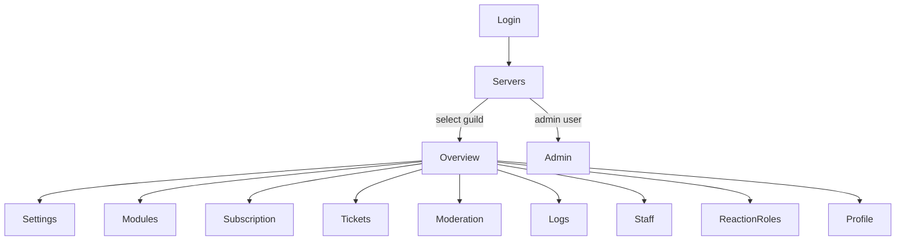

# RC-001 — Dashboard UX & Product Audit (Release Readiness)

**Date:** 2026-07-03  
**Audit ID:** RC-001  
**Type:** Product & UX audit — public beta preparation  
**Scope:** Full dashboard — all workspaces, navigation, flows, states, mobile, accessibility, IA  
**Explicitly out of scope:** Code quality, performance, backend architecture  
**Verdict:** **Conditional beta** — core guild-owner and moderator workflows are usable and largely polished, but several **trust-breaking UX gaps** and **permission/navigation surprises** must be fixed or explicitly documented before a broad public beta.

---

## Executive summary

The dashboard has matured into a **coherent guild workspace product** for English-speaking server owners: overview mission control, tickets/logs/moderation master-detail workspaces, settings studios (welcome/auto role), subscription billing, and staff role management follow a shared hero + toolbar + panel pattern. **Subscription and logs** are the strongest reference implementations.

Public beta readiness is held back not by missing pages, but by **product honesty**, **permission UX**, **terminology drift**, and **incomplete surfaces** that advertise actions the product cannot perform. Admin and Arabic RTL paths lag the guild experience.

| Dimension | Beta readiness | Notes |
|-----------|:--------------:|-------|
| Core owner workflows (settings, modules, profile) | **Ready with caveats** | Tab deep-linking, some meta hero stats |
| Moderator workflows (tickets, logs, moderation) | **Ready** | Filter UX differs across pages |
| Overview / first-run activation | **Mostly ready** | Onboarding checklist bug on zero-server state |
| Reaction roles workspace | **Not ready** | Hero CTA misleads; edit is toast-only |
| Staff / permissions management | **Not ready** | Destructive delete without confirmation |
| Subscription / billing | **Ready** | “Payments” stat label misleading |
| Admin platform | **Internal beta only** | Visual parity, mobile tables |
| Arabic / RTL | **Not ready** | Copy exists; layout parity incomplete |
| Auth / login | **Not ready for public** | Dev infra copy on login page |

**Recommended launch posture:** **Closed/coached beta** for English owner + moderator personas. Defer **public beta** until Critical issues below are resolved or masked.

---

## Workspaces reviewed

| Workspace | Route | Primary persona | Workspace pattern |
|-----------|-------|-----------------|-------------------|
| Login / OAuth callback | `/login`, `/auth/callback` | All | Standalone card |
| Servers (landing) | `/servers` | All | Onboarding + grid |
| Overview | `/guilds/:id/overview` | Owner | Mission control hero |
| Settings | `/guilds/:id/settings` | Owner | Tabbed hero + studios |
| Profile | `/guilds/:id/profile` | Owner | Hero + sticky preview |
| Modules | `/guilds/:id/modules` | Owner | Hero + module cards |
| Subscription | `/guilds/:id/subscription` | Owner | Hero + billing flow |
| Tickets | `/guilds/:id/tickets` | Moderator | Master/detail + drawer |
| Ticket transcript | `/guilds/:id/tickets/:id/transcript` | Moderator | Standalone page |
| Moderation log | `/guilds/:id/moderation` | Moderator | Master/detail |
| Moderation permissions | `/guilds/:id/moderation/settings` | Owner | Hero + table form |
| Logs | `/guilds/:id/logs` | Moderator | Master/detail |
| Reaction roles | `/guilds/:id/reaction-roles` | Owner | Master/detail (read-mostly) |
| Staff / role management | `/guilds/:id/staff` | Owner | Master/detail + editor mode |
| Admin home / guilds / users / plans / upgrade requests | `/admin/**` | Platform admin | Legacy stat + table UI |

---

## Critical issues (fix or explicitly gate before public beta)

Prioritized by **user trust**, **data loss risk**, and **misleading affordances**.

### C1 — Reaction roles hero CTA promises “Create panel” but only scrolls

**Impact:** High — breaks trust on a flagship module page  
**Where:** Reaction roles workspace — hero primary action `workspaceHero.reactionRoles.cta.create` (“Create panel”)  
**Behavior:** `onHeroPrimaryAction()` scrolls to the panel list; creation is Discord-only (`/reaction-role create`). Detail “Edit” shows a success toast with `editHint`, not an editor.  
**Empty state** correctly says create in Discord; **hero CTA contradicts** that message.  
**Fix direction:** Rename CTA to “View panels” / “Open Discord guide”, remove create wording, or disable CTA until in-dashboard creation exists.

---

### C2 — Staff role delete executes immediately with no confirmation

**Impact:** High — irreversible permission mapping loss  
**Where:** Staff workspace — `removeRole()` calls API on button click with no dialog  
**Contrast:** Logs clear-all, subscription cancel, admin upgrade review use proper modals; staff delete is one click + toast.  
**Fix direction:** Match logs/subscription confirm-overlay pattern before any beta with staff admins.

---

### C3 — Login page exposes infrastructure details to all users

**Impact:** High — unprofessional, security-adjacent noise for public users  
**Where:** Login card — raw API URL and Railway env var hint (`Discord__DashboardUrl`)  
**Fix direction:** Remove dev hints from production build or gate behind environment flag.

---

### C4 — Onboarding checklist shows 0% progress on zero-server welcome screen

**Impact:** High — undermines first-time user trust at the most important moment  
**Where:** Servers empty state — `onboardingChecklist` getter returns `emptyChecklist()` always, while numbered steps above describe real progress  
**Behavior:** User sees “0 of 6 complete / 0%” while following invite/setup steps. Per-guild checklist on server cards works when guilds exist.  
**Fix direction:** Hide progress bar on zero-guild state, or drive checklist from onboarding API / step completion.

---

### C5 — Permission denials redirect silently (no access-denied feedback)

**Impact:** High — moderators and mixed-role users get confusing navigation  
**Where:** `GuildAccessGuard` — denied owner routes redirect to moderation or `/servers` with no toast, banner, or page  
**Related:** Server cards always show “Open Dashboard” and “Settings” (owner routes) regardless of user’s actual access.  
**Fix direction:** Access-denied empty state or toast; role-aware CTAs on server cards.

---

### C6 — Notifications bell appears interactive but does nothing

**Impact:** Medium–high — false affordance in global chrome  
**Where:** Dashboard topbar — bell button with aria-label, no click handler, `notificationsOpen` unused  
**Fix direction:** Remove until notifications ship, or add “Coming soon” disabled state with explanation.

---

### C7 — Subscription hero stat “Payments” counts approved requests, not payments

**Impact:** Medium–high — misleading during manual billing beta  
**Where:** Subscription workspace hero — `completedPayments` filters `Approved` upgrade requests  
**Fix direction:** Rename stat to “Approved requests” or hide until real payment tracking exists.

---

### C8 — Auth error copy not fully internationalized

**Impact:** Medium–high — blocks credible Arabic launch  
**Where:** Login/callback — hardcoded English fallbacks alongside i18n keys  
**Fix direction:** Wire all auth strings through `en.json` / `ar.json` before marketing Arabic support.

---

## Important improvements (should ship early in beta)

Prioritized by **cross-workspace impact** and **consistency debt**.

### I1 — Unify load-error pattern (`app-error-state` vs `app-empty-state`)

**Impact:** High (consistency)  
**Split today:**

| `app-error-state` | `app-empty-state` + ⚠️ for errors |
|-------------------|-------------------------------------|
| Overview, tickets, logs, moderation, modules, profile, reaction roles, subscription | Servers, settings, staff, moderation-settings, all admin pages, ticket transcript |

Users hitting the same failure type see different UI. Standardize on `app-error-state` with retry for load failures.

---

### I2 — Terminology drift (Server vs Guild, Staff naming)

**Impact:** High (IA + i18n)  
**Examples:**

- Nav/titles: **Servers** vs admin **Guilds**
- Same page: nav “Roles & permissions”, hero “Role permission management”, Arabic nav “الطاقم” (staff/team)
- Modules breadcrumb “Modules” vs hero “Bot modules”

Align customer-facing terms per [UL-001](../blueprint/ubiquitous-language.md) or document intentional admin-only vocabulary.

---

### I3 — Navigation discoverability and scanability

**Impact:** High  
**Issues:**

- ~11 flat guild nav items with no grouping (Configure vs Moderate vs Billing)
- Duplicate icons: Profile + Overview (`overview`), Moderation + Moderation permissions (`shield`), two admin entries with `subscription` icon
- Server switcher hidden when zero guilds — sidebar feels empty during onboarding
- Switcher always navigates to Overview, not last visited page

---

### I4 — Unify destructive confirmation patterns

**Impact:** High  
**Native `window.confirm` still used:** ticket close, moderation-settings role delete, settings auto-reply delete, admin plan delete  
**Polished modals used:** subscription cancel, logs clear-all, admin upgrade approve/reject  

Pick one pattern for beta; logs/subscription modals are the template.

---

### I5 — Settings tabs not URL-addressable

**Impact:** Medium–high  
**Behavior:** `activeTab` is component state; reload always returns to General. Welcome, Auto Role, logs, tickets, panel, auto-replies tabs cannot be linked from overview drawer, docs, or support.  
**Fix direction:** Query param or child route (`?tab=welcome`) without changing visible URL structure if desired.

---

### I6 — Onboarding checklist is read-only with no deep links

**Impact:** Medium–high  
**Where:** Servers empty state + checklist component — hints reference `/setup`, `/ticket setup` but items are not clickable links to Settings, Modules, Subscription.  
**Fix direction:** Link each item to the relevant dashboard route when guild exists.

---

### I7 — Filter UX inconsistency (instant vs Apply)

**Impact:** Medium  
| Instant apply | Manual Apply/Clear |
|---------------|-------------------|
| Tickets (status pills), Staff (search/select), Reaction roles (pills/channel), Admin upgrade requests | Moderation, Logs |

Document for beta testers or align behavior within persona (feeds vs audit logs).

---

### I8 — Hero stats that mislead or add little value

**Impact:** Medium  
| Page | Issue |
|------|-------|
| Tickets | “Page 1/3” in hero — operator meta, not user value |
| Settings | “Sections” = visible tab count — internal metric |
| Logs | Five stats in four-column grid; unused i18n keys for storage/retention |
| Staff vs moderation-settings | Identical stat labels for different concepts |

Audit hero stats against PX-002 “decision-support” rule; remove or replace meta counters.

---

### I9 — Missing empty states

**Impact:** Medium  
- **Modules:** No empty state if module list is empty after load  
- **Admin plans:** No empty state when zero plans exist  
- **Auto-replies tab (settings):** Plain muted text, not `app-empty-state`

---

### I10 — Mobile master-detail breakpoint split (960px vs 1023px)

**Impact:** Medium  
Staff uses custom 960px editor/detail behavior; global `workspace-layouts.css` uses 1023px bottom sheet. Users feel different mobile patterns on adjacent pages.

---

### I11 — No post-login return URL / deep-link preservation

**Impact:** Medium  
OAuth and auth guard always land on `/servers`. Shared links to settings/tickets lose context after re-login.

---

### I12 — Admin workspace visual and mobile parity

**Impact:** Medium (admin-only but visible to operators)  
Admin pages use pre-workspace `stat-card` + wide tables without hero, card fallbacks, or mobile layouts. Upgrade requests table (~13 columns) is unusable on phone.

---

### I13 — RTL layout incomplete despite Arabic translations

**Impact:** Medium (blocking for Arabic marketing)  
`ar.json` mirrors structure, but `rtl.css` covers feed workspaces only — not overview mission control, hero band, subscription, modules, profile, admin, settings tabs.  
**Fix direction:** RTL pass on high-traffic paths or defer Arabic launch explicitly.

---

### I14 — Toast accessibility and error urgency

**Impact:** Medium  
All toasts use `aria-live="polite"`; errors not `assertive`. Auto-dismiss 4.5s without pause. Error toasts should announce urgently for screen reader users.

---

### I15 — Server cards expose raw Discord guild IDs

**Impact:** Medium (noise for non-technical owners)  
Monospace guild ID on every card adds clutter without user value.

---

### I16 — Moderation-only users see owner CTAs on server cards

**Impact:** Medium  
“Open Dashboard” / “Settings” lead to guard redirects (see C5).

---

## Nice-to-have improvements (polish backlog)

Prioritized by delight and long-term quality; safe to defer past closed beta.

### N1 — Profile menu is logout-only

No account preferences, language is separate in header — acceptable but thin for a SaaS product.

### N2 — Wildcard routes redirect to `/servers` instead of 404

Mistyped URLs feel like arbitrary jumps; minor confusion.

### N3 — Unify retry copy (`Try again` vs `Retry` vs overview-specific keys)

Low friction consistency win.

### N4 — Consolidate hero i18n under one namespace

`workspaceHero.*`, `modules.hero.*`, `subscription.hero.*`, `staff.workspace.hero.*` — copy audit overhead, not user-visible alone.

### N5 — Skeleton loading only on overview

Extend skeleton pattern to settings, tickets queue, admin tables for perceived performance.

### N6 — Unsaved-changes warning on profile/settings navigate away

Prevent accidental loss on long forms.

### N7 — Remove decorative emoji inconsistency

Empty states mix emoji (⚠️, 🔒, 🚀) with `app-ui-icon` elsewhere — acceptable per design system but uneven tone.

### N8 — Hero CSS hardcoded gradients vs design tokens

Visual distinctive; future theming debt per PP-001.

### N9 — Ticket transcript uses topbar title not workspace hero

Functional; optional alignment with guild workspace language.

### N10 — Search/sort on servers list for power users with many guilds

Advanced user quality-of-life.

### N11 — Post-login welcome moment

Success OAuth lands silently on servers — optional orientation overlay for first login.

### N12 — Moderation detail panel is read-only with no cross-links

No jump to user, channel, or related ticket — advanced moderator friction.

### N13 — Privacy/terms copy near OAuth button

Standard SaaS expectation for public launch.

### N14 — `errors.generic` defined but unused

Missed fallback for friendly error tone.

### N15 — Community pulse / mission dismiss snooze discoverability

Advanced overview feature; low priority unless analytics show confusion.

---

## Workspace scorecard (product UX)

Scores reflect **beta readiness for intended persona**, not code quality.

| Workspace | Score | Strengths | Top gap |
|-----------|:-----:|-----------|---------|
| **Overview** | 8/10 | Mission hero, activity timeline, context drawer, permission-aware | Double error (page + toast) on load fail |
| **Settings** | 7/10 | Welcome/auto-role studios, tab hero, sync/save toasts | Tabs not in URL; error component split |
| **Tickets** | 8/10 | Master/detail, drawer reply, filter pills, transcript link | Close uses native confirm |
| **Logs** | 9/10 | Best-in-class empty/filtered/select trilogy; clear-all modal | Filter apply vs tickets instant |
| **Moderation** | 8/10 | Permission gate, rich filters, detail panel | Read-only detail; no cross-links |
| **Moderation settings** | 6/10 | Hero + table CRUD | Delete confirm; missing `ws-page` shell |
| **Modules** | 7/10 | Hero CTA adapts to plan state | No empty modules state |
| **Subscription** | 8/10 | Billing modals, mobile sticky CTA, history | “Payments” stat label |
| **Profile** | 8/10 | Live preview rail, validation, hero save | No unsaved warning |
| **Staff** | 6/10 | Editor mode focus, filter bar, empty CTAs | **Delete without confirm** |
| **Reaction roles** | 4/10 | Good read/preview/deactivate | **Misleading create/edit CTAs** |
| **Servers** | 7/10 | Strong zero-guild onboarding | Checklist 0% bug; raw guild IDs |
| **Ticket transcript** | 7/10 | Clear archive notice, pagination | Error via empty-state not error-state |
| **Admin** | 5/10 | Upgrade review modals are strong | No hero; mobile tables; visual drift |
| **Auth** | 5/10 | Simple OAuth flow | Dev hints on login; no return URL |

---

## User experience lenses

### First-time user (FTU)

**Works well:**

- Zero-server onboarding hero with numbered steps and invite CTA  
- Servers refresh after bot invite  
- Overview mission control orients toward setup tasks  
- Onboarding hints reference Discord commands  

**Friction:**

- Checklist shows 0% while steps imply progress (**C4**)  
- Checklist items don’t link anywhere (**I6**)  
- No explanation when permission redirect happens (**C5**)  
- Login shows developer infrastructure (**C3**)  

**FTU recommendation:** Fix C3, C4, I6 before marketing “5-minute setup.”

---

### Advanced user (power owner / head moderator)

**Works well:**

- Master/detail workspaces with keyboard-friendly panels (staff editor Escape to cancel)  
- Logs clear with typed confirmation  
- Subscription change flow stepper  
- Context drawer deep links from overview  
- Filter + pagination on tickets/logs  

**Friction:**

- Settings tab state lost on refresh (**I5**)  
- Inconsistent filter apply models (**I7**)  
- No server search at scale (**N10**)  
- Moderation detail without cross-navigation (**N12**)  
- Admin tables on mobile (**I12**)  

---

## Navigation & information architecture

**IA strengths:** Clear hub (Overview), guild context in sidebar, RBAC-filtered nav items.  
**IA weaknesses:** Flat nav list, terminology drift, no grouping, admin visual island, reaction roles positioned as fully manageable in-dashboard when it is observational.

---

## Visual & workspace consistency

**Unified (guild beta surface):**

- `page-workspace-hero` + `ws-page` / `ws-atf` / `ws-toolbar` / `ws-master-detail`  
- `app-page-notice` on complex modules  
- Shared empty/filtered/select trilogy on feed workspaces  

**Divergent:**

- Admin stat-card + table era  
- Servers onboarding card (intentionally different — OK if branded as “home”)  
- Moderation-settings missing full `ws-page` shell  
- Error/loading component choice varies  

**Design system alignment:** PP-001 tokens adopted on guild pages; hero gradients and admin pages lag documented token-only rule.

---

## Accessibility summary

| Area | Status |
|------|--------|
| Workspace ARIA (lists, filters, detail panels) | Good on feed pages |
| Hero `role="region"`, `aria-busy` | Good |
| Loading `role="status"` | Good |
| Error announcements | Weak — no `role="alert"` on errors |
| Heading hierarchy | Multiple H2s (hero H1 + empty H2 + sections) |
| Status badges | Visual only — no programmatic status |
| Notifications control | Misleading |
| RTL | Partial — see I13 |
| Mobile touch targets | Generally adequate; admin tables fail |

---

## Release readiness verdict

### Ready for closed beta (with coaching)

- English-speaking **server owners**: settings, modules, profile, subscription, overview  
- **Moderators**: tickets, logs, moderation log  
- **Platform admins**: desktop-only, aware of table UX limits  

### Not ready without fixes

- **Public beta** — fix **C1–C7** minimum  
- **Arabic public launch** — fix **C8, I13**  
- **Reaction roles self-serve story** — fix **C1** or remove module from marketing  
- **Staff permission management** — fix **C2** before handing to customers  

### Suggested beta communications (known limitations)

If shipping before all Important items:

1. Reaction roles: manage in Discord; dashboard is preview/monitor only  
2. Manual billing: subscription stats are request counts, not payment processor data  
3. Admin console: desktop recommended  
4. Arabic: English-first beta  
5. Moderators: use sidebar nav, not server card Settings button  

---

## Prioritized remediation roadmap

| Phase | Items | Goal |
|-------|-------|------|
| **Pre-beta blockers** | C1, C2, C3, C4, C5, C6, C7 | Trust + safety + FTU |
| **Beta polish sprint** | I1–I10 | Consistency + IA |
| **Public beta** | I11–I16, C8 | Deep links, RTL, admin mobile |
| **GA polish** | N1–N15 | Delight + power users |

**Estimated blocker count:** 7 critical · 16 important · 15 nice-to-have

---

## Related documents

| Document | Relationship |
|----------|--------------|
| [frontend-performance-audit.md](./frontend-performance-audit.md) | Architecture complete; not UX |
| [global-experience-audit.md](./global-experience-audit.md) | UX-002 prior pass; RC-001 updates for post-lazy-load product |
| [design-system.md](../design/design-system.md) | Visual standards referenced |
| PERF-002 / PERF-003 progress | Performance work complete |

---

*Audit complete — no implementation performed per RC-001 scope.*
