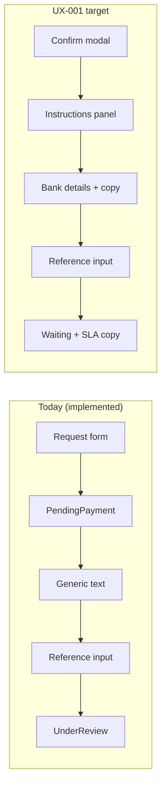

# Subscription Page — Design & UX Review

**Review ID:** SUB-UX-001  
**Date:** 2026-07-03  
**Status:** Review complete — no implementation  
**Scope:** Guild owner page `/guilds/:id/subscription` (+ cross-reference to admin queue)  
**Frozen:** Overview Mission Control (UI-005) — out of scope  

---

## Authority alignment

This review evaluates the live Subscription page against:

| Document | Role |
|----------|------|
| [PX-001 Product Experience Architecture](../ux/product-experience-architecture.md) | Mission, trust, CTA, copy, loading, hierarchy |
| [PX-002 Product Decision Architecture](../ux/product-decision-architecture.md) | Billing missions, precedence, dismiss rules |
| [UX-001 Subscription Experience](../ux/subscription-experience.md) | Manual billing journey, screens, status UX |
| [SB-003 Subscription Change Flow](../progress/2026-07-03-SB-003-subscription-change-flow.md) | Owner stepper, payment reference, history |
| [SB-004 Admin Subscription Review](../progress/2026-07-03-SB-004-admin-subscription-review.md) | Admin queue polish; owner gaps noted |
| [PP-001 Design System](../design/design-system.md) | Tokens, cards, dialogs, badges, page widths |

**Live baseline reviewed:** `subscription.component.{html,ts,css}`, `en.json` / `ar.json` `subscription.*`, admin upgrade-requests page, Modules locked state.

---

## Executive summary

SB-003 delivered a **functionally complete** manual billing loop: current plan, change stepper, payment reference submission, waiting state, cancel dialog, plan grid, and history table. SB-004 strengthened the admin side. The owner page is **usable for Closed Beta** but does **not yet feel like a premium SaaS billing surface** (Stripe / Linear / Vercel tier).

The largest gaps are **information architecture and trust**, not missing API:

1. **No single mission focus** — the page stacks seven card sections with duplicated plan information.  
2. **Payment instructions are abstract** — no bank details, copy targets, or reference format; owners cannot complete payment from the page alone.  
3. **Terminal journeys incomplete** — rejected, expired, and cancelled requests have no dedicated owner UX; rejection reasons are not surfaced.  
4. **Confirmation step missing** — money moves off-platform without a confirmation modal or beta disclaimer at commit time.  
5. **Mobile and stepper patterns** — vertical list stepper and history table under-deliver vs UX-001 mobile spec.

**Verdict:** Keep the SB-003 foundation. Redesign should be **restructure + copy + trust panels**, not a new billing backend.

---

## What works

### Journey & backend alignment (SB-003)

| Area | Assessment |
|------|------------|
| **Status API** | `GET /subscription/status` drives `currentChange` — single source of truth |
| **Change stepper** | Five steps map to real workflow states; progress is understandable |
| **Payment reference** | Form appears only at `PendingPayment`; submit advances to review |
| **Waiting card** | Clear copy for `PaymentSubmitted` / `UnderReview` |
| **Cancel flow** | Platform dialog (not `window.confirm`); EN/AR strings present |
| **Renew shortcut** | Header renew button pre-fills plan and scrolls to request form |
| **History table** | Type, status, plan, created — baseline audit trail |
| **Beta notice** | Manual billing disclosed at top — aligns with UX-001 principle 8 |

### Product & design system

| Area | Assessment |
|------|------------|
| **Owner guard** | Route restricted to guild owner — matches UX-001 permission model |
| **Page width** | `page-medium` — appropriate for billing forms (PP-001) |
| **Loading / load error** | Standard `app-loading-state` + `app-empty-state` with retry |
| **Dialogs** | Cancel uses shared `confirm-overlay` / `confirm-dialog` pattern |
| **Module names** | i18n lookup with fallback for `allowedModules` list |
| **Admin queue (SB-004)** | Filters, payment reference column, approve/reject dialogs — operator-ready |

### Copy foundations (EN/AR)

- Core journey strings exist in parity: stepper, payment, waiting, cancel, change types, statuses.  
- Tone is generally professional — no “snowflake” jargon, no gamification.  
- `betaBillingNotice` sets manual billing expectations early.

---

## What feels unprofessional

### 1. Page lacks mission hierarchy (PX-001 P-01, P-13)

The Subscription page answers **multiple questions at once**:

- What is my plan?  
- What should I do now?  
- How do I compare tiers?  
- How do I start a change?  
- What happened in the past?

Everything is given **equal visual weight** (same `.card` stack). There is no page title, no status strip, and no “one primary CTA” zone. Compare to Overview Mission Control: one hero mission, secondary in drawer.

**Feels like:** Admin form page from 2018, not Stripe Customer Portal.

### 2. Duplicated plan information (PX-001 P-05)

Plan name, description, modules, and price appear in:

1. Current plan card  
2. Request change form (select + estimates)  
3. Plans grid (every tier again)

On a typical visit, the owner reads the same modules list **three times**. This increases scroll and cognitive load without adding trust.

### 3. Card stacking without rhythm (PP-001)

Seven sections in sequence with similar padding and borders:

```
Beta notice → Current plan → Activated → Stepper → Payment → Waiting → Request form → Plans grid → History
```

When a change is in progress, **four to six cards** may be visible simultaneously. No progressive disclosure; inactive sections (request form while `hasActiveChange`) remain on screen disabled — a greyed form still reads as “broken UI.”

### 4. Stepper presentation

- UX-001 specifies **horizontal stepper on desktop**, vertical on mobile.  
- Implementation is a **vertical numbered list** only — functional but not polished.  
- No status badges/icons from UX-001 §4 token table (clock, wallet, hourglass).  
- Step labels are plain text; current step lacks visual prominence beyond marker color.

### 5. Legacy copy drift

`en.json` / `ar.json` still contain **unused legacy keys** from pre–SB-003 UI:

- `devNote`, `pendingRequestTitle`, `requestUpgradeTitle`, `requestUpgradeHint`, `requestUpgradeButton`, `pendingApprovalNote`

These suggest incomplete migration and risk translators maintaining dead strings. Some keys duplicate newer `requestChange*` / `changeRequest*` wording.

### 6. Activated success underwhelming

When paid and active, a green `card-status is-success` block appears — good — but:

- No **Go to Modules** primary CTA (UX-001 Activated spec)  
- Competes visually with beta notice and current plan card  
- Uses `lastActivatedRequest` from history scan — could show stale activation if multiple rows exist

### 7. Modules ↔ Subscription link gap (UX-001 §2)

Modules page shows `lockedByPlan` + `upgradePlan` text but **no link** to Subscription with plan name in CTA. Broken loop from locked module to billing.

---

## Payment flow clarity

### Current owner path

```
Select plan + duration → Submit (no modal) → Toast → Stepper + Payment card
→ Generic instructions paragraph → Enter reference → Submit → Waiting card
```

### What is clear

| Step | Clarity |
|------|---------|
| Estimated total | Shown in request form and payment card with monthly × duration |
| Request expiry | `requestExpiresHint` with formatted date |
| Reference field | Label, placeholder, hint (no upload in beta) |
| After submit | Waiting copy + submitted timestamp |

### What is unclear or missing (UX-001 gaps)

| Gap | Impact |
|-----|--------|
| **No bank / payment destination** | Owner must leave dashboard to find how to pay — highest friction point |
| **No reference format example** | Placeholder only; no “use guild name + date” pattern |
| **No copy-to-clipboard** for amount or reference | Stripe-style copy buttons absent |
| **No confirmation modal** before submit | Money commitment without final review (plan, total, expiry preview, beta note) |
| **Instructions duplicated vaguely** | Beta notice + `paymentInstructions` repeat “pay off-platform” without specifics |
| **USD hardcoded** | `currency:'USD'` in template — acceptable for beta if documented; AR locale doesn’t change symbol placement rules in all browsers |
| **Estimated expiry logic** | `addMonths(new Date(), duration)` ignores current subscription end date on renewal — misleading preview |

### Payment flow diagram (as-implemented vs target)



**Clarity score:** 6/10 for beta insiders who know bank details out-of-band; **3/10** for self-serve owners reading only the dashboard.

---

## Manual billing trust

PX-001 trust architecture requires: honest state, visible deadlines, rejection reasons, no surprise billing.

| Trust commitment (UX-001 § trust) | Status |
|-----------------------------------|--------|
| Always show current plan + expiry | ✅ Current plan card |
| Show request deadline | ✅ When `requestExpiresAt` set |
| Show estimated total before pay | ✅ Payment card + form |
| Rejection reason visible to owner | ❌ Not in UI; `adminNote` key exists but unused in history |
| Owner sees same truth as admin | ⚠️ Partial — admin sees reference in queue; owner sees own reference only in waiting hint |
| Manual beta disclosed | ✅ Beta notice |
| No fake “paid” state | ✅ Subscription unchanged until admin approve |
| SLA expectation | ❌ UX-001 “1–2 business days” not in `waitingReviewBody` |
| Who cancelled (owner vs admin) | ❌ Not shown |
| Request expired state | ❌ No dedicated card when status `Expired` |

**Trust killers today:**

1. Paying without on-page destination details feels **informal / risky**.  
2. Rejection without reason feels **opaque** — undermines PX-001 “bad news not hidden.”  
3. Disabled request form during active change looks like a **bug**, not policy.

---

## Arabic / English copy

### Strengths

| Area | EN | AR |
|------|----|----|
| Stepper steps | Clear verbs | Natural equivalents |
| Payment / waiting | Professional | Parity maintained |
| Cancel dialog | Respectful | Parity maintained |
| Status enum keys | Lowercase normalized in code | Matching keys |

### Issues

| Issue | Detail |
|-------|--------|
| **Legacy key duplication** | Two parallel vocabularies (`requestUpgrade*` vs `requestChange*`) — consolidate before next copy pass |
| **Duration pluralization** | AR uses `{{count}} شهر` for all counts — should use plural forms for 2+ (grammar) |
| **Priority labels in history** | Status strings are translated; table headers use generic `common.status` — OK |
| **Hard-coded `$` via Angular currency pipe** | EN/AR both show USD; document as beta policy or localize |
| **Date formatting** | `date:'medium'` depends on Angular locale registration — verify Arabic month names in runtime |
| **“Off-platform”** | EN stepper “Pay off-platform” — AR “الدفع خارج المنصة” — good; ensure support docs use same term |
| **Missing strings for future states** | Rejected headline, expired headline, duplicate-request error — spec written, keys absent |

### Copy recommendation

Run a **single SUB-COPY-001 pass**: delete legacy keys, add rejection/expiry/duplicate strings, add SLA line to waiting body, add confirmation modal copy EN/AR before FE work.

---

## Empty / loading / error states

| Context | UX-001 spec | Implemented |
|---------|-------------|-------------|
| **Loading** | Skeleton or spinner | ✅ `app-loading-state` |
| **Load error** | Retry | ✅ Empty state + try again |
| **No active request (idle)** | “Ready to upgrade?” empty | ❌ Request form always visible |
| **No history** | Empty inbox message | ❌ History section hidden when length 0 |
| **No paid plans** | Contact support | ❌ Form with empty plans edge case unhandled |
| **Duplicate active request** | View / cancel CTA | ⚠️ API error toast only |
| **Rejected terminal** | Banner + reason + retry | ❌ Missing |
| **Expired request** | Start new change | ❌ Missing |
| **Permission denied** | Owner-only message | ⚠️ Guard redirects — no in-page empty |
| **Payment reference invalid** | Inline validation copy | ⚠️ API error toast only |

**Error handling pattern:** Most failures use **toast + generic message** — acceptable for v1 but below UX-001 error table (headline + recovery CTA on page).

---

## Mobile / RTL

### Mobile (UX-001 §9)

| Pattern | Spec | Current |
|---------|------|---------|
| Plan grid | Single column | ✅ Grid collapses via default card stack (no dedicated responsive CSS in subscription.component.css) |
| Stepper | Vertical timeline | ✅ Vertical (but also vertical on desktop — misses desktop horizontal) |
| History | Card list | ❌ Full `data-table` — horizontal scroll on small screens |
| Payment CTA | Sticky bottom bar | ❌ Inline buttons only |
| Touch targets | 44×44 min | ⚠️ `btn-sm` on secondary actions may undershoot |
| Dialogs | Full-screen sheet | ❌ Center modal only |

### RTL

| Area | Assessment |
|------|------------|
| Layout | Logical properties not used in subscription CSS — relies on global `rtl.css` |
| Tables | History table LTR column order — acceptable with scroll |
| Chevrons | Plan cards / links — no directional icons on subscription page |
| Form labels | Standard block labels — OK in RTL |
| Currency + dates | Verify visual order of `$` amount and parentheses in AR |

**RTL score:** 7/10 passive compatibility; **no subscription-specific RTL polish**.

---

## Recommended redesign

**Principle:** One page → one mission: **“Complete or manage your subscription change.”** Everything else is supporting context.

### Proposed information architecture

```
┌─────────────────────────────────────────────────────────────┐
│  PAGE HEADER: Subscription · [Plan badge] · [Expiry]      │
├─────────────────────────────────────────────────────────────┤
│  MISSION ZONE (state-driven — only ONE primary block)       │
│  • Idle: Compare + "Request change" CTA                     │
│  • PendingPayment: Instructions + amount + reference form   │
│  • UnderReview: Waiting + SLA + optional cancel             │
│  • Rejected/Expired/Cancelled: Result + reason + retry     │
│  • Active (no change): Renewal nudge if within 7d         │
├─────────────────────────────────────────────────────────────┤
│  STATUS STRIP: horizontal stepper when change active        │
├─────────────────────────────────────────────────────────────┤
│  SECONDARY (collapsed / tabs / drawer)                      │
│  • Plan comparison (compact table, not N cards)             │
│  • Change history (cards on mobile)                         │
└─────────────────────────────────────────────────────────────┘
```

### Visual direction (PP-001 + PX-001)

- Replace beta **card** with `.banner-beta` from design system.  
- Use **status badges** from PP-001 for request/subscription states — not ad-hoc colored paragraphs.  
- **Hide** request form entirely when `hasActiveChange` — show link “Start new request after current completes.”  
- **Payment instructions panel**: monospace IBAN block, copy buttons, amount highlight, deadline chip.  
- **Confirmation modal** before create: plan, duration, total, expiry preview, beta manual billing checkbox copy.  
- **History**: row expand for rejection reason, duration, total; mobile card layout.

### Alignment with PX-002 billing missions

Overview Mission Card already handles `SubscriptionExpired` / expiring missions (PX-002 catalog). Subscription page should **echo the same truth** — not contradict expiry dates or plan names. Deep-link from Mission CTA should scroll/focus the mission zone on Subscription.

### Admin (out of owner sprint scope but linked)

Owner rejection UX depends on admin always filling `adminNote` (SB-004 enforced). Next owner sprint should **read `adminNote` in history and rejected banner**.

---

## Top implementation tasks

Prioritized for a future **FE-SUB-001** sprint (do not start now).

### P0 — Trust & payment clarity

| # | Task | Rationale |
|---|------|-----------|
| 1 | **Payment instructions panel** — static config (bank name, IBAN, beneficiary, reference format) + copy buttons | UX-001 blocker for self-serve manual billing |
| 2 | **Confirmation modal** before `createUpgradeRequest` — summary + beta disclaimer | PX-001 P-03 surprise prevention |
| 3 | **Rejected / expired / cancelled result cards** with `adminNote`, retry CTA | PX-001 trust; SB-004 follow-up |
| 4 | **Hide request form** when active change; surface “view active request” anchor | Reduces broken-ui perception |

### P1 — Hierarchy & polish

| # | Task | Rationale |
|---|------|-----------|
| 5 | **Mission zone refactor** — single state-driven hero section | PX-001 P-01 |
| 6 | **Collapse plan comparison** — one compact comparison table; remove duplicate modules prose | PX-001 P-05 |
| 7 | **Horizontal stepper desktop** / vertical mobile | UX-001 §9 |
| 8 | **History enhancements** — duration, total, rejection reason; mobile cards | UX-001 history spec |
| 9 | **Activated CTA** — “Go to Modules” primary | UX-001 Activated spec |
| 10 | **Fix renewal expiry preview** — extend from current `expiresAt`, not `today` | Billing honesty |

### P2 — Copy & cross-page

| # | Task | Rationale |
|---|------|-----------|
| 11 | **SUB-COPY-001** — remove legacy i18n keys; add missing status strings; SLA in waiting copy | EN/AR parity |
| 12 | **Modules locked → Subscription link** with plan name | UX-001 navigation IA |
| 13 | **Empty states** — no history, no plans, idle helper | UX-001 §5 |
| 14 | **Duplicate-request inline error** panel | UX-001 §6 |

### P3 — Nice to have

| # | Task | Rationale |
|---|------|-----------|
| 15 | Sticky payment CTA on mobile | UX-001 §9 |
| 16 | Admin billing settings page for instruction markdown | UX-001 OQ-7 |
| 17 | Request detail route `/subscription/requests/:id` | UX-001 v1.1 |
| 18 | Renewal banners 7/3/1 on Overview + Modules | PX-002 + UX-001 notifications |

---

## PX-001 checklist (subscription-focused excerpt)

| # | Question | Pass? |
|---|----------|-------|
| 1 | One page → one mission? | ❌ |
| 2 | One primary CTA per viewport? | ⚠️ Multiple primaries when cards stack |
| 3 | Truth over optimism? | ✅ |
| 4 | Scrolling for history only? | ❌ Too much above fold |
| 5 | No duplicate information? | ❌ |
| 6 | Trust architecture honored? | ⚠️ Rejection/expiry gaps |
| 7 | Loading honest? | ✅ |
| 8 | Empty states actionable? | ⚠️ Partial |
| 9 | EN/AR parity? | ⚠️ Legacy keys |
| 10 | Mobile mindset? | ⚠️ Table-heavy history |

---

## Admin cross-reference (SB-004)

The admin **Subscription Changes** queue is **ahead of the owner page** in polish. Owner redesign should not rework admin. Ensure:

- Rejection reasons entered in admin appear on owner history.  
- Status vocabulary matches (`UnderReview` not “pending approval” legacy copy).

---

## Governance

- **Overview is frozen** at UI-005 — no visual changes unless bugfix.  
- **This review is documentation only** — no code changes in SUB-UX-001.  
- Implementation waits for explicit sprint approval (**FE-SUB-001** or equivalent).

---

## Related documents

- [Subscription Experience Blueprint (UX-001)](../ux/subscription-experience.md)
- [Product Experience Architecture (PX-001)](../ux/product-experience-architecture.md)
- [Design System (PP-001)](../design/design-system.md)
- [SB-003 Progress](../progress/2026-07-03-SB-003-subscription-change-flow.md)
- [SB-004 Progress](../progress/2026-07-03-SB-004-admin-subscription-review.md)
