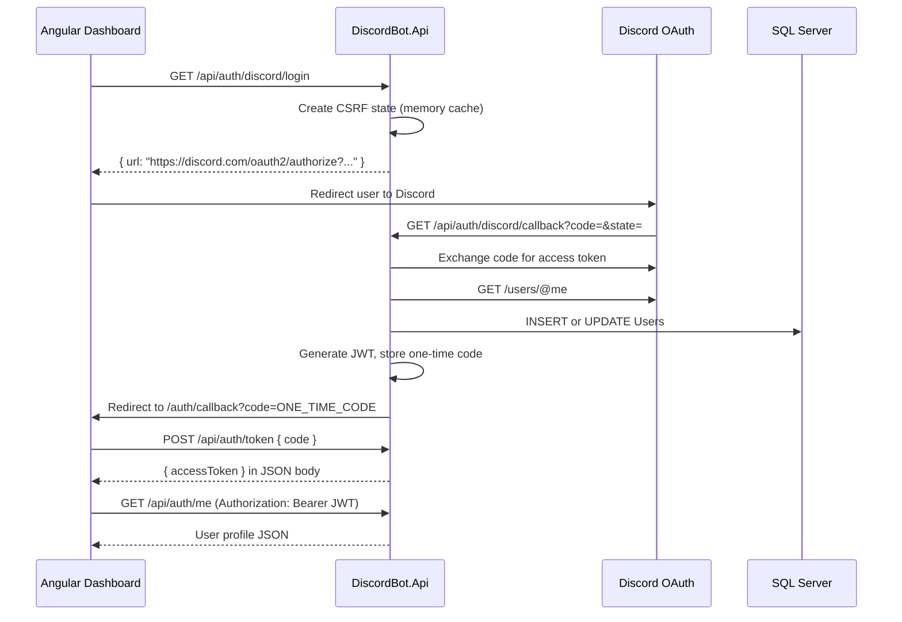

# Step 4 — Discord OAuth + JWT Authentication

Version 1 keeps auth simple: Discord login, upsert user, return JWT, protect endpoints.  
No refresh tokens, no RBAC, no admin panel.

---

## What happens when a user logs in



---

## API endpoints

| Method | Route | Auth | Purpose |
|--------|-------|------|---------|
| GET | `/api/auth/discord/login` | Public | Returns Discord authorize URL |
| GET | `/api/auth/discord/callback` | Public | Discord redirect target; creates user + one-time code |
| POST | `/api/auth/token` | Public | Exchange one-time code for JWT (JSON body) |
| GET | `/api/auth/me` | **JWT required** | Returns logged-in user profile |
| GET | `/api/health` | Public | Health check (unchanged) |

---

## Discord Developer Portal setup

1. Go to [Discord Developer Portal](https://discord.com/developers/applications)
2. Create an application (or use existing)
3. **OAuth2 → Redirects** — add:
   ```
   http://localhost:5217/api/auth/discord/callback
   ```
4. Copy **Client ID** and **Client Secret** into config
5. OAuth2 URL generator scope for v1: **`identify`** only

---

## Configuration

Set values in `appsettings.Development.json` (do not commit secrets):

```json
{
  "Discord": {
    "ClientId": "YOUR_CLIENT_ID",
    "ClientSecret": "YOUR_CLIENT_SECRET",
    "RedirectUri": "http://localhost:5217/api/auth/discord/callback",
    "DashboardUrl": "http://localhost:4200"
  },
  "Jwt": {
    "Secret": "dev-only-change-me-use-32-chars-minimum!!",
    "Issuer": "DiscordBot",
    "Audience": "DiscordBot.Dashboard",
    "ExpiresMinutes": 60
  }
}
```

Or use environment variables (see `.env.example`):

```
Discord__ClientId=...
Discord__ClientSecret=...
```

**Important:** `RedirectUri` must exactly match what is registered in Discord and what the API listens on (`launchSettings.json` → port `5217` for HTTP).

---

## File reference — every new/changed file and why it exists

### Infrastructure — Options

| File | Why it exists |
|------|----------------|
| `Options/DiscordOptions.cs` | Strongly typed `Discord` section from `appsettings.json` (ClientId, RedirectUri, DashboardUrl). Keeps magic strings out of services. |
| `Options/JwtOptions.cs` | Strongly typed `Jwt` section (Secret, Issuer, Audience, expiry). Same pattern as Discord options. |

### Infrastructure — Auth

| File | Why it exists |
|------|----------------|
| `Auth/DiscordApiModels.cs` | Internal JSON shapes for Discord API responses (`access_token`, user `id`, `username`). Not exposed outside Infrastructure. |
| `Auth/DiscordProfile.cs` | Public, minimal profile we use after OAuth — decouples Discord API from our `User` entity. |
| `Auth/IDiscordOAuthService.cs` | Interface for OAuth: build login URL + exchange code. Easy to mock in tests later. |
| `Auth/DiscordOAuthService.cs` | Talks to Discord HTTP API. Stores CSRF `state` in memory cache for 10 minutes. Scope `identify` only in v1. |
| `Auth/IJwtTokenService.cs` | Interface for creating JWT strings from a `User`. |
| `Auth/JwtTokenService.cs` | Signs JWT with HMAC-SHA256. Embeds `sub` (user Id), `discord_id`, and `unique_name` (username). |

### Infrastructure — Services

| File | Why it exists |
|------|----------------|
| `Services/IAuthService.cs` | Orchestrates login: OAuth → upsert user → JWT. Also loads user by Id for `/me`. |
| `Services/AuthService.cs` | **Business flow for login.** Finds user by `DiscordUserId` or creates new row, updates profile on every login, saves to SQL Server. |

### Infrastructure — DI

| File | Why it exists |
|------|----------------|
| `DependencyInjection.cs` | Registers DbContext, options, HttpClient, memory cache, and all auth services in one place. Called from `Program.cs`. |

### API — Models

| File | Why it exists |
|------|----------------|
| `Models/UserProfileDto.cs` | Safe JSON returned to dashboard — no internal entity leakage. |
| `Models/DiscordLoginResponse.cs` | Wrapper `{ "url": "..." }` for the login endpoint. |

### API — Controllers

| File | Why it exists |
|------|----------------|
| `Controllers/AuthController.cs` | Three endpoints: login URL, OAuth callback, current user. Callback redirects to Angular with `?token=` (simple v1 handoff). |

### API — Extensions

| File | Why it exists |
|------|----------------|
| `Extensions/AuthenticationExtensions.cs` | Configures JWT Bearer validation and CORS for the dashboard origin. Keeps `Program.cs` readable. |

### API — Startup

| File | Why it exists |
|------|----------------|
| `Program.cs` | Wires middleware in correct order: **Cors → Authentication → Authorization**. `[Authorize]` only works after `UseAuthentication()`. |

---

## JWT contents

After login, the token includes:

| Claim | Value |
|-------|--------|
| `sub` | Internal user `Guid` |
| `discord_id` | Discord snowflake (string) |
| `unique_name` | Discord username |
| `iss` | `DiscordBot` |
| `aud` | `DiscordBot.Dashboard` |
| `exp` | Now + `ExpiresMinutes` (default 60) |

Dashboard sends: `Authorization: Bearer {token}`

---

## How endpoint protection works

1. `[Authorize]` on `GET /api/auth/me` requires a valid JWT
2. `AddJwtAuthentication` validates signature, issuer, audience, and expiry
3. Invalid or missing token → **401 Unauthorized**
4. Public routes use `[AllowAnonymous]` (login + callback)

Future guild/settings controllers will use the same `[Authorize]` attribute.

---

## Manual testing (without Angular)

### 1. Start SQL Server + apply migrations

```bash
docker compose up -d

dotnet ef database update \
  --project src/DiscordBot.Infrastructure \
  --startup-project src/DiscordBot.Api
```

### 2. Run the API

```bash
dotnet run --project src/DiscordBot.Api --launch-profile http
```

### 3. Get login URL

```bash
curl http://localhost:5217/api/auth/discord/login
```

Open the returned `url` in a browser, approve Discord, and you will be redirected to:

```
http://localhost:4200/auth/callback?code=abc123...
```

Exchange the code for a JWT:

```bash
curl -X POST http://localhost:5217/api/auth/token \
  -H "Content-Type: application/json" \
  -d '{"code":"YOUR_ONE_TIME_CODE"}'
```

Copy `accessToken` from the JSON response.

### 4. Call protected endpoint

```bash
curl http://localhost:5217/api/auth/me \
  -H "Authorization: Bearer YOUR_TOKEN_HERE"
```

Expected: JSON user profile with `id`, `discordUserId`, `username`, etc.

### 5. Verify protection

```bash
curl http://localhost:5217/api/auth/me
```

Expected: **401 Unauthorized**

---

## Security notes (v1)

- **CSRF state** — random `state` stored in memory; validated on callback
- **No refresh tokens** — user re-logs via Discord when JWT expires
- **Secrets in env** — never commit `ClientSecret` or `Jwt:Secret`
- **HTTPS in production** — use TLS for API and update Redirect URI accordingly

---

## What comes next (Step 5)

- REST endpoints for guild list and guild settings
- Guild authorization (user must own/manage the server)
- Angular login page + token storage + `/auth/me` call

**Step 4 is complete. Waiting for your approval before continuing.**
