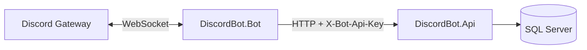

# Step 6 — Discord.Net Bot MVP

The bot is a separate worker process. It connects to Discord and calls the .NET API for all business data.

---

## Architecture



The bot **never** reads SQL Server directly.

---

## New projects and API endpoints

### Bot project

`src/DiscordBot.Bot/` — .NET Worker + Discord.Net 3.17

### Bot-only API endpoints

| Method | Route | Auth |
|--------|-------|------|
| POST | `/api/bot/guilds/join` | `X-Bot-Api-Key` header |
| GET | `/api/bot/guilds/{discordGuildId}/settings` | `X-Bot-Api-Key` header |

Dashboard JWT is **not** used for bot calls.

---

## Bot folder structure

```
DiscordBot.Bot/
├── Program.cs                      ← DI + host startup
├── appsettings.json                ← Token + API URL + API key
├── Configuration/
│   └── BotOptions.cs               ← Discord:Token, Api:BaseUrl, Api:ApiKey
├── Api/
│   ├── BotApiClient.cs             ← HTTP calls to backend
│   └── Models/ApiModels.cs         ← Request/response DTOs
├── Commands/
│   └── SlashCommandHandlers.cs     ← /ping, /server, /setup logic
└── Services/
    ├── DiscordBotHostedService.cs  ← Gateway connection + events
    ├── SlashCommandRegistration.cs ← Register slash commands
    └── WelcomeMessageService.cs    ← Format + send welcome text
```

---

## Slash commands

| Command | What it does |
|---------|----------------|
| `/ping` | Replies with bot latency |
| `/server` | Fetches settings from API, shows embed |
| `/setup` | Registers guild with API (manual trigger) |

Commands are registered **globally** on `Ready` and **per-guild** on join (faster for local testing).

---

## Events

| Event | Handler | Action |
|-------|---------|--------|
| `Ready` | `DiscordBotHostedService` | Register commands, sync existing guilds to API |
| `JoinedGuild` | `DiscordBotHostedService` | POST `/api/bot/guilds/join`, register guild slash commands |
| `UserJoined` | `DiscordBotHostedService` | GET settings → send welcome if enabled |
| `InteractionCreated` | `DiscordBotHostedService` | Route to slash command handlers |

---

## Welcome messages

1. Member joins Discord server
2. Bot calls `GET /api/bot/guilds/{discordGuildId}/settings`
3. If `welcomeEnabled` is true and `welcomeChannelId` is set → send message
4. Template placeholders: `{user}` → mention, `{server}` → guild name

Configure via dashboard API (Step 5 PUT) or SQL — set `WelcomeEnabled`, `WelcomeChannelId`, `WelcomeMessage`.

---

## Configuration

### API (`appsettings.json`)

```json
"Bot": {
  "ApiKey": "dev-bot-api-key-change-me"
}
```

### Bot (`src/DiscordBot.Bot/appsettings.json`)

```json
{
  "Discord": {
    "Token": "YOUR_BOT_TOKEN"
  },
  "Api": {
    "BaseUrl": "http://localhost:5217",
    "ApiKey": "dev-bot-api-key-change-me"
  }
}
```

**Important:** `Api:ApiKey` must match `Bot:ApiKey` on the API.

Use `appsettings.Development.json` or user secrets for the token — never commit it.

---

## Discord Developer Portal checklist

1. Create application → Bot → copy **token**
2. Enable **Server Members Intent** (required for `UserJoined` / welcome messages)
3. OAuth2 URL generator (for dashboard later) — not needed for bot-only testing
4. Invite bot with scopes: `bot`, `applications.commands`
5. Permissions: Send Messages, Manage Roles (later), Read Message History

Invite URL template:

```
https://discord.com/api/oauth2/authorize?client_id=YOUR_CLIENT_ID&permissions=277025508352&scope=bot%20applications.commands
```

---

## Local testing

### 1. Start SQL Server + apply migrations

```bash
docker compose up -d

dotnet ef database update \
  --project src/DiscordBot.Infrastructure \
  --startup-project src/DiscordBot.Api
```

### 2. Start the API

```bash
dotnet run --project src/DiscordBot.Api --launch-profile http
```

### 3. Configure and start the bot

Set `Discord:Token` in `src/DiscordBot.Bot/appsettings.Development.json`, then:

```bash
dotnet run --project src/DiscordBot.Bot
```

Expected log: `Logged in as YourBot#1234`

### 4. Invite bot to your test server

Use the invite URL from the Developer Portal.

### 5. Test slash commands

- `/ping` → should reply instantly
- `/setup` → registers guild in SQL Server (also happens automatically on join)
- `/server` → shows settings embed from API

### 6. Test welcome message

Update settings via API (use guild **internal** Guid from `/setup` or `/api/guilds`):

```bash
curl -X PUT "http://localhost:5217/api/guilds/GUILD_GUID/settings" \
  -H "Authorization: Bearer YOUR_JWT" \
  -H "Content-Type: application/json" \
  -d '{
    "welcomeEnabled": true,
    "welcomeChannelId": "YOUR_CHANNEL_DISCORD_ID",
    "welcomeMessage": "Welcome {user} to {server}!",
    "autoRoleEnabled": false,
    "logsEnabled": true
  }'
```

Join with a second Discord account (or rejoin) → welcome message should appear in the channel.

### 7. Verify guild registration API

```bash
curl -X POST http://localhost:5217/api/bot/guilds/join \
  -H "X-Bot-Api-Key: dev-bot-api-key-change-me" \
  -H "Content-Type: application/json" \
  -d '{
    "discordGuildId": "123",
    "name": "Test",
    "ownerDiscordUserId": "456"
  }'
```

---

## Troubleshooting

| Problem | Fix |
|---------|-----|
| Bot online but no slash commands | Wait ~1 min for global commands, or re-invite; guild commands register on join |
| Welcome not sending | Enable Server Members Intent; set `welcomeChannelId`; ensure bot can send messages in channel |
| API errors from bot | Check API is running; `ApiKey` matches on both sides |
| `UserJoined` never fires | Privileged intent must be enabled in Developer Portal |

---

## Next step (Step 7)

Angular dashboard — login, server picker, settings UI.

**Step 6 is complete. Waiting for your approval before continuing.**
