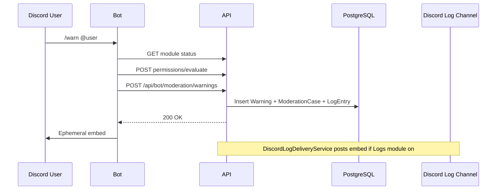
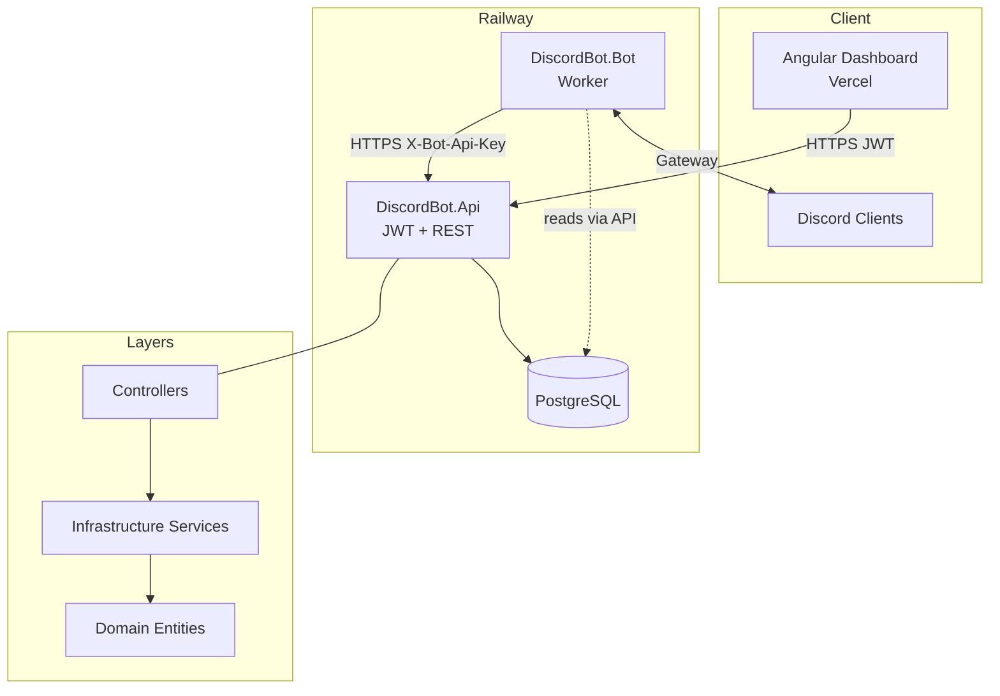

# Step 30 — Complete Project Architecture Audit

Read-only audit of the Discord Bot Platform solution. Findings are based on source code, migrations, configs, and docs — not assumptions.

**Audit date:** July 2026  
**Scope:** API, Bot, Dashboard, Infrastructure, Domain, migrations, deployment, documentation

---

## Executive Summary

This is a **multi-tenant Discord bot SaaS** with:

- **.NET 9 API** (JWT + bot API key)
- **.NET 9 Bot worker** (Discord.Net)
- **Angular 16 dashboard** (EN/AR, i18n)
- **PostgreSQL** via EF Core
- **Railway** (API, Bot, DB) + **Vercel** (dashboard)

**Architecture style:** Layered monolith — **not** Clean Architecture, **not** CQRS, **no** separate Application project.

**Commercial readiness:** Strong foundation for a **closed beta** with guild setup, modules, subscriptions, tickets, partial moderation, and admin tooling. **Not** ready for full commercial launch as a “full-featured moderation + logging + analytics” product without significant gaps filled.

| Metric | Estimate |
|--------|----------|
| Overall completion (commercial platform) | **~58%** |
| Closed beta readiness (focused scope) | **~75%** |

---

## Phase 1 — High Level Architecture

### Solution structure (4 .NET projects + 1 Angular app)

| Project | Role |
|---------|------|
| `DiscordBot.Domain` | Entities, enums, constants |
| `DiscordBot.Infrastructure` | EF Core, services, auth, DTOs, migrations |
| `DiscordBot.Api` | HTTP API for dashboard + bot |
| `DiscordBot.Bot` | Discord gateway, slash commands, workers |
| `DiscordBot.Dashboard` | Angular SPA |

**Missing:** `DiscordBot.Application`, shared kernel, test projects.

### Layer responsibilities

```
┌─────────────────┐     JWT Bearer      ┌──────────────────┐
│ Angular Dashboard│ ──────────────────► │  DiscordBot.Api  │
└─────────────────┘                     └────────┬─────────┘
                                               │
                                    X-Bot-Api-Key
                                               │
┌─────────────────┐     HTTP REST     ┌──────▼─────────┐
│  DiscordBot.Bot │ ◄────────────────►│ Infrastructure │
│  (Discord.Net)  │                   │   Services     │
└────────┬────────┘                   └──────┬─────────┘
         │                                   │
         │ Gateway events                    │ EF Core
         ▼                                   ▼
    Discord API                         PostgreSQL
```

- **Domain:** POCOs + enums only.
- **Infrastructure:** All business logic lives in `*Service.cs` classes (no MediatR/handlers).
- **API:** Thin controllers → services.
- **Bot:** Command handlers + 2 background workers (30s polling).

### Communication: Bot ↔ API

- Bot uses `BotApiClient` with **`X-Bot-Api-Key`** on every call.
- **26 HTTP methods** to `/api/bot/*` endpoints.
- No message queue, SignalR, or webhooks between bot and API — **synchronous HTTP + DB polling**.

### Authentication

| Actor | Mechanism |
|-------|-----------|
| Dashboard user | Discord OAuth → JWT (HMAC-SHA256, claims: `sub`, `discord_id`) |
| Bot | Shared API key header |
| Platform admin | JWT + `PlatformAdmins` table check |

### Database

- PostgreSQL, **16 migrations**, **22 tables** (see Phase 4).
- Seeders: modules, subscription plans, platform admin.

### Discord integration

- **Gateway intents:** Guilds, GuildMembers, GuildMessages, MessageContent.
- **10 slash commands** (+ subcommands), buttons/modals for tickets/panels/reaction roles.
- **6 gateway events** subscribed (Ready, InteractionCreated, JoinedGuild, UserJoined, MessageReceived, Log).

### Background services

| Service | Interval | Purpose |
|---------|----------|---------|
| `GuildMaintenanceWorker` | 30s | Command panel sync, ticket cleanup, outbound ticket messages |
| `GuildResourceSyncWorker` | 30s | Dashboard-requested Discord resource sync |

### Event flow (typical moderation action)



### Architecture diagram



---

## Phase 2 — Feature Inventory

Legend: **Yes** = implemented end-to-end, **Partial** = exists but incomplete, **No** = not found in code.

### Core

| Feature | Status | ~% | Description | Key files | Missing / gaps |
|---------|--------|-----|-------------|-----------|----------------|
| Guild registration | Yes | 90% | `/setup`, `POST /api/bot/guilds/join` | `SlashCommandHandlers`, `GuildService` | Re-sync on owner transfer edge cases |
| Server setup | Partial | 75% | Onboarding checklist, `/setup`, `/sync` | `OnboardingService`, `ResourceSyncService` | No guided wizard beyond checklist |
| Discord OAuth | Yes | 90% | OAuth code exchange → JWT | `AuthController`, `DiscordOAuthService` | No refresh tokens |
| Authentication | Yes | 85% | JWT + guards | `AuthenticationExtensions`, dashboard guards | No MFA, no session revoke |
| Dashboard | Yes | 75% | Full guild + admin UI | `dashboard/DiscordBot.Dashboard` | Notifications bell is stub |
| Guild settings | Yes | 85% | Welcome, auto-role, logs, tickets, panel, auto-replies | `SettingsComponent`, `GuildService` | Complex dual module/settings toggles |
| Multi-server support | Yes | 90% | Per-guild isolation | All guild-scoped tables | — |
| Configuration system | Yes | 85% | Env vars + local json + startup validation | `ConfigurationValidationExtensions` | No secrets manager integration |
| API security | Partial | 70% | JWT, bot key, admin filter | Filters, middleware | **No rate limiting** |
| Logging (app) | Partial | 60% | Console + request middleware | `RequestLoggingMiddleware` | No structured logging / APM |
| Audit logs | Yes | 70% | `LogEntries` table + dashboard viewer | `LogService`, `LogsComponent` | Not Discord event logs; cap 200 rows/query |
| Rate limiting | No | 0% | — | — | Entirely absent |
| Error handling | Partial | 75% | Global exception middleware | `ExceptionHandlingMiddleware` | Inconsistent controller patterns |

### Tickets

| Feature | Status | ~% | Files | Missing |
|---------|--------|-----|-------|---------|
| Ticket creation | Yes | 80% | `TicketCommandHandlers`, `TicketService` | — |
| Ticket closing | Yes | 85% | Bot + dashboard close | — |
| Archive / transcript | Partial | 60% | `TicketArchiveService` | Preview-only transcript, not full history |
| Ticket panels | Yes | 75% | Command panel + buttons | — |
| Categories | Partial | 70% | `TicketCategoryId` in settings | No multi-category UX |
| Claim | No | 0% | — | — |
| Rename | No | 0% | — | — |
| Priority | No | 0% | — | — |
| Limits | No | 0% | — | — |
| Staff permissions | Partial | 75% | Dashboard staff roles + bot access evaluate | Legacy `GuildStaff` unused in UI |
| Dashboard replies | Yes | 80% | `TicketOutboundMessageService` | Polling-based delivery |

### Moderation

| Feature | Status | ~% | Files | Missing |
|---------|--------|-----|-------|---------|
| Warn | Yes | 85% | `ModerationCommandHandlers` | — |
| View warnings | Yes | 80% | `/warnings`, dashboard | — |
| Clear/purge messages | Yes | 75% | `/clear` (≤100, ≤14 days) | — |
| Kick | Yes | 80% | `/kick` | — |
| Ban | No | 0% | — | Domain labels exist in UI only |
| Timeout/mute | No | 0% | `CanTimeout` in DTOs | Never enforced in bot |
| Slowmode | No | 0% | — | — |
| Lock/unlock channel | No | 0% | — | — |
| Role-based mod permissions | Yes | 80% | `ModerationPermissionRole` | Separate from dashboard staff |
| Dashboard mod cases | Partial | 70% | `ModerationComponent` | Read-only, no actions from dashboard |

### Welcome

| Feature | Status | ~% | Missing |
|---------|--------|-----|---------|
| Welcome messages | Yes | 80% | — |
| Leave messages | No | 0% | No `UserLeft` handler |
| Auto roles | Yes | 75% | Requires module + settings |
| DM messages | No | 0% | Welcome is channel-only |
| Welcome images | No | 0% | — |

### Logging (platform activity vs Discord events)

**Important distinction:** “Logs” in this product = **bot activity audit trail** stored in DB, optionally mirrored to a Discord channel. It is **not** full Discord server logging.

| Feature | Status | ~% | Notes |
|---------|--------|-----|-------|
| Activity log (DB) | Yes | 70% | 17 `LogEventType` values |
| Discord log channel delivery | Partial | 60% | `DiscordLogDeliveryService` — subset of events |
| Message delete/edit logs | No | 0% | No `MessageUpdated`/`MessageDeleted` handlers |
| Voice logs | No | 0% | — |
| Member join log | Partial | 50% | Logged to DB, not always to Discord channel |
| Channel/role change logs | No | 0% | — |
| Moderation logs | Partial | 65% | Warn/kick/clear via API persistence |
| Clear all logs | Yes | 90% | DELETE + type DELETE confirm |

### Dashboard pages

| Page | Status | ~% | Notes |
|------|--------|-----|-------|
| Servers / overview | Yes | 80% | Module status from `/modules` API |
| Settings | Yes | 85% | Tabbed, large form |
| Tickets | Yes | 75% | List, close, staff reply |
| Moderation | Partial | 65% | View warnings/cases only |
| Moderation settings | Yes | 80% | Role → command permissions |
| Modules | Yes | 85% | Plan gating UI |
| Logs | Yes | 80% | Filters + clear |
| Reaction roles | Partial | 50% | Deactivate only; create in Discord |
| Subscription | Yes | 75% | Manual upgrade requests |
| Staff | Yes | 80% | Role-based dashboard access |
| Profile | Yes | 75% | Bot embed profile, not Discord rename |
| Admin (5 pages) | Yes | 80% | Stats, guilds, users, plans, upgrades |
| Statistics/analytics | Partial | 25% | Overview counts only |
| Premium pages | Partial | 70% | Subscription + admin plans |

### Premium / subscriptions

| Feature | Status | ~% | Notes |
|---------|--------|-----|-------|
| Subscription plans | Yes | 85% | Free/Basic/Pro/Premium + admin CRUD |
| Feature gating | Yes | 80% | Plan → allowed modules → bot `ModuleGuard` |
| Manual upgrade workflow | Yes | 75% | Request → admin approve |
| Monthly pricing | Yes | 80% | `MonthlyPrice` on plans |
| Payment integration | No | 0% | No Stripe/payment webhooks |
| License validation | Partial | 60% | Expiration → downgrade to free |
| Usage limits | No | 0% | No per-guild quotas |

### Analytics

| Feature | Status | ~% |
|---------|--------|-----|
| Member analytics | No | 5% |
| Ticket analytics | No | 10% |
| Activity analytics | Partial | 15% (overview ticket counts, admin stats) |

### Other implemented features

| Feature | Status | ~% |
|---------|--------|-----|
| Auto-replies | Yes | 75% |
| Command button panel | Yes | 75% |
| Reaction roles (button) | Yes | 70% |
| Resource sync (channels/roles/members) | Yes | 80% |
| i18n EN/AR + RTL | Yes | 85% |
| Platform admin panel | Yes | 80% |
| Server profile (`/server`) | Yes | 75% |
| Health check | Yes | 70% | `GET /api/Health` (custom, not ASP.NET health checks) |

---

## Phase 3 — Code Quality (1–10)

| Category | Score | Notes |
|----------|-------|-------|
| Architecture | 6/10 | Clear layers, but fat Infrastructure; no Application boundary |
| Folder structure | 7/10 | Consistent per feature; `GuildsController` ~1,180 lines is a smell |
| Naming | 8/10 | Generally clear, matches domain language |
| SOLID | 6/10 | DI used well; SRP violated in large controllers/services |
| CQRS | 2/10 | Explicitly not used (documented in step-01) |
| Clean Architecture | 4/10 | Domain exists; business rules live in Infrastructure |
| Dependency injection | 8/10 | Scoped services registered in `DependencyInjection.cs` |
| Validation | 5/10 | Ad-hoc; `GuildSettingsValidator`, `AutoReplyValidator` only |
| Error handling | 7/10 | Middleware + problem+json; uneven in controllers |
| Logging | 6/10 | Basic ILogger; no correlation IDs / structured fields |
| Maintainability | 6/10 | Good docs; large files hinder changes |
| Scalability | 5/10 | Single bot instance, 30s polling workers, HTTP coupling |
| Performance | 6/10 | Reasonable indexes; log query capped at 200; no caching layer |

**Average: ~6.0/10** — Solid for a beta-stage product; needs refactoring before large team scale.

---

## Phase 4 — Database Audit

### Tables (22)

| Table | Purpose | Key relationships |
|-------|---------|-------------------|
| `Users` | OAuth users | — |
| `Guilds` | Tenant root | 1:1 Settings, Subscription; 1:N everything else |
| `GuildSettings` | Feature config | FK Guild |
| `LogEntries` | Audit trail | FK Guild |
| `Tickets` | Support tickets | FK Guild |
| `TicketOutboundMessages` | Reply queue | FK Guild, Ticket |
| `DiscordChannels` | Cached channels | FK Guild |
| `DiscordRoles` | Cached roles | FK Guild |
| `DiscordGuildMembers` | Cached members + role JSON | FK Guild |
| `Warnings` | Mod warnings | FK Guild |
| `ModerationCases` | Kick/clear cases | FK Guild |
| `Modules` | Global catalog | — |
| `GuildModules` | Per-guild toggles | FK Guild, Module |
| `ReactionRoles` | Button panels | FK Guild |
| `SubscriptionPlans` | Plan catalog | — |
| `GuildSubscriptions` | Active plan | FK Guild, Plan |
| `PlanUpgradeRequests` | Upgrade workflow | FK Guild |
| `PlatformAdmins` | Admin allowlist | — |
| `GuildStaff` | **Legacy** user staff | FK Guild |
| `GuildPermissionRoles` | Dashboard access by Discord role | FK Guild |
| `ModerationPermissionRoles` | Bot command access by role | FK Guild |
| `AutoReplyRules` | Keyword replies | FK Guild |

### Migrations (16)

1. `20260630154720_InitialCreate`
2. `20260630160616_RenameDiscordResources`
3. `20260630163114_AddModeration`
4. `20260630164742_AddModules`
5. `20260630165829_UpdateLogEntries`
6. `20260630170333_AddReactionRoles`
7. `20260630171155_AddSubscriptionPlans`
8. `20260630212001_AddPlatformAdmins`
9. `20260630230729_AddUpgradeRequestsAndGuildStaff`
10. `20260630231054_AddSubscriptionDuration`
11. `20260701120000_AddCommandPanelAndTicketCleanup`
12. `20260701134452_AddDiscordGuildMembers`
13. `20260701141022_AddGuildPermissionRolesAndMemberRoleIds`
14. `20260701150442_AddTicketMessagesAndAutoReplies`
15. `20260701231527_BetaFeedbackFixes`
16. `20260701235500_AddSubscriptionPlanMonthlyPrice`

### Indexes (good coverage)

Unique indexes on snowflakes, composite indexes on `(GuildId, CreatedAt)`, `(GuildId, Type, CreatedAt)`, ticket status, etc.

### Gaps / improvements

| Issue | Priority |
|-------|----------|
| `GuildStaff` redundant with `GuildPermissionRoles` | High — remove or migrate |
| No soft-delete on logs/tickets | Medium |
| `LogEntries` unbounded growth | High — retention policy needed |
| No full-text search index on log messages | Medium |
| Member role IDs stored as JSON string | Medium — harder to query |

---

## Phase 5 — API Audit

**89 HTTP routes** across 13 controllers.

| Group | Routes | Auth |
|-------|--------|------|
| `/api/auth/*` | 4 | Mixed |
| `/api/guilds/*` | 44 | JWT + service-layer access |
| `/api/admin/*` | 14 | JWT + PlatformAdmin |
| `/api/bot/*` | 24 | Bot API key |
| `/api/plans` | 1 | JWT |
| `/api/onboarding/*` | 1 | JWT |
| `/api/Health` | 1 | Anonymous |

### Controllers

| Controller | Route prefix | Auth |
|------------|--------------|------|
| `AuthController` | `/api/auth` | Per-action |
| `GuildsController` | `/api/guilds` | JWT |
| `AdminController` | `/api/admin` | JWT + PlatformAdmin |
| `BotGuildsController` | `/api/bot/guilds` | Bot API key |
| `BotTicketsController` | `/api/bot/tickets` | Bot API key |
| `BotTicketSetupController` | `/api/bot/guilds/{id}/tickets` | Bot API key |
| `BotLogsController` | `/api/bot/logs` | Bot API key |
| `BotModerationController` | `/api/bot/moderation` | Bot API key |
| `BotCommandPanelController` | `/api/bot/command-panels` | Bot API key |
| `BotReactionRolesController` | `/api/bot/reaction-roles` | Bot API key |
| `HealthController` | `/api/Health` | Anonymous |
| `OnboardingController` | `/api/onboarding` | JWT |
| `PlansController` | `/api/plans` | JWT |

### Notable endpoints

- `DELETE /api/guilds/{id}/logs` — clear logs (requires `DELETE` confirmation body)
- `GET/PUT /api/guilds/{id}/profile`
- CRUD `/api/guilds/{id}/moderation/permission-roles`
- Admin CRUD `/api/admin/plans`

### Common gaps

| Gap | Severity |
|-----|----------|
| No rate limiting | High |
| No FluentValidation / unified request validation | Medium |
| Inconsistent 404 vs empty array for unauthorized guild access | Low |
| No API versioning | Low |
| DELETE with body (clear logs) — some clients/proxies fragile | Low |

---

## Phase 6 — Discord Bot Audit

### Slash commands (10)

`/ping`, `/server`, `/setup`, `/sync`, `/ticket` (setup/open/close), `/warn`, `/warnings`, `/clear`, `/kick`, `/reaction-role create`

### Interactions

Ticket buttons/modals, command panel buttons, reaction-role toggle.

### Gateway events

| Subscribed | Not subscribed |
|------------|----------------|
| Ready, InteractionCreated, JoinedGuild, UserJoined, MessageReceived | UserLeft, MessageDeleted/Updated, Voice, Ban, Role/Channel updates |

### Permission model

- **ModuleGuard** — 5 modules checked before features run.
- **ModerationPermissionResolver** — role-based command access via API.
- **Dashboard staff** — separate evaluate endpoint for tickets.

### BotApiClient methods (26)

Register guild, settings, tickets, sync, permissions, profile, dashboard access, warnings, cases, modules, logs, reaction roles, command panels, ticket cleanup, auto-replies, outbound messages.

### Missing for “full mod bot”

Ban, timeout, mute, unban, case management commands, automod, raid protection, lockdown.

---

## Phase 7 — Angular Dashboard Audit

### Routes

| Path | Guard | Access |
|------|-------|--------|
| `/login`, `/auth/callback` | — | Public |
| `/servers` | Auth | — |
| `/guilds/:id/*` | Auth + GuildAccess | owner or moderation |
| `/admin/*` | Auth + Admin | Platform admin |

### Services

`AuthService`, `GuildService`, `GuildAccessService`, `GuildContextService`, `AdminService`, `OnboardingService`, `LanguageService`, `ToastService`

### Strengths

- Route guards (auth, admin, guild access)
- Auth interceptor with 401 handling
- Loading/error/empty states on most pages
- EN/AR i18n + RTL
- Toast feedback

### Weaknesses

| Issue | Impact |
|-------|--------|
| No centralized state (NgRx/Akita) | Medium |
| Notifications UI is dead | Low |
| Plan gating not reflected in sidebar routing | Medium |
| `GuildStaff` API unused in UI | Confusion |
| Almost no automated tests | High |
| Hardcoded Railway API URL in committed env files | Medium |

### Incomplete pages

- **Reaction roles** — manage-only, no create
- **Moderation** — read-only
- **Notifications** — stub

---

## Phase 8 — Security Audit

| Area | Status | Risk |
|------|--------|------|
| Secrets in git | Good — placeholders + gitignore | Low |
| JWT | Good — HMAC, validation, expiry | Medium (no refresh/revoke) |
| Bot API key | Good — header filter on bot routes | Medium (single shared key) |
| Webhooks | N/A — none inbound | — |
| Authorization | Good guild-level checks | Medium |
| Input validation | Partial | Medium |
| SQL injection | Low — EF Core parameterized | Low |
| XSS | Low — Angular default escaping | Low |
| CSRF | Low — JWT in header, not cookies | Low |
| Rate limiting | **Missing** | **High** |
| CORS | Dashboard origin + optional `*.vercel.app` | Medium if AllowVercelOrigins=true in prod |

### Recommended fixes (priority)

1. Add rate limiting on auth + bot endpoints
2. Rotate/revoke JWT strategy
3. Restrict `AllowVercelOrigins` to known deployment URL in production
4. Add log retention + PII policy
5. Automated dependency scanning

---

## Phase 9 — DevOps Audit

| Item | Status |
|------|--------|
| Railway deploy | Yes — Dockerfiles, toml, migrate.sh |
| Vercel deploy | Yes — `vercel.json`, cache headers |
| Docker (local) | Postgres only in `docker-compose.yml` |
| GitHub Actions | **No** — zero CI/CD |
| Env documentation | Strong — `.env.example`, runbooks, step docs |
| Health checks | Custom `/api/Health` on Railway |
| Monitoring/APM | **No** |
| Structured alerting | **No** |
| Migration strategy | Manual `migrate.sh` / EF CLI |

**Critical gap:** No automated build/test/deploy pipeline.

---

## Phase 10 — Technical Debt (ranked)

| Priority | Item |
|----------|------|
| **P0** | No automated tests (API, bot, dashboard) |
| **P0** | No CI/CD pipeline |
| **P0** | No rate limiting |
| **P1** | `GuildsController` god-controller (~1,180 lines) |
| **P1** | Dual staff models (`GuildStaff` vs `GuildPermissionRole`) |
| **P1** | Dual permission systems (dashboard staff vs moderation roles) |
| **P1** | Module toggle vs `GuildSettings` flag confusion |
| **P1** | Log table unbounded — no retention/archival |
| **P2** | `BotApiClient` monolith (~772 lines) |
| **P2** | Polling workers every 30s |
| **P2** | No Application layer — hard to unit test business rules |
| **P2** | Hardcoded production API URL in dashboard env files |
| **P3** | Notifications stub in layout |

---

## Phase 11 — Missing Features Roadmap

### Critical (before beta)

1. Automated tests — at least API integration + critical bot paths
2. CI pipeline — build, test, migrate check on PR
3. Rate limiting — especially `/api/auth/*`
4. Log retention policy — prevent DB bloat
5. Remove or migrate `GuildStaff` — single staff model
6. Production deploy verification — migrations on Railway, correct Vercel URL
7. Payment story — document clearly for beta testers

### Important (before launch)

1. Ban + timeout moderation commands
2. Discord event logging (message delete/edit, member leave) OR rename product scope
3. Ticket claim/assign + limits
4. Payment integration (Stripe) or fully manual workflow UI
5. Monitoring + error tracking (Sentry, etc.)
6. JWT refresh / session management
7. Dashboard plan-based route gating
8. Automated E2E smoke tests

### Nice to have (post-launch)

1. Analytics dashboards
2. Welcome/leave DMs and images
3. Reaction roles from dashboard
4. Redis cache / message queue for bot↔API
5. Multi-bot sharding strategy

---

## Phase 12 — Overall Project Status

| Area | Completion |
|------|------------|
| Core infrastructure | **85%** |
| Auth & multi-tenancy | **85%** |
| Dashboard UI | **75%** |
| Admin / SaaS billing (manual) | **70%** |
| Modules & plan gating | **80%** |
| Tickets | **55%** |
| Moderation | **40%** |
| Activity logging (DB) | **65%** |
| Discord event logging | **5%** |
| Welcome / onboarding | **50%** |
| Reaction roles | **65%** |
| Auto-replies | **70%** |
| DevOps / CI | **35%** |
| Testing | **5%** |
| Security hardening | **60%** |
| Analytics | **5%** |

### Overall: ~58% toward a commercial “full platform” release

### ~75% toward a focused closed beta (tickets + basic mod + dashboard + subscriptions)

---

## Phase 13 — Next Development Plan

| # | Task | Why next | Complexity | Est. time | Dependencies | Impact |
|---|------|----------|------------|-----------|--------------|--------|
| 1 | **CI/CD (GitHub Actions)** | No safety net for deploys | Medium | 2–3 days | — | Prevents regressions |
| 2 | **API integration tests** | Zero test coverage is highest risk | Medium | 3–5 days | CI | Confidence for refactors |
| 3 | **Rate limiting** | Auth/bot endpoints exposed | Low | 1 day | — | Security |
| 4 | **Log retention job** | DB will grow unbounded | Low | 1–2 days | — | Ops stability |
| 5 | **Consolidate staff models** | Two systems confuse users/devs | Medium | 2–3 days | Migration | Maintainability |
| 6 | **`/ban` + `/timeout` commands** | Expected moderation baseline | Medium | 3–4 days | Mod permissions | Product completeness |
| 7 | **Ticket assign/claim** | Support teams need ownership | Medium | 2–3 days | Ticket UI | UX |
| 8 | **Message delete/edit logging** | “Logging bot” market expectation | High | 5–7 days | New gateway events | Product scope |
| 9 | **Stripe or documented manual billing** | SaaS needs payment clarity | High | 5–10 days | Admin plans exist | Revenue |
| 10 | **Monitoring (Sentry + health metrics)** | Production blind spots | Low | 1–2 days | Railway | Reliability |
| 11 | **Split `GuildsController`** | Technical debt blocker | Medium | 2–3 days | Tests help | Velocity |
| 12 | **Dashboard E2E smoke tests** | Catch routing/deploy issues | Medium | 2–4 days | CI | Deploy confidence |

---

## Bottom Line

**Built well:** Multi-tenant Discord bot SaaS skeleton — OAuth dashboard, guild isolation, module/plan gating, tickets with archive, role-based permissions, admin panel, i18n, Railway/Vercel deployment docs.

**Not built yet:** Competitive all-in-one moderation + logging bot (no ban/timeout, no message/event logging), automated testing or CI, payments, analytics, operational gaps (rate limits, monitoring, log retention).

**Recommendation:** Position the beta as a **“managed tickets + welcome + basic moderation + dashboard control plane”** product — not a full MEE6/Carl-bot replacement — until Phase 13 items 1–7 are done.

---

## Key file references

| Area | Path |
|------|------|
| API entry | `src/DiscordBot.Api/Program.cs` |
| Guild API | `src/DiscordBot.Api/Controllers/GuildsController.cs` |
| Bot entry | `src/DiscordBot.Bot/Program.cs` |
| Bot events | `src/DiscordBot.Bot/Services/DiscordBotHostedService.cs` |
| Services DI | `src/DiscordBot.Infrastructure/DependencyInjection.cs` |
| DbContext | `src/DiscordBot.Infrastructure/Data/AppDbContext.cs` |
| Dashboard routes | `dashboard/DiscordBot.Dashboard/src/app/app-routing.module.ts` |
| Railway deploy | `deploy/railway/` |
| Vercel config | `dashboard/DiscordBot.Dashboard/vercel.json` |
| Config runbook | `docs/configuration-runbook.md` |
