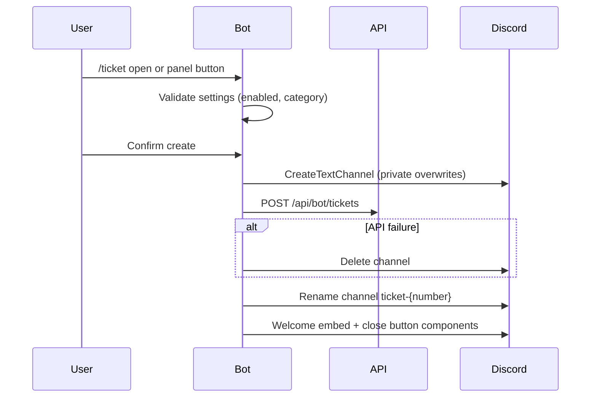
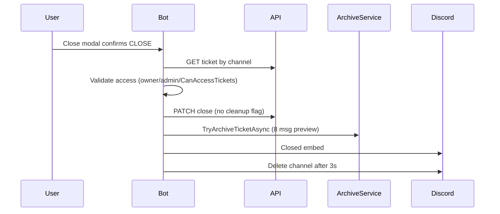
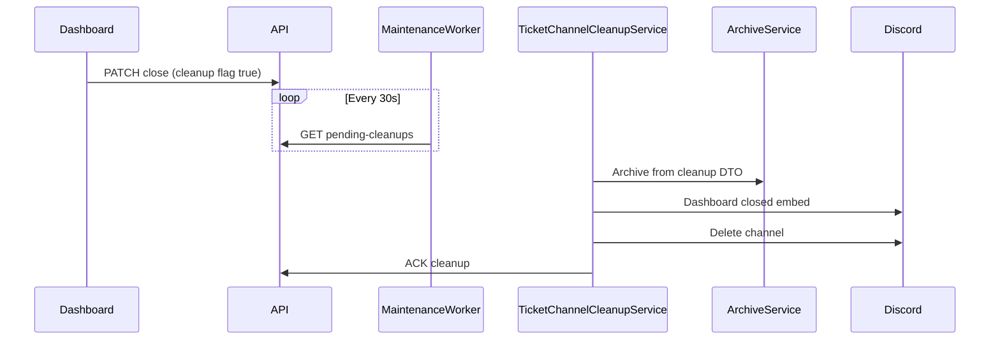

# Ticket System — Bot Layer

**Project:** `DiscordBot.Bot`  
**Integration:** REST API via `BotApiClient`  
**Background worker:** `GuildMaintenanceWorker` (30s interval)

---

## Command Surface

### Slash commands: `/ticket`

| Subcommand | Permission | Handler |
|------------|------------|---------|
| `setup` | Discord `ManageGuild` | Creates "Tickets" category, calls API setup |
| `open` | Any member | Ephemeral prompt + confirm button |
| `close` | Owner / admin / dashboard staff | Opens CLOSE confirmation modal |

**Module guard:** `ModuleKeys.Tickets` on all interactions  
**Files:** `TicketCommandHandlers.cs`, registered in `SlashCommandHandlers.cs`

---

## Interactions (Non-slash)

### Ticket-specific

| Custom ID pattern | Type | Action |
|-------------------|------|--------|
| `ticket-create` | Button | Create ticket (same as open confirm) |
| `ticket-close:{channelId}` | Button | Open close modal |
| `ticket-select:{channelId}` | Select | Close or help options |
| `ticket-close-modal:{channelId}` | Modal | Validate `CLOSE` → close ticket |

**File:** `TicketInteractionHandlers.cs`

### Command panel

| Action | Handler |
|--------|---------|
| `ticket_open` | Delegates to `HandleCreateButtonAsync` |
| `ticket_help` | Ephemeral help embed |

**File:** `PanelInteractionHandlers.cs`

---

## Ticket Creation Flow

### Channel permission overwrites

| Principal | Access |
|-----------|--------|
| `@everyone` | Deny view |
| Ticket owner | View, send, history, attach |
| Roles with `Administrator` or `ManageGuild` | View, send, history, manage messages |

**Not included:** Dashboard staff roles with `ViewTickets` — **gap for support teams without admin roles.**

### Business rules (API)

- One open ticket per owner per guild
- Sequential ticket number
- Tickets must be enabled + valid category id

---

## Ticket Close Flow (Discord-initiated)

**Access check:** `EvaluateDashboardAccessAsync` → `CanAccessTickets` for non-owner non-admin.

---

## Ticket Close Flow (Dashboard-initiated)

**Difference from Discord close:** Archive uses cleanup DTO closed-by fields; channel persists until worker runs.

---

## Archive Service

**File:** `TicketArchiveService.cs`

| Constant | Value |
|----------|-------|
| `MaxPreviewMessages` | 8 |
| `MaxPreviewLength` | 1500 chars |

**Behavior:**
1. Skip if no `TicketArchiveChannelId`
2. Fetch timeline via `GET /api/bot/tickets/{ticketId}/timeline` (BR-X03 — not Discord channel scrape)
3. Build preview from `MessageSent` and delivered `StaffReplyQueued` events
4. Post embed to archive channel
5. `POST /api/bot/tickets/{ticketId}/timeline/archive-posted` → `ArchivePosted` event (BR-T05)
6. Write `LogEventType.TicketArchived` via `BotLogWriter` (logging consumes domain events; separate from Timeline)

**Limitations:**
- Attachments, embeds, stickers not in Timeline v1
- Preview capped at 8 messages / 1500 chars
- Messages sent before CM-002 deployment are not on the timeline

**Traceability:** D-001 §8 · BR-X03, BR-T05

---

## Outbound Message Delivery

**File:** `TicketOutboundMessageService.cs`

1. Poll `GET /api/bot/tickets/pending-messages`
2. Resolve guild + channel
3. Format: `{StaffReplyPrefix}\n{content}` with `{staff}` substitution
4. `SendMessageAsync` to ticket channel
5. `POST ack` with `delivered: true` on success
6. `POST ack` with `delivered: false` + `failureReason` if channel missing or send fails → `StaffReplyFailed` Timeline Event

**Latency:** Up to 30 seconds + Discord rate limits

**Traceability:** D-001 §8 · BR-T02

---

## Ticket Timeline Message Capture

**File:** `TicketTimelineMessageService.cs`  
**Wiring:** `DiscordBotHostedService.OnMessageReceivedAsync` (after auto-reply handler)

**Behavior:**
1. Ignore bot messages and empty content
2. Resolve ticket via `GET /api/bot/tickets/by-channel/{channelId}`
3. `POST /api/bot/tickets/timeline/message-sent` → `MessageSent` event (BR-T01)

**Scope:** Ticket channels only — non-ticket channels are ignored.

**Traceability:** D-001 §8 · BR-T01

---

## Channel Cleanup Service

**File:** `TicketChannelCleanupService.cs`

Processes dashboard closes; same archive + delete pattern; uses `TicketClosedFromDashboardMessage` template.

**Failure handling:** Logs warning; does not ack if delete throws — will retry next poll.

---

## Guild Maintenance Worker

**File:** `GuildMaintenanceWorker.cs`

When Discord connected, each 30s:
1. `CommandPanelSyncService.ProcessPendingRefreshesAsync`
2. `TicketChannelCleanupService.ProcessPendingCleanupsAsync`
3. `TicketOutboundMessageService.ProcessPendingMessagesAsync`

**Registration:** `Program.cs` hosted service

---

## Embeds & Components

**File:** `EmbedBuilderService.cs`, `ComponentBuilderService.cs`

| Embed | Use |
|-------|-----|
| `BuildTicketOpenPrompt` | Confirm before create |
| `BuildTicketCreated` | Success followup with channel mention |
| `BuildTicketWelcome` | First message in channel |
| `BuildTicketClosed` | Discord close |
| `BuildTicketClosedFromDashboard` | Dashboard close |
| `BuildTicketArchive` | Archive channel transcript preview |
| `BuildTicketHelp` | Help text |

**Components:**
- Open prompt button
- Channel close button + select menu
- Close confirmation modal (`CLOSE` text input)

**Templates:** Loaded from API settings; placeholders via `MessageTemplateFormatter` (`{mention}`, `{ticket}`, `{staff}`, `{server}`)

---

## Auto-Replies in Ticket Channels

**File:** `AutoReplyMessageService.cs`

- Rules with `Scope = TicketChannelsOnly`
- Detects ticket channel via `GET /api/bot/tickets/by-channel/{id}`
- Fires auto-response on trigger match

**Independent of ticket Timeline ingestion** — auto-replies do not create Timeline events (future automation work).

---

## API Client Methods

**File:** `BotApiClient.cs`

| Method | Endpoint |
|--------|----------|
| `SetupTicketsAsync` | POST setup |
| `CreateTicketAsync` | POST tickets |
| `GetTicketByChannelAsync` | GET by-channel |
| `CloseTicketAsync` | PATCH close |
| `GetPendingTicketCleanupsAsync` | GET pending-cleanups |
| `AckTicketCleanupAsync` | POST ack-cleanup |
| `GetPendingTicketMessagesAsync` | GET pending-messages |
| `AckTicketMessageAsync` | POST messages ack |
| `GetSettingsAsync` | Settings including ticket templates |
| `EvaluateDashboardAccessAsync` | Ticket close authorization |

---

## Logging & Discord Delivery

| Event | Writer | Discord log channel |
|-------|--------|---------------------|
| TicketOpened | API `LogService` | If logs enabled |
| TicketClosed | API `LogService` | If logs enabled |
| TicketArchived | Bot `BotLogWriter` | If logs enabled |

**File:** `DiscordLogDeliveryService.cs` — includes ticket event types with blue color.

---

## Resource Sync

After `/ticket setup`, `ResourceSyncService.SyncGuildAsync` refreshes channel list for dashboard dropdowns.

---

## Error Handling Patterns

| Scenario | Behavior |
|----------|----------|
| Category create fails | Ephemeral error to admin |
| API create fails | Delete channel, show error |
| Duplicate open ticket | API 400 message surfaced |
| Close on non-ticket channel | Error embed |
| Archive channel missing | Log warning, skip archive |
| Outbound channel deleted | Ack with `delivered: false` → `StaffReplyFailed` |

---

## Bot v1 Implementation Tasks

| Task | Component |
|------|-----------|
| Ingest Discord messages to API | New handler + `BotApiClient` |
| Grant staff role overwrites on create | `BuildTicketOverwrites` + settings |
| Unified close + archive from Timeline | `TicketCommandHandlers`, cleanup service |
| Optional: slash claim/assign | New handlers Phase 2 |
| Reduce delivery latency | Worker interval or push Phase 3 |

---

## Files Reference

| File | Role |
|------|------|
| `TicketCommandHandlers.cs` | Core create/close/setup |
| `TicketInteractionHandlers.cs` | Buttons/modals |
| `PanelInteractionHandlers.cs` | Panel routing |
| `TicketTimelineMessageService.cs` | Discord → `MessageSent` timeline events |
| `TicketArchiveService.cs` | Archive embed from timeline |
| `TicketChannelCleanupService.cs` | Dashboard close cleanup |
| `TicketOutboundMessageService.cs` | Staff reply delivery + failure ack |
| `GuildMaintenanceWorker.cs` | Poll orchestration |
| `TicketResults.cs` | Result records |
| `TicketMessageDefaults.cs` | Default template strings |
