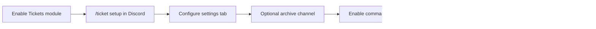
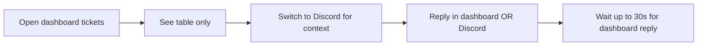

# Ticket System — Dashboard UX & Implementation

**Route:** `/guilds/:id/tickets` · `/guilds/:id/tickets/:ticketId/transcript`  
**Components:** `TicketsComponent`, `TicketTranscriptComponent`  
**Guard:** `GuildAccessGuard` with `guildAccess: 'moderation'`

---

## Current Pages & Navigation

| Location | Ticket-related UX |
|----------|-------------------|
| **Sidebar** | "Tickets" link when `canAccessModeration` |
| **`/guilds/:id/tickets`** | List table + inline reply/close + conversation panel |
| **`/guilds/:id/tickets/:ticketId/transcript`** | Full transcript (CM-004) — Timeline-derived durable record |
| **`/guilds/:id/settings` → Tickets tab** | Category, archive channel, message templates |
| **`/guilds/:id/settings` → Button panel tab** | Ticket open/help buttons |
| **`/guilds/:id/overview`** | Stats: total/open/closed ticket counts |
| **`/guilds/:id/staff`** | Permission flags: View/Reply/Close/Manage tickets |
| **`/guilds/:id/logs`** | Filter event types: TicketOpened, TicketClosed, TicketArchived |
| **`/servers`** | Quick link to tickets per guild |

---

## Tickets List Page

**File:** `tickets.component.html` / `tickets.component.ts`

**API calls:** `GuildService.getTicketSummaries`, `getTicketConversation`, `getTicketTranscript`, `closeTicket`, `sendTicketMessage`

**Read models (CM-003):**
- List uses **Ticket Summary** (`lastActivityAt`, preview, counts, pagination, status filter)
- Conversation panel uses **Ticket Conversation** (delivery badges, cursor load-more)
- Permissions from `GuildAccess`: `canViewTickets`, `canReplyToTickets`, `canCloseTickets` (server enforced)

### Implemented UI

| Element | Behavior |
|---------|----------|
| Loading / error / empty states | Spinner, retry, hints |
| Status filter | All / Open / Closed |
| Pagination | Page prev/next when `totalPages > 1` |
| Summary columns | Number, status, owner, last activity, preview, message/reply/failed stats |
| Conversation panel | Expandable; event type, actor, delivery state, content |
| Delivery indicators | Queued / Delivered / Failed border + badge |
| Closed tickets | Readable via conversation panel and dedicated **transcript** route without Discord channel |
| Transcript page | Metadata (number, owner, status, created/closed, source=Timeline) + paginated Timeline entries + Archive vs Transcript notice |
| View transcript | Button on closed tickets → `/guilds/:id/tickets/:ticketId/transcript` |
| Reply / Close | Hidden unless `canReplyToTickets` / `canCloseTickets` |
| Close confirm | `window.confirm` → PATCH close API |

### Missing UI

| Feature | Priority |
|---------|----------|
| Dedicated ticket detail route | P2 — partial via transcript route (CM-004) |
| Search by number/owner | P1 |
| Assignee column | P2 |
| Transcript download | P2 — HTML/PDF export out of scope; Dashboard transcript view shipped (CM-004) |
| Mobile-responsive table polish | P2 |

---

## Transcript Page (CM-004)

**Route:** `/guilds/:id/tickets/:ticketId/transcript`  
**File:** `ticket-transcript.component.{ts,html,css}`

**API:** `GET /api/guilds/{id}/tickets/{ticketId}/transcript` via `GuildService.getTicketTranscript`

**UI:**
- Prominent notice: Archive (Discord digest) ≠ Transcript (Timeline truth)
- Metadata grid: status, owner, created, closed, source
- Paginated Timeline entries with delivery badges
- Internal note badge when `isInternal` (staff-only entries filtered server-side)
- Load more cursor pagination
- Back to tickets list

**Access:** Same guard as tickets list (`guildAccess: 'moderation'`); API enforces `ViewTickets`.

---

## Settings → Tickets Tab

### Implemented

**Visibility:** `activeTab === 'tickets' && ticketsEnabled` (module flag)

| Field | Control |
|-------|---------|
| Ticket category | Dropdown from synced channels (categories) |
| Archive channel | Dropdown (text channels) |
| Welcome title | Text input, max 256 |
| Welcome message | Textarea |
| Closed message | Textarea |
| Closed from dashboard message | Textarea |
| Staff reply prefix | Textarea, `{staff}` hint |

**Save:** Part of guild settings PUT — triggers command panel refresh if panel fields changed.

### Gaps

- No UI for **staff role channel access** (which Discord roles see tickets).
- No **multi-category** management.
- No **auto-close** settings.
- Archive channel help text updated (CM-004) — digest vs transcript distinction
- `/ticket setup` still required for initial enable — settings tab does not enable tickets alone (category must exist).

---

## Settings → Button Panel Tab

Default JSON includes:
- `ticket_open` — Create Ticket (Success)
- `ticket_help` — Ticket Help (Secondary)

Panel posts to configured channel; bot syncs via `CommandPanelSyncService`.

**Gap:** No visual editor for mapping buttons → ticket categories (Phase 3).

---

## Staff Permissions Page

**Flags exposed:**
- `ViewTickets`
- `ReplyToTickets`
- `CloseTickets`
- `ManageTickets`

**Legacy mapping:** `AccessTickets` → `ViewTickets`

**Gap:** Dashboard route guard uses `canAccessModeration`, not ticket flags — staff with only ticket permissions may be blocked from nav unless they also have moderation page access via cross-grants.

---

## UX Review Summary

### Server owner journey (current)



**Friction points:**
1. Setup split between Discord command and dashboard settings.
2. Archive/transcript expectations not met in dashboard.
3. Staff onboarding requires understanding Discord admin roles vs dashboard staff roles.

### Support team journey (current)



**Blockers for daily use:** No conversation view, no queue, no assignment.

---

## Recommended v1 Dashboard Structure

```
/guilds/:id/tickets              → Queue list (open default, filters, pagination)
/guilds/:id/tickets/:ticketId    → Detail: timeline, reply, close, notes, metadata
/guilds/:id/settings (tickets)   → Templates, archive, staff roles, auto-close
/guilds/:id/settings (panel)     → Open buttons / category routing
```

### Detail page wireframe (conceptual)

```
┌─────────────────────────────────────────────────┐
│ Ticket #42 · Open · Owner @User · #ticket-42    │
│ [Claim] [Assign ▼] [Close]                      │
├─────────────────────────────────────────────────┤
│ Message timeline (scroll)                       │
│  User: help with billing                        │
│  Staff (Discord): checking now                  │
│  Staff (Dashboard): sent invoice link ✓ delivered│
├─────────────────────────────────────────────────┤
│ [Internal note tab]                             │
│ Reply: [textarea                    ] [Send]    │
└─────────────────────────────────────────────────┘
```

---

## i18n

**Files:** `src/assets/i18n/en.json`, `ar.json`

**Existing keys:** `tickets.*`, `settings.ticket*`, `logs.eventTypes.ticket*`, `staff.permissions.*Tickets*`

**Needed for v1:** detail page, filters, delivery status, claim/assign, empty history notice for legacy tickets.

---

## Frontend Models

**`ticket.models.ts`**

```typescript
interface Ticket {
  id, guildId, ticketNumber,
  ownerDiscordUserId, ownerDisplayName?,
  channelDiscordId, channelName?,
  status, createdAt, closedAt?
}
```

**v1 extensions:** `assignedTo`, `lastMessageAt`, `priority`, `tags`

**New:** `TicketMessage`, `TicketNote` interfaces matching API.

---

## Service Layer

**`guild.service.ts`**

| Method | HTTP |
|--------|------|
| `getTickets(guildId)` | GET tickets |
| `closeTicket(guildId, ticketId)` | PATCH close |
| `sendTicketMessage(guildId, ticketId, content)` | POST messages |

**v1 additions:** `getTicket`, `getTicketMessages`, `claimTicket`, `assignTicket`, `reopenTicket`, `addTicketNote`

---

## Component Architecture (Proposed)

| Component | Responsibility |
|-----------|----------------|
| `TicketsComponent` | List / queue |
| `TicketDetailComponent` | Timeline + actions |
| `TicketMessageListComponent` | Reusable message thread |
| `TicketReplyFormComponent` | Reply + delivery state |
| `TicketSettingsSectionComponent` | Extract from settings (optional) |

---

## Accessibility & UX Polish

- Replace `window.confirm` with accessible modal for close confirm.
- Show toast on reply **queued** vs **delivered** (after poll/refetch).
- Status badges: color + text (already partially done).
- Keyboard: focus reply textarea when expanding row.

---

## Files Reference

| Path | Role |
|------|------|
| `features/tickets/tickets.component.*` | List page |
| `features/settings/settings.component.*` | Ticket settings tab |
| `core/services/guild.service.ts` | API client |
| `core/models/ticket.models.ts` | Types |
| `app-routing.module.ts` | Route + guard |
| `features/layout/dashboard-layout.component.*` | Nav link |
