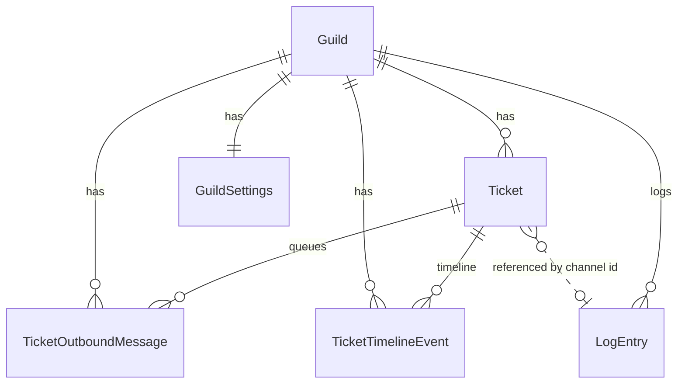

# Ticket System — Database Design

**As of:** CM-002 (2026-07-02)  
**ORM:** EF Core / PostgreSQL

---

## Current Schema

### Table: `Tickets`

| Column | Type | Notes |
|--------|------|-------|
| `Id` | uuid PK | |
| `GuildId` | uuid FK → `Guilds` | CASCADE delete |
| `TicketNumber` | int | Sequential per guild |
| `OwnerDiscordUserId` | varchar(32) | Snowflake |
| `ChannelDiscordId` | varchar(32) | Snowflake; unique |
| `Status` | varchar(16) | `Open`, `Closed` (string enum) |
| `ClosedAt` | timestamptz? | Set on close |
| `ChannelCleanupRequested` | bool | Dashboard close → bot deletes channel |
| `CreatedAt` | timestamptz | BaseEntity |
| `UpdatedAt` | timestamptz | BaseEntity |

**Indexes**
- `IX_Tickets_GuildId_TicketNumber` — UNIQUE
- `IX_Tickets_ChannelDiscordId` — UNIQUE
- `IX_Tickets_GuildId_Status`

**Entity:** `src/DiscordBot.Domain/Entities/Ticket.cs`  
**Configuration:** `src/DiscordBot.Infrastructure/Data/Configurations/TicketConfiguration.cs`

---

### Table: `TicketOutboundMessages`

| Column | Type | Notes |
|--------|------|-------|
| `Id` | uuid PK | |
| `TicketId` | uuid FK → `Tickets` | CASCADE |
| `GuildId` | uuid FK → `Guilds` | CASCADE |
| `Content` | varchar(2000) | Dashboard staff reply body |
| `SenderDiscordUserId` | varchar(32) | |
| `SenderDisplayName` | varchar(128)? | |
| `IsDelivered` | bool | Bot ack |
| `DeliveredAt` | timestamptz? | |
| `DeliveryFailed` | bool | Set when bot cannot deliver (CM-002) |
| `DeliveryFailureReason` | varchar(500)? | Failure detail |
| `StaffReplyQueuedTimelineEventId` | uuid | Links queue row to `StaffReplyQueued` event (D-001 §8, BR-T02) |
| `CreatedAt` | timestamptz | |
| `UpdatedAt` | timestamptz | |

**Indexes**
- `IX_TicketOutboundMessages_TicketId`
- `IX_TicketOutboundMessages_GuildId_IsDelivered_CreatedAt`
- `IX_TicketOutboundMessages_GuildId_IsDelivered_DeliveryFailed_CreatedAt`

**Purpose:** Outbound delivery queue only — **not** the Ticket Timeline. Timeline is the business source of truth; this table tracks Discord delivery state for dashboard replies.

---

### Table: `TicketTimelineEvents` (CM-002)

| Column | Type | Notes |
|--------|------|-------|
| `Id` | uuid PK | |
| `TicketId` | uuid FK → `Tickets` | CASCADE delete |
| `GuildId` | uuid FK → `Guilds` | CASCADE delete; denormalized for queries |
| `EventType` | varchar(32) | See `TicketTimelineEventType` enum |
| `OccurredAt` | timestamptz | Business ordering timestamp (BR-T04) |
| `ActorDiscordUserId` | varchar(32)? | Optional actor snowflake |
| `ActorDisplayName` | varchar(128)? | |
| `Content` | varchar(4000)? | Message body or failure reason |
| `DiscordMessageId` | varchar(32)? | Dedup for inbound Discord messages |
| `RelatedTimelineEventId` | uuid? | e.g. `StaffReplyDelivered` → `StaffReplyQueued` |
| `MetadataJson` | varchar(4000)? | Structured facts (status change, archive channel, etc.) |
| `CreatedAt` | timestamptz | BaseEntity |
| `UpdatedAt` | timestamptz | BaseEntity |

**Event types (Timeline v1):** `TicketCreated`, `MessageSent`, `StaffReplyQueued`, `StaffReplyDelivered`, `StaffReplyFailed`, `StatusChanged`, `ArchivePosted`

**Indexes**
- `IX_TicketTimelineEvents_TicketId_OccurredAt`
- `IX_TicketTimelineEvents_GuildId_OccurredAt`
- UNIQUE `(TicketId, DiscordMessageId)` WHERE `DiscordMessageId IS NOT NULL`

**Entity:** `src/DiscordBot.Domain/Entities/TicketTimelineEvent.cs`  
**Configuration:** `src/DiscordBot.Infrastructure/Data/Configurations/TicketTimelineEventConfiguration.cs`  
**Service:** `TicketTimelineService` — append-only writes (BR-T03)

**Traceability:** D-001 §3, §8 · BR-C06, BR-T01–T03, BR-T05, BR-S03, BR-X03

**Read models (CM-003):** Ticket Summary and Ticket Conversation are **query projections** over `Tickets` + `TicketTimelineEvents` — no separate projection tables in v1. Service: `TicketReadService`.

---

### Table: `GuildSettings` (ticket columns)

| Column | Type | Notes |
|--------|------|-------|
| `TicketsEnabled` | bool | Module + setup gate |
| `TicketCategoryId` | varchar(32)? | Discord category snowflake |
| `TicketArchiveChannelId` | varchar(32)? | Archive destination |
| `TicketWelcomeTitle` | varchar(256) | Template |
| `TicketWelcomeMessage` | varchar(2000) | Template |
| `TicketClosedMessage` | varchar(2000) | Bot close template |
| `TicketClosedFromDashboardMessage` | varchar(2000) | Cleanup worker template |
| `TicketStaffReplyPrefix` | varchar(500) | `{staff}` prefix |
| `CommandPanel*` | various | Panel UX (not ticket-specific table) |

**Related migrations**
- `20260630154720_InitialCreate` — `Tickets`, base settings
- `20260701120000_AddCommandPanelAndTicketCleanup` — `ChannelCleanupRequested`, panel fields
- `20260701150442_AddTicketMessagesAndAutoReplies` — templates + `TicketOutboundMessages`
- `20260701231527_BetaFeedbackFixes` — `TicketArchiveChannelId`
- `20260702195029_AddTicketTimelineEvents` — `TicketTimelineEvents`, outbound delivery failure columns

---

### Related tables (not ticket-owned)

| Table | Relationship |
|-------|--------------|
| `LogEntries` | Events `TicketOpened`, `TicketClosed`, `TicketArchived` |
| `GuildPermissionRoles` | Ticket permission flags on dashboard roles |
| `AutoReplyRules` | Optional `Scope = TicketChannelsOnly` |
| `GuildChannels` / `GuildMembers` | Display name enrichment |

---

## Entity Relationships (Current)



---

## Data Flow (CM-002)

| Expected data | Stored today? |
|---------------|---------------|
| Ticket metadata | Yes |
| Ticket Timeline (business history) | **Yes** — `TicketTimelineEvents` |
| Discord channel messages | **Yes** — `MessageSent` timeline events (bot ingestion) |
| Dashboard replies (content) | **Yes** — `StaffReplyQueued` + outbound queue |
| Dashboard reply delivery state | **Yes** — `StaffReplyDelivered` / `StaffReplyFailed` |
| Status changes | **Yes** — `StatusChanged` timeline events |
| Archive notification | **Yes** — `ArchivePosted` timeline event |
| Attachments | **No** |
| Assignee / claim | **No** |
| Category (multi) | **No** |
| Form answers | **No** |
| Full transcript export | **No** (timeline is source; export is future work) |

---

## Legacy / Superseded Proposals

The sections below describe pre-D-001 proposals. **CM-002 implements D-001 Timeline instead of a separate `TicketMessages` table.**

### New: `TicketMessages`

| Column | Type | Notes |
|--------|------|-------|
| `Id` | uuid PK | |
| `TicketId` | uuid FK | |
| `GuildId` | uuid FK | Denormalized for queries |
| `Source` | varchar(32) | `Discord`, `Dashboard`, `System` |
| `AuthorDiscordUserId` | varchar(32)? | Null for system |
| `AuthorDisplayName` | varchar(128)? | |
| `Content` | text | Up to Discord limits; consider 4000 |
| `DiscordMessageId` | varchar(32)? | Dedup inbound |
| `OutboundMessageId` | uuid? | FK to queue row if applicable |
| `AttachmentMetadataJson` | jsonb? | URLs, filenames |
| `CreatedAt` | timestamptz | Message time |

**Indexes**
- `IX_TicketMessages_TicketId_CreatedAt`
- `IX_TicketMessages_GuildId_CreatedAt`
- UNIQUE `(TicketId, DiscordMessageId)` where DiscordMessageId not null

### Extend: `Tickets`

| Column | Type | Phase |
|--------|------|-------|
| `AssignedToDiscordUserId` | varchar(32)? | Phase 2 |
| `ClaimedByDiscordUserId` | varchar(32)? | Phase 2 |
| `ClaimedAt` | timestamptz? | Phase 2 |
| `Priority` | int / enum | Phase 3 |
| `TagsJson` | jsonb | Phase 3 |
| `CategoryId` | uuid FK? | Phase 3 |
| `LastMessageAt` | timestamptz | Phase 2 (denormalized) |
| `CloseSource` | varchar(16)? | Phase 1 (`Discord`, `Dashboard`) |
| `TranscriptSnapshotJson` | jsonb? | Phase 1 optional |

### New: `TicketCategories` (Phase 3)

| Column | Type |
|--------|------|
| `Id` | uuid PK |
| `GuildId` | uuid FK |
| `Name` | varchar(128) |
| `DiscordCategoryId` | varchar(32) |
| `WelcomeTitle` | varchar(256)? |
| `WelcomeMessage` | varchar(2000)? |
| `StaffRoleIdsJson` | jsonb? |
| `PanelButtonId` | varchar(64)? |
| `SortOrder` | int |

### New: `TicketNotes` (Phase 2)

| Column | Type |
|--------|------|
| `Id` | uuid PK |
| `TicketId` | uuid FK |
| `AuthorDiscordUserId` | varchar(32) |
| `Content` | varchar(4000) |
| `CreatedAt` | timestamptz |

---

## Index & Query Strategy

### Current hot queries

1. List tickets by guild — `(GuildId)` + order by `CreatedAt DESC` — OK with status filter index.
2. Pending cleanups — `(Status, ChannelCleanupRequested)` — consider composite partial index `WHERE ChannelCleanupRequested = true`.
3. Pending outbound — `(IsDelivered, CreatedAt)` — global scan; v1 add `WHERE NOT IsDelivered` partial index.

### v1 recommendations

```sql
-- Example partial indexes (conceptual)
CREATE INDEX IX_Tickets_GuildId_Open ON Tickets (GuildId, CreatedAt DESC) WHERE Status = 'Open';
CREATE INDEX IX_TicketOutboundMessages_Pending ON TicketOutboundMessages (CreatedAt) WHERE NOT IsDelivered;
```

### Pagination

Use keyset pagination on `(CreatedAt, Id)` for ticket list at scale; offset pagination acceptable for v1 beta.

---

## Migration Strategy

1. **Phase 1.1:** Add `TicketMessages`; backfill **not** possible for historical tickets (channels deleted). Document empty history for pre-migration tickets.
2. **Phase 1.1:** Link new outbound sends to `TicketMessages` row at creation.
3. **Phase 1.4:** No schema change if using existing permission tables.
4. **Phase 2+:** Additive columns on `Tickets`; nullable for backward compatibility.

**Never** drop `TicketOutboundMessages` until bot delivery refactored to read from unified message outbox.

---

## Integrity Rules

| Rule | Enforcement |
|------|-------------|
| One open ticket per owner per guild | App layer (`TicketService.CreateTicketAsync`) — consider DB partial unique index `(GuildId, OwnerDiscordUserId) WHERE Status = 'Open'` |
| Channel maps to one ticket | UNIQUE on `ChannelDiscordId` |
| Ticket number unique per guild | UNIQUE `(GuildId, TicketNumber)` |
| Closed ticket has `ClosedAt` | App layer — add CHECK constraint in v1 |

---

## Technical Debt

1. **Status as string** in DB — consistent with codebase pattern; OK.
2. **No soft delete** on tickets — closed tickets remain forever; plan retention policy later.
3. **Cascade delete guild → tickets** — correct for multi-tenant cleanup; transcripts lost on guild delete (expected).
4. **Outbound queue separate from messages** — dual write risk until unified in Phase 1.

---

## Files Reference

| File | Role |
|------|------|
| `Ticket.cs` | Core entity |
| `TicketOutboundMessage.cs` | Queue entity |
| `TicketConfiguration.cs` | EF config |
| `AutoReplyRuleConfiguration.cs` | Outbound EF config |
| `AppDbContext.cs` | DbSets |
| `TicketService.cs` | All ticket persistence logic today |
