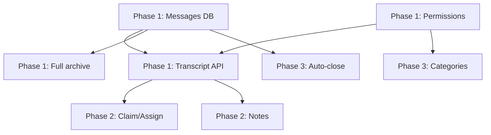

# Ticket System — Implementation Roadmap

**Target:** Ticket System v1 (see success criteria in [ticket-system-future.md](./ticket-system-future.md))  
**Current baseline:** ~52% complete (CM-001 review)

---

## Phase Overview

| Phase | Theme | Outcome | Est. duration |
|-------|-------|---------|---------------|
| **Phase 1** | Foundation & trust | Messages, permissions, detail UX, honest archive | 3–4 weeks |
| **Phase 2** | Staff workflow | Claim/assign, filters, staff channel access, reopen | 2–3 weeks |
| **Phase 3** | Product parity & scale | Categories/panels, auto-close, analytics, delivery reliability | 3–4 weeks |

---

## Phase 1 — Foundation & Trust

**Goal:** Make the system truthful, secure, and usable for real support teams.

### 1.1 Message persistence & transcript model

- Add `TicketMessage` entity (inbound Discord + outbound dashboard + system events).
- Bot: capture messages in ticket channels on `MessageReceived` (text; attachments as metadata URL refs).
- Persist outbound messages at queue time with delivery status linkage.
- Migration + indexes `(TicketId, CreatedAt)`.

### 1.2 Transcript API & dashboard viewer

- `GET /api/guilds/{id}/tickets/{ticketId}` — ticket detail.
- `GET /api/guilds/{id}/tickets/{ticketId}/messages` — paginated timeline.
- Dashboard route `/guilds/:id/tickets/:ticketId` with conversation view.
- Remove or rewrite misleading "full ticket in dashboard" archive strings.

### 1.3 Full archive on close

- On close (both paths): generate archive from persisted messages (not live channel scrape only).
- Archive embed: summary + link/button to dashboard transcript OR attach `.txt`/hosted HTML (v1 minimum: dashboard link).
- Optional: store `TranscriptSnapshot` JSON on ticket at close for immutability.

### 1.4 Wire granular ticket permissions

- Replace `CanAccessModerationPagesAsync` in ticket API with:
  - List/detail: `ViewTickets` OR owner/admin
  - Reply: `ReplyToTickets`
  - Close: `CloseTickets`
  - Settings (future): `ManageTickets`
- Update `GuildAccessGuard` / nav: tickets link uses ticket access evaluate, not moderation bundle only.
- Dashboard: hide reply/close buttons based on user flags from guild access payload.

### 1.5 Fix API edge cases

- `GET /guilds/{id}/tickets`: return `200 []` for authorized users with no tickets; reserve `403` for denied.
- Add pagination query params: `status`, `page`, `pageSize`, `sort`.

### 1.6 Unify close lifecycle

- Single close pipeline in `TicketService` setting cleanup flag consistently OR performing soft-close with explicit `CloseSource` enum.
- Bot Discord close: optionally set cleanup flag and let worker delete (consistent archive ordering) OR document intentional immediate delete with pre-archive from persisted messages.

### 1.7 Staff role Discord channel access

- Settings: configurable `TicketStaffRoleIds` (or reuse `GuildPermissionRole` with ticket flags).
- On ticket create: add overwrites for roles/users with `ViewTickets`+ (or configured list).
- Document permission sync when staff roles change (optional v1.1: worker to sync open ticket overwrites).

**Phase 1 exit criteria:** Staff can list tickets, open detail, read full history, reply and close with correct permissions; archive accurate; no false marketing copy.

---

## Phase 2 — Staff Workflow

**Goal:** Support teams can run a daily queue.

### 2.1 Claim & assign

- Add `AssignedToDiscordUserId`, `ClaimedAt`, optional `ClaimedByDiscordUserId`.
- Bot commands or dashboard actions: Claim, Unclaim, Assign.
- API: `PATCH /tickets/{id}/claim`, `PATCH /tickets/{id}/assign`.
- Log events: `TicketClaimed`, `TicketAssigned`.

### 2.2 Ticket list UX upgrade

- Default filter: Open only.
- Columns: assignee, last activity (from messages).
- Search by ticket number, owner name/id.
- Pagination component.

### 2.3 Reopen

- Add `TicketStatus.Reopened` or allow `Closed → Open` with `ReopenedAt`, `ReopenedBy`.
- Bot + dashboard reopen action; recreate channel OR reopen existing if channel exists (design choice: v1 = new channel linked to same ticket record with channel id update).

### 2.4 Rename & topic

- Dashboard/bot: rename channel `ticket-{number}-{slug}`.
- Optional topic field stored on ticket.

### 2.5 Internal notes

- `TicketNote` entity (staff-only, not sent to Discord).
- Dashboard UI on detail page.

### 2.6 Reply delivery feedback

- Show queued/sent/failed on dashboard from `TicketOutboundMessage.IsDelivered`.
- Retry failed deliveries (limited attempts).

**Phase 2 exit criteria:** Team queue with ownership, reopen path, notes, usable list at 50+ tickets.

---

## Phase 3 — Product Parity & Scale

**Goal:** Competitive feature set for commercial ticket module.

### 3.1 Multiple categories & panel routing

- `TicketCategory` entity: name, discord category id, welcome templates, staff role overrides, panel button id.
- Panel buttons map to category; select menu for open flow when multiple categories.
- Settings UI for category CRUD.

### 3.2 Open forms (modal)

- Optional modal on open: reason, order id, etc. → stored as `TicketFieldValue` or opening message.
- Dashboard displays submitted form answers.

### 3.3 Auto-close & reminders

- Settings: inactivity hours, warning message before close.
- Worker: scan open tickets last message timestamp; notify then close.

### 3.4 Priority & tags

- Enum priority on ticket; string tags JSON or join table.
- Filter/sort in dashboard.

### 3.5 Analytics

- Guild ticket stats endpoint: opened/closed per day, avg first response time, avg close time.
- Dashboard charts on overview or dedicated tickets analytics tab.

### 3.6 Delivery & worker scale

- Replace global poll with guild-scoped or cursor-based pending fetch.
- Dead-letter table for failed outbound messages.
- Metrics: pending count, delivery latency histogram.

### 3.7 Export & compliance

- Transcript export HTML/TXT download from dashboard.
- Optional DM transcript to ticket owner on close (setting).

**Phase 3 exit criteria:** Multi-category servers supported; automation and analytics match commercial baseline for v1 launch.

---

## Implementation Order (Recommended)

```
Phase 1.1 → 1.2 → 1.4 → 1.3 → 1.6 → 1.5 → 1.7
Phase 2.1 → 2.2 → 2.6 → 2.5 → 2.3 → 2.4
Phase 3.1 → 3.2 → 3.3 → 3.4 → 3.5 → 3.6 → 3.7
```

**Recommended next task after CM-001:** **CM-002 — Ticket message persistence & ingestion** (Phase 1.1)

---

## Dependencies Between Phases



---

## Out of Scope for v1 (Deferred)

- SLA escalation chains
- Email/web ticket ingestion
- AI summarization
- Multi-guild ticket routing
- Billing per ticket
- Voice ticket channels

See [ticket-system-future.md](./ticket-system-future.md) for backlog IDs and post-v1 ideas.
