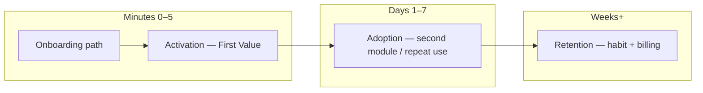
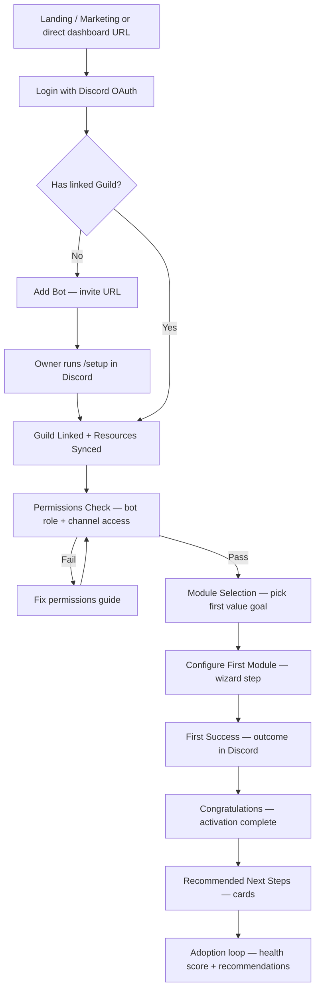
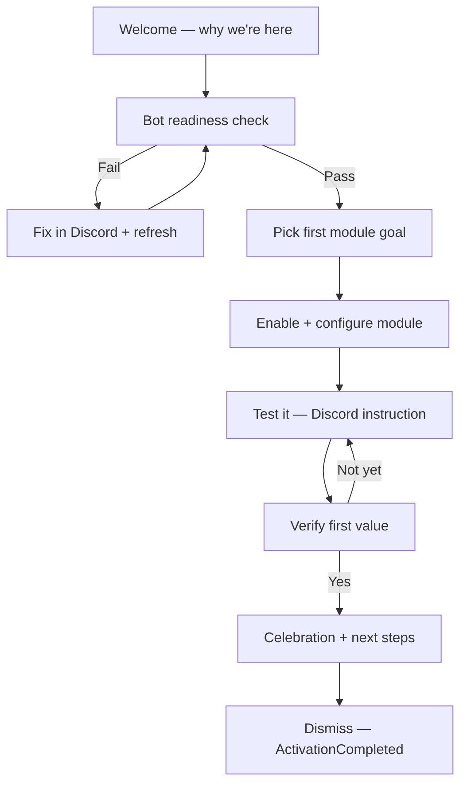
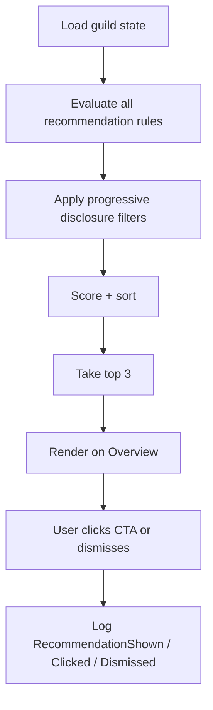
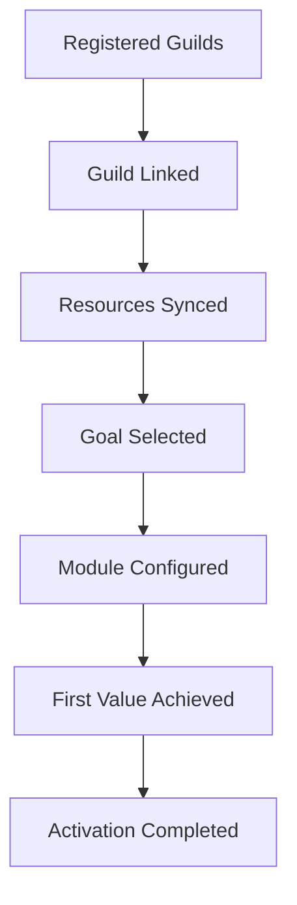

# First-Time User Activation Blueprint

**Document ID:** O-001  
**Status:** Official — UX authority for First-Time User Activation  
**Owner:** Product & UX Architecture  
**Last updated:** 2026-07-03  
**Product alignment:** [Product Blueprint (PB-001)](/docs/blueprint/product-blueprint.md)  
**Vocabulary:** [Ubiquitous Language (UL-001)](/docs/blueprint/ubiquitous-language.md)  
**Related:** [Subscription Experience (UX-001)](/docs/ux/subscription-experience.md) · [Ticket Domain Blueprint (D-001)](/docs/domains/ticket-management/ticket-domain-blueprint.md) · [Step 19 Onboarding](/docs/step-19-customer-onboarding.md)

---

## How to use this document

This blueprint defines the **complete first-time user activation experience** for guild owners on the Discord Bot Platform. It does not specify Angular components, API contracts, database schemas, or analytics implementation — those trace to future implementation sprints (O-002+).

**Audience:** Product, design, engineering, platform admins, copywriters.

**North star:** **Time To First Value (TTFV) < 5 minutes** — the owner reaches their first successful module outcome, not merely links a guild.

**Live baseline today:** `/servers` onboarding hero, 6-item setup checklist (`OnboardingService`), overview progress bar. **Gap:** checklist measures configuration completeness, not first value. This blueprint supersedes checklist semantics for activation while preserving compatible infrastructure.

Every future module (Tickets, Moderation, Logs, Billing, Automation, etc.) **must plug into** the activation checklist, health score, recommendation engine, and success moments defined here.

---

## 1. Activation Philosophy

### Definitions

| Term | Definition | Success signal |
|------|------------|----------------|
| **Activation** | The moment a guild owner **experiences first value** from an enabled **Module** | Observable outcome in Discord or dashboard (e.g. first **Ticket** opened, first welcome message sent) |
| **Onboarding** | The **guided path** that moves a new owner from login to activation | Owner completes wizard/checklist steps without abandoning |
| **Adoption** | **Continued use** of one or more modules after activation | Module used again within 7 days; second module enabled |
| **Retention** | **Sustained engagement** with the platform over weeks | Weekly dashboard visits, staff invited, subscription renewed |

### How they differ



- **Onboarding** is a **means**. Checking boxes without a real outcome is a false positive.
- **Activation** is the **first proof** the product works for *this* community.
- **Adoption** expands scope (more modules, staff, configuration depth).
- **Retention** is long-term; upsell and automation belong here, not in minute-one UX.

### Product stance

| Old success metric | New success metric |
|--------------------|-------------------|
| Guild linked (`/setup` completed) | **First module value event** recorded |
| Checklist 100% (config-only) | **ActivationCompleted** with module + outcome type |

Configuration steps (sync resources, enable module, set channel) remain **necessary preconditions** but are not sufficient. The owner must see **evidence** their community benefited.

### Relationship to existing onboarding

The current 6-item checklist (Step 19) maps to **setup milestones**. O-001 **extends** it with:

1. **Module intent selection** (pick first value goal)
2. **First value verification** (system-detected or owner-confirmed)
3. **Community Health Score** and **recommendations** after activation

Legacy checklist items are retained as sub-steps under the activation funnel, not removed abruptly.

---

## 2. Time To First Value

### Target

**TTFV < 5 minutes** from first dashboard login (or return visit after Discord OAuth) to **First Value Confirmed**.

Clock starts: `DashboardSessionStarted` (first authenticated load of `/servers` or post-login redirect).  
Clock stops: `ActivationCompleted` (first module outcome event).

### Measurable steps

| Step | ID | Target duration | Cumulative budget | Measurable event |
|------|-----|-----------------|-------------------|------------------|
| 1. Land on dashboard | `L1` | ≤ 10 s | 0:10 | `DashboardSessionStarted` |
| 2. OAuth already complete / login | `L2` | ≤ 30 s | 0:40 | `UserAuthenticated` |
| 3. Invite bot (if no guild) | `L3` | ≤ 60 s | 1:40 | `BotInviteClicked` |
| 4. Run `/setup` in Discord | `L4` | ≤ 90 s | 3:10 | `GuildLinked` |
| 5. Select first module goal | `L5` | ≤ 30 s | 3:40 | `ActivationGoalSelected` |
| 6. Enable module + minimal config | `L6` | ≤ 60 s | 4:40 | `ModuleConfigured` |
| 7. Trigger first outcome | `L7` | ≤ 30 s | **5:10** hard cap | `FirstValueAchieved` |
| 8. Congratulations + next step | `L8` | ≤ 20 s | — | `ActivationCompleted` |

**SLA note:** Steps 3–4 depend on Discord context-switching. The wizard must **preserve state** when the owner returns from Discord (deep link to `/servers` with refreshed guild list).

### First value outcomes (official)

| Module | First value event | Detection |
|--------|-------------------|-----------|
| **Welcome** | Member join → welcome message posted in Discord | Bot **Log Entry** or welcome delivery confirmation |
| **Tickets** | Member opens first **Ticket** (panel button or `/ticket`) | `Ticket` created in API |
| **Reaction Roles** | Member assigns role via panel button | Reaction role assignment **Log Entry** |
| **Logs** | First qualifying **Log Entry** stored (join, message delete, etc.) | `LogEntry` created |
| **Moderation** | First warn/kick executed | **Moderation Case** or command **Log Entry** |
| **Auto Role** | New member receives auto-assigned role | Role assignment **Log Entry** |

Free-tier modules (Welcome, Logs) are **default recommended paths** for fastest TTFV. Paid modules show plan gate honestly with alternative free path.

---

## 3. User Journey

### Complete journey



### Stage detail

| Stage | Owner mental model | Platform responsibility |
|-------|-------------------|-------------------------|
| **Landing** | "Is this legit?" | Clear value prop; single CTA: Login with Discord |
| **Login** | "Connect my Discord account" | OAuth; redirect to `/servers` |
| **Add Bot** | "Put the bot in my server" | Invite URL; permission scope explanation |
| **Link Guild** | "Register my community" | `/setup` registers guild, syncs channels/roles |
| **Permissions Check** | "Can the bot actually work?" | Validate bot role position, Manage Channels, Send Messages |
| **Module Selection** | "What do I want working first?" | 3 recommended cards; one primary choice |
| **Configure First Module** | "Minimal setup to go live" | Wizard with ≤ 3 fields for chosen module |
| **First Success** | "It worked!" | Detect outcome; show proof (link to ticket, log snippet) |
| **Congratulations** | "I'm done… what's next?" | Celebration + health score intro |
| **Recommended Next Steps** | "What should I do now?" | Prioritized recommendation cards |

### Permissions check (activation gate)

Before module configuration, show a **Bot Readiness** panel:

| Check | Pass criteria | Failure CTA |
|-------|---------------|-------------|
| Bot in guild | Guild registered, active | Re-invite bot |
| Resources synced | `resourcesSyncedAt` set, channels/roles > 0 | Run `/sync` |
| Bot role hierarchy | Bot role above managed roles (module-specific) | Discord role guide |
| Required intents | Bot online (heartbeat / last bot activity) | Contact support |

Do not block activation on subscription (Free tier is valid). Do block on missing bot or zero synced resources.

---

## 4. Activation Checklist

The checklist replaces "setup completeness" as the **primary progress UI** while retaining familiar items.

### Structure

**Phase A — Connect (required for all paths)**

| # | Item | Complete when | Weight |
|---|------|---------------|--------|
| ☑ | Login with Discord | JWT session valid | — (implicit) |
| ☐ | Add Bot to guild | Guild registered | 15% |
| ☐ | Link guild (`/setup`) | `GuildLinked` + resources synced | 20% |

**Phase B — Activate (one module path required)**

| # | Item | Complete when | Weight |
|---|------|---------------|--------|
| ☐ | Choose activation goal | `ActivationGoalSelected` | 10% |
| ☐ | Enable target module | Module `IsEnabled` + plan allowed | 15% |
| ☐ | Configure first module | Module-specific minimum config | 20% |
| ☐ | **Achieve first value** | `FirstValueAchieved` for chosen module | **20%** |

**Phase C — Expand (post-activation, optional for 100%)**

| # | Item | Complete when | Weight |
|---|------|---------------|--------|
| ☐ | Invite staff (permission role) | ≥ 1 **Permission Role** mapped | 5% |
| ☐ | Enable Logs (if not activation module) | Logs module on + log channel | 5% |
| ☐ | Review subscription | Owner viewed `/subscription` | 5% |

### Progress calculation

```
Progress % = sum(completed step weights) / sum(all weights) × 100
```

- **Activation milestone** = Phase A + Phase B complete (≥ 85%) → show **Congratulations**.
- **Full checklist** = 100% includes Phase C (adoption nudges).

### Reward messaging

| Progress | Message (EN) | Message (AR) |
|----------|--------------|--------------|
| 0–30% | "Let's connect your Discord community." | "لنربط مجتمع Discord الخاص بك." |
| 31–60% | "Almost ready — pick what you want working first." | "اقتربنا — اختر ما تريد تفعيله أولاً." |
| 61–84% | "One step away from your first win." | "خطوة واحدة قبل أول نجاح." |
| **85%+ (activated)** | "🎉 Activated! Your community is live on [module]." | "🎉 تم التفعيل! مجتمعك يعمل الآن عبر [module]." |
| 100% | "Community setup complete — explore recommendations below." | "اكتمل إعداد المجتمع — استكشف التوصيات أدناه." |

### Completion state

When **ActivationCompleted**:

- Checklist collapses to compact "Activated" badge on overview
- Primary CTA shifts from wizard to **Recommendation cards**
- Health Score widget appears (see §7)
- Server list card shows "Activated" not just "Setup X%"

---

## 5. Welcome Wizard

A **modal or full-page wizard** (not a browser tour overlay) launched automatically when:

- Owner has guild linked **and**
- `ActivationCompleted` is false **and**
- Owner opens overview or `/servers` guild card

Re-launchable from overview: **"Continue setup"**.

### Wizard flow



### Step specification

| Step | Purpose | Expected duration | Primary CTA | Error recovery | Skip rule |
|------|---------|-------------------|-------------|----------------|-----------|
| **W0 Welcome** | Set TTFV expectation; not generic onboarding | 15 s | "Get started" | — | Cannot skip |
| **W1 Bot readiness** | Permissions + sync status | 30–90 s | "Refresh status" | Links to `/setup`, `/sync`, invite URL | Skip if all checks pass on entry |
| **W2 Pick goal** | Choose Welcome / Tickets / Logs / Reaction Roles | 20 s | "Continue with [module]" | — | Cannot skip (required for activation) |
| **W3 Configure** | Module-specific minimal fields | 45–90 s | "Save and continue" | Inline validation; link to Settings | Cannot skip config |
| **W4 Test in Discord** | Copy-paste instruction (e.g. "Join with alt account") | 30–120 s | "I've tested it" | Troubleshooting accordion | Can skip only if system already detected value |
| **W5 Verify** | Poll for `FirstValueAchieved` or manual confirm | 15 s | "Confirm success" | "Not working?" → support + docs | Auto-advance on detection |
| **W6 Celebrate** | Confetti/micro-animation; show outcome proof | 10 s | "See recommendations" | — | Cannot skip celebration (short) |

### Module-specific W3 fields (minimum)

| Module | Fields | Defaults |
|--------|--------|----------|
| Welcome | Welcome channel, message template | General channel if exists |
| Tickets | Category or `/ticket setup` prompt | Link to Discord command |
| Logs | Log channel | First text channel warning |
| Reaction Roles | Panel channel + one button | Pre-built template panel |
| Moderation | Map one Discord role to mod permissions | Owner role |
| Auto Role | Role to assign on join | @Member or custom role |

### Skip rules (global)

- **Never skip** guild link or module selection.
- **May skip** W4 if backend detects first value before owner clicks.
- **May defer** Phase C checklist items indefinitely.
- **Wizard dismiss** saves progress; resume at last incomplete step.

---

## 6. Empty States

Platform-wide empty state pattern:

```
[Illustration]
Headline (benefit-oriented)
Description (one sentence + what happens next)
[Primary CTA]  [Secondary CTA]
```

All copy must exist in **EN + AR**. Illustrations: simple line icons or emoji for beta; custom SVG in future.

### No Guild

| Field | Content |
|-------|---------|
| **Illustration** | Rocket / Discord server outline |
| **Headline** | "Connect your first community" |
| **Description** | "Invite the bot, run `/setup` in Discord, then return here to activate your first module." |
| **Primary CTA** | Invite Bot |
| **Secondary CTA** | "I already invited — refresh" |

*Live today:* `/servers` onboarding hero — align copy to activation language.

### No Modules Enabled

| Field | Content |
|-------|---------|
| **Illustration** | Toggle / puzzle piece |
| **Headline** | "Turn on your first feature" |
| **Description** | "Modules are bot capabilities. Enable one to reach your first win in under 5 minutes." |
| **Primary CTA** | Open Modules |
| **Secondary CTA** | Start activation wizard |

### No Tickets

| Field | Content |
|-------|---------|
| **Illustration** | Ticket / inbox |
| **Headline** | "No support tickets yet" |
| **Description** | "Configure a ticket panel in Discord so members can open private support channels." |
| **Primary CTA** | Configure Tickets |
| **Secondary CTA** | View setup guide |

If Tickets module disabled: primary CTA → Enable module (with plan gate if needed).

### No Staff

| Field | Content |
|-------|---------|
| **Illustration** | People / roles |
| **Headline** | "You're managing alone" |
| **Description** | "Map Discord roles to dashboard access so moderators and support can help without sharing your account." |
| **Primary CTA** | Add Permission Role |
| **Secondary CTA** | Learn about capabilities |

### No Logs

| Field | Content |
|-------|---------|
| **Illustration** | Scroll / activity lines |
| **Headline** | "No activity recorded yet" |
| **Description** | "Enable the Logs module and pick a channel to start your community audit trail." |
| **Primary CTA** | Enable Logs |
| **Secondary CTA** | Open Settings |

### No Subscription (context)

| Field | Content |
|-------|---------|
| **Illustration** | Plan card |
| **Headline** | "You're on the Free plan" |
| **Description** | "Free includes Welcome and Logs. Upgrade when you need Tickets, Moderation, or Reaction Roles." |
| **Primary CTA** | View plans |
| **Secondary CTA** | Continue with Free |

Not a dead end — Free is valid for activation.

### No Activity (Overview)

| Field | Content |
|-------|---------|
| **Illustration** | Pulse / chart flatline |
| **Headline** | "Quiet so far" |
| **Description** | "Complete activation to see tickets, logs, and module status here." |
| **Primary CTA** | Continue activation |
| **Secondary CTA** | Open Discord server |

### No Panels (Reaction Roles)

| Field | Content |
|-------|---------|
| **Illustration** | Button row |
| **Headline** | "No role panels yet" |
| **Description** | "Create a button panel so members can self-assign roles without moderator help." |
| **Primary CTA** | Create panel |
| **Secondary CTA** | Enable Reaction Roles module |

### No Permissions Configured

| Field | Content |
|-------|---------|
| **Illustration** | Shield |
| **Headline** | "Staff permissions not set up" |
| **Description** | "Only you can access moderation and tickets in the dashboard until you map Discord roles." |
| **Primary CTA** | Configure permissions |
| **Secondary CTA** | Skip for now |

---

## 7. Health Score

### Community Health

A **0–100 score** shown on guild **Overview** after first login. Before activation, show "Setup in progress" instead of numeric score.

### Factors and weights

| Factor | Weight | Scoring |
|--------|--------|---------|
| Guild linked | 15 | 0 or 15 |
| Bot online / recent sync | 10 | 0, 5, or 10 by recency |
| Modules enabled (≥1) | 10 | 0 or 10 |
| **Activation completed** | 20 | 0 or 20 |
| Tickets configured | 10 | 0, 5, or 10 |
| Logs configured | 10 | 0 or 10 |
| Permissions configured | 10 | 0 or 10 |
| Subscription active (paid) | 5 | 0 or 5 (optional bonus) |
| Recent activity (7d) | 10 | 0–10 by event count |

**Maximum:** 100

### Healthy defaults

| Score band | Label | Color | Meaning |
|------------|-------|-------|---------|
| 0–39 | Needs attention | Amber | Stuck before activation |
| 40–69 | Getting started | Blue | Activated but thin config |
| 70–89 | Healthy | Green | Operational community |
| 90–100 | Thriving | Green + badge | Multi-module + activity |

### Recommendations tied to score

Each factor below target contributes a **recommendation card** (see §8). Score breakdown is expandable: "Missing 10 pts — configure logs."

### Visual design concept

```
┌─────────────────────────────────────┐
│  Community Health            72/100 │
│  ████████████████░░░░░░  Healthy    │
│  ▼ Breakdown                        │
│    ✓ Activated (Welcome)            │
│    ○ Invite staff (+10)             │
│    ○ Enable ticket panel (+10)      │
└─────────────────────────────────────┘
```

Circular ring or horizontal bar; accessible text alternative required. RTL: mirror bar fill direction in AR.

---

## 8. Recommendation Engine

### Purpose

After activation (and ongoing), show **1–3 prioritized cards** on Overview. Each card: icon, title, one-line benefit, primary CTA, dismiss/snooze.

### Example cards

| ID | Title | Trigger | Priority |
|----|-------|---------|----------|
| `REC_WELCOME` | Configure Welcome | Activation module ≠ Welcome, Welcome not configured | Medium |
| `REC_LOGS` | Enable Logs | Logs off | Medium |
| `REC_STAFF` | Invite Staff | 0 permission roles | High (post-activation) |
| `REC_TICKET_PANEL` | Create Ticket Panel | Tickets on, 0 tickets ever | High |
| `REC_TICKET_FIRST` | Open a test ticket | Tickets configured, 0 tickets | High |
| `REC_MOD_PERMS` | Map moderator roles | Moderation on, no mod permission roles | Medium |
| `REC_REACTION_PANEL` | Create role panel | Reaction roles on, 0 panels | Medium |
| `REC_UPGRADE` | Upgrade plan | Hit plan gate OR ≥2 locked modules clicked | Low until basic setup done |
| `REC_RENEW` | Renew subscription | Paid plan expiring ≤ 7 days | High (billing) |

### Priority algorithm

```
score(card) = basePriority × urgencyMultiplier × relevanceMultiplier
```

1. **Base priority** (High=3, Medium=2, Low=1)
2. **Urgency multiplier**
   - Blocked user action (plan gate) → 1.5×
   - Expiring subscription → 2×
   - Stalled activation > 24h → 1.8×
3. **Relevance multiplier**
   - Matches owner's selected activation goal → 1.3×
   - Module already enabled → 0.5× for duplicate enable cards
4. **Suppress if**
   - Card dismissed in last 7 days (snooze)
   - Prerequisite unmet (progressive disclosure, §9)
   - Activation not complete AND card is Phase C only

Return top 3 by score. Always include at least one **activation-progress** card until `ActivationCompleted`.



---

## 9. Progressive Disclosure

Advanced features stay hidden until prerequisites exist.

| Hide until | Feature |
|------------|---------|
| Activation complete | Subscription upsell banners (except honest plan gate at click) |
| Tickets module on + ≥1 ticket | Automation / auto-reply advanced rules |
| ≥1 Permission Role | Granular capability tuning (show simplified first) |
| Logs module on | Log retention / clear-all emphasis |
| Paid plan active | Premium-only module marketing on Overview |
| Health score ≥ 70 | "Power user" shortcuts (bulk actions, API docs) |

### Rules

1. **Plan gate at point of need** — show upgrade when user clicks locked module, not on login.
2. **Wizard before settings depth** — Settings pages stay available but wizard handles happy path.
3. **Admin features** — Platform admin never mixed into guild owner activation.
4. **No empty advanced tabs** — hide nav items whose module is off (existing pattern; enforce consistently).

---

## 10. Success Moments

Micro-celebrations reinforce activation without blocking flow.

| Moment | Trigger | UX treatment |
|--------|---------|--------------|
| First linked guild | `GuildLinked` | Toast + checklist confetti (subtle) |
| First module enabled | Module toggled on | Inline check animation on checklist |
| First ticket | Ticket created | Dashboard toast + Overview badge "First ticket!" |
| First welcome sent | Welcome delivery | "Your community was greeted" card with timestamp |
| First log entry | LogEntry created | Logs page banner (dismissible) |
| Activation complete | `ActivationCompleted` | Wizard celebration step; Overview health unlock |
| First subscription change submitted | Subscription change created | Use UX-001 stepper praise at PendingPayment |
| **100 tickets** | Ticket count milestone | Email-free dashboard banner; optional Discord announce (future) |

### Micro-interaction guidelines

- Duration ≤ 2 s for animations
- Always skippable / dismissible
- Never use browser `alert()`
- Sound off by default
- Arabic: same timing; localized strings

---

## 11. Admin Perspective

Platform admins (`/admin/*`) need **activation funnel visibility**, not guild-level wizard UI.

### Dashboard widgets (Platform Admin Overview)

| Metric | Definition |
|--------|------------|
| **Guild activation %** | Guilds with `ActivationCompleted` / registered guilds |
| **Median TTFV** | Median minutes from first `GuildLinked` to `ActivationCompleted` |
| **Most abandoned step** | Wizard step with highest drop-off |
| **Average activation time** | Mean TTFV (trim outliers > 24h) |
| **Top setup failures** | Bot readiness failures grouped by reason |
| **Most skipped modules** | Activation goals selected but not completed |
| **Activation funnel** | Counts per funnel stage (see diagram) |

### Activation funnel (admin)



Show conversion % between stages; highlight largest drop.

### Operational use

- Identify if `/setup` or bot permissions cause beta churn
- Coach cohort guilds stuck at same step
- Prioritize engineering fixes (e.g. ticket panel UX) by abandonment data

---

## 12. Analytics Events

**Recommendations only — no implementation in O-001.**

### Identity conventions

- Include `guildId`, `userId`, `sessionId`, `locale` where available
- Timestamps UTC
- Module keys match `ModuleKeys` constants

### Core activation funnel

| Event | When | Key properties |
|-------|------|----------------|
| `DashboardSessionStarted` | First page load after auth | `referrer`, `hasGuilds` |
| `UserAuthenticated` | OAuth success | `isNewUser` |
| `BotInviteClicked` | Invite CTA click | `source` (servers, wizard) |
| `GuildLinked` | Guild registered via `/setup` | `guildId`, `discordGuildId` |
| `ResourcesSynced` | Sync success | `channelCount`, `roleCount` |
| `BotReadinessChecked` | Wizard step 1 | `passed`, `failedChecks[]` |
| `WizardStarted` | Wizard opened | `entryPoint` |
| `WizardStepViewed` | Each step | `stepId`, `stepIndex` |
| `WizardStepCompleted` | Step CTA success | `stepId`, `durationMs` |
| `WizardSkipped` | Allowed skip | `stepId`, `reason` |
| `ActivationGoalSelected` | Module goal picked | `moduleKey` |
| `ModuleEnabled` | Module toggled on | `moduleKey`, `planKey` |
| `ModuleConfigured` | Min config saved | `moduleKey`, `configFields[]` |
| `FirstValueAchieved` | Outcome detected | `moduleKey`, `outcomeType` |
| `ActivationCompleted` | Wizard finished | `moduleKey`, `ttfvMinutes` |
| `WizardAbandoned` | Wizard closed incomplete | `lastStepId`, `durationMs` |

### Module-specific

| Event | When |
|-------|------|
| `TicketConfigured` | Category or `/ticket setup` complete |
| `PanelCreated` | Reaction role panel created |
| `PermissionRoleAdded` | First permission role saved |
| `LogChannelSet` | Logs channel configured |
| `WelcomeChannelSet` | Welcome channel + message saved |

### Recommendations & health

| Event | When |
|-------|------|
| `HealthScoreViewed` | Overview loaded with score |
| `RecommendationShown` | Card rendered | `recommendationId`, `rank` |
| `RecommendationClicked` | CTA click | `recommendationId` |
| `RecommendationDismissed` | Dismiss/snooze | `recommendationId`, `snoozeDays` |

### Success moments

| Event | When |
|-------|------|
| `SuccessMomentShown` | Celebration UI displayed | `momentType` |
| `MilestoneReached` | 100 tickets, etc. | `milestoneKey`, `count` |

---

## 13. Product Principles

Ten activation principles — mandatory for all first-time UX work:

| # | Principle |
|---|-----------|
| 1 | **Every screen has one primary action.** Secondary actions are visually subordinate. |
| 2 | **Never leave the user wondering what to do next.** Always show the next step or a recommendation. |
| 3 | **Every completed step unlocks the next recommendation.** Progress must feel causal. |
| 4 | **No dead ends.** Empty states always offer a primary CTA and recovery path. |
| 5 | **Celebrate progress, not just completion.** Micro-wins at module enable, first value, etc. |
| 6 | **Activation beats configuration.** A checked box without outcome is not success. |
| 7 | **Discord ↔ dashboard loops must be explicit.** Tell users when to switch to Discord and when to return. |
| 8 | **Free tier is a valid destination.** Do not treat unpaid owners as failures. |
| 9 | **Honest plan gates at point of need.** No upsell before basic setup is complete. |
| 10 | **i18n from day one.** Every activation string exists in EN and AR; RTL layouts tested. |

---

## Diagrams (summary index)

| Diagram | Section |
|---------|---------|
| Activation vs onboarding vs adoption vs retention | §1 |
| TTFV user journey | §3 |
| Welcome wizard flow | §5 |
| Activation funnel (admin) | §11 |
| Recommendation engine flow | §8 |
| Health score factor weights | §7 |

---

## Integration requirements for future modules

Any new module **must** ship with:

1. **First value definition** — detectable event for `FirstValueAchieved`
2. **Wizard W3 minimum config** — ≤ 3 fields
3. **Empty state** — headline, CTAs, EN/AR
4. **Recommendation rule** — at least one card with priority
5. **Health score factor** (optional weight) — if module is core to operations
6. **Analytics events** — configure + first value
7. **Success moment** — first use celebration copy

---

## Related documents

- [Product Blueprint (PB-001)](/docs/blueprint/product-blueprint.md)
- [Ubiquitous Language (UL-001)](/docs/blueprint/ubiquitous-language.md)
- [Architecture Handbook](/docs/architecture/README.md)
- [Subscription Experience (UX-001)](/docs/ux/subscription-experience.md)
- [Manual Billing Domain Blueprint (SB-001)](/docs/domains/subscription-billing/manual-billing-domain-blueprint.md)
- [Ticket Domain Blueprint (D-001)](/docs/domains/ticket-management/ticket-domain-blueprint.md)
- [Release 0.1 Readiness (R-001)](/docs/releases/release-0.1-readiness.md)
- [Step 19 — Customer Onboarding](/docs/step-19-customer-onboarding.md)

---

## Revision history

| Date | Change |
|------|--------|
| 2026-07-03 | O-001 initial official blueprint |
