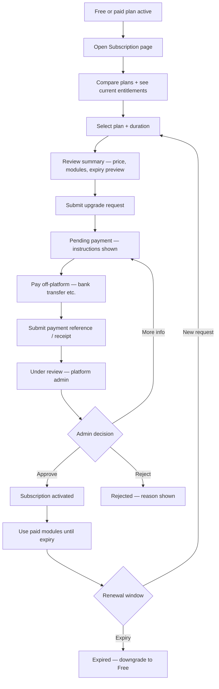
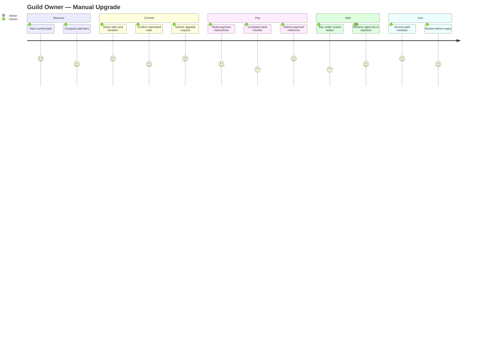
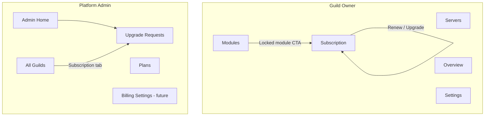
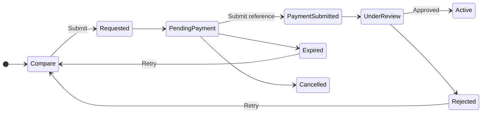
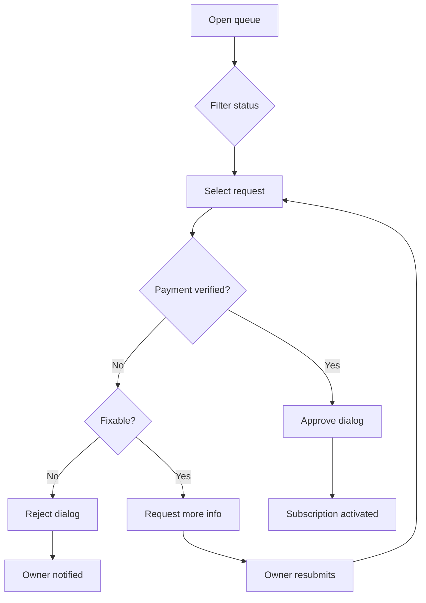
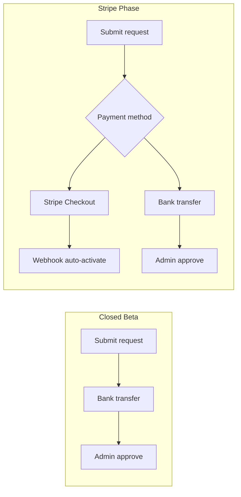

# Subscription Experience Blueprint

**Document ID:** UX-001  
**Status:** Official — UX authority for Manual Billing & Subscription  
**Owner:** Product Design  
**Last updated:** 2026-07-03  
**Domain alignment:** [Manual Billing Domain Blueprint (SB-001)](/docs/domains/subscription-billing/manual-billing-domain-blueprint.md) · [SB-002 Foundation](/docs/progress/2026-07-03-SB-002-manual-billing-foundation.md)  
**Product alignment:** [Product Blueprint (PB-001)](/docs/blueprint/product-blueprint.md)  
**Vocabulary:** [Ubiquitous Language (UL-001)](/docs/blueprint/ubiquitous-language.md)

---

## How to use this document

This blueprint defines the **complete user experience** for guild subscription and manual billing. It does not specify Angular components, API contracts, or database schemas — those trace to SB-001/SB-002 and implementation sprints.

**Audience:** Product designers, frontend engineers, copywriters, platform admins training beta customers.

**Design goal:** A **world-class SaaS subscription experience** during Closed Beta — modern, trustworthy, and guided — even without Stripe or in-app card payments.

**Live baseline:** Single-page `/guilds/:id/subscription` with subscription change stepper, payment reference form, and change history. Admin queue at `/admin/upgrade-requests` (UI: **Subscription Changes**) with filters, payment reference column, and approve/reject dialogs (SB-003/SB-004).

---

## 1. User Journey

### Primary upgrade journey (Guild Owner)

The owner should always know **where they are**, **what to do next**, and **who is responsible** (self vs platform admin).



| Stage | User mental model | System state (request) | System state (subscription) |
|-------|-------------------|------------------------|----------------------------|
| Compare plans | "What do I get if I pay?" | — | Current plan |
| Submit request | "I'm committing to upgrade" | `Requested` → `PendingPayment` | Unchanged |
| Pay externally | "I've sent the money" | `PendingPayment` | Unchanged |
| Submit proof | "Please verify my payment" | `PaymentSubmitted` → `UnderReview` | Unchanged |
| Wait | "They're checking my payment" | `UnderReview` | Unchanged |
| Active | "I'm on a paid plan" | `Activated` (terminal) | `Active` + expiry |
| Rejected | "I need to fix something or choose again" | `Rejected` | Unchanged |
| Cancelled | "I changed my mind" | `Cancelled` | Unchanged |
| Expired (request) | "I took too long — start over" | `Expired` | Unchanged |
| Expired (subscription) | "My plan ended — renew or stay Free" | — | `Expired` → Free |

### Alternate journeys

#### Rejected

1. Owner sees rejection banner with **admin reason** (never hidden).
2. Primary CTA: **Start new upgrade request** (if no active request).
3. Secondary: **Contact support** (Discord/email from beta guide).

#### Cancelled

1. Owner or admin cancelled in-flight request.
2. Show who cancelled and when (owner-cancel vs admin-cancel copy differs).
3. Primary CTA: **Upgrade again** when ready.

#### Expired (request)

1. Request passed `RequestExpiresAt` without payment proof.
2. Explain: reservation released; no charge assumed.
3. Primary CTA: **Submit new request**.

#### Renewal

Manual billing has **no auto-charge**. Renewal = new upgrade request before or after subscription expiry.

| Timing | UX |
|--------|-----|
| **7 / 3 / 1 days before `ExpiresAt`** | Banner on Subscription + Modules: "Renew to keep [modules]" |
| **On expiry** | Expired banner; out-of-plan modules locked with link to Subscription |
| **After expiry** | Same upgrade journey from Free; history shows prior paid period |

#### Downgrade

| Type | UX |
|------|-----|
| **Automatic (expiry)** | Free plan restored; modules outside Free disabled; honest messaging |
| **Owner-initiated** | **Not in v1** — show "Contact support" or wait for expiry |
| **Admin-initiated** | Admin cancel subscription (operator path); owner sees notification + updated plan card |

### Journey diagram (condensed)



---

## 2. Screen Inventory

Each screen has a **purpose**, **entry points**, and **exit actions**. No component specs.

### Guild Owner screens

| Screen | Route (target) | Purpose |
|--------|------------------|---------|
| **Current Subscription** | `/guilds/:id/subscription` | Home for billing — plan, status, expiry, modules, primary CTA |
| **Plan Comparison** | Same page — section or `/subscription/compare` | Side-by-side tiers; highlight current vs selected |
| **Upgrade Confirmation** | Modal or step before submit | Final check: plan, duration, total, expiry preview, beta manual-billing note |
| **Payment Instructions** | Same page — panel after request | Bank details, amount, reference format, deadline (`RequestExpiresAt`) |
| **Submit Payment Proof** | Panel or `/subscription/requests/:id` | Reference input + optional receipt upload (future sprint) |
| **Request Status** | Banner + stepper on Subscription | Live state for active request; replaces generic "pending" copy |
| **Request Detail** (optional v1.1) | `/guilds/:id/subscription/requests/:requestId` | Full timeline of status changes + admin notes |
| **Subscription History** | Section on Subscription | Past requests with status, amounts, rejection reasons |
| **Expired Subscription** | State on Current Subscription | Downgrade messaging + renew CTA |
| **Renew Subscription** | Reuses upgrade flow | Pre-select previous plan optional; same payment loop |

### Platform Admin screens

| Screen | Route | Purpose |
|--------|------|---------|
| **Admin Overview** | `/admin` | Count of requests awaiting review; plan distribution |
| **Upgrade Review Queue** | `/admin/upgrade-requests` | Filterable list; primary operator workspace |
| **Request Detail** | `/admin/upgrade-requests/:id` (target) | Full context: guild, owner, payment ref, receipt, snapshots |
| **Approve Dialog** | Modal on queue/detail | Confirm activation period; optional note; override reason if bypassing |
| **Reject Dialog** | Modal | Required or strongly encouraged rejection reason (owner-visible) |
| **Request More Info** | Modal | Message to owner; returns request to Pending Payment |
| **Cancel Request** | Modal | Admin cancel with reason |
| **Guild Subscription Panel** | `/admin/guilds` row expand or detail | Status, expiry, extend, cancel — consistent with approve flow |
| **Billing Settings** | `/admin/billing` (future) | Payment instructions markdown, require reference/receipt toggles |
| **Plan Catalog Admin** | `/admin/plans` | CRUD plans — exists today |

### Shared / system screens

| Screen | Purpose |
|--------|---------|
| **Module locked by plan** | Inline on Modules page — links to Subscription |
| **Load / error** | Standard dashboard patterns |
| **Permission denied** | Non-owner hits Subscription route |

---

## 3. Information Architecture

### Navigation



| Area | Nav placement | Visibility |
|------|---------------|------------|
| **Subscription** | Guild sidebar — owner only | `guildAccess: owner` |
| **Upgrade Requests** | Admin section | Platform admin |
| **Plans** | Admin section | Platform admin |
| **Billing Settings** | Admin section | Platform admin (future) |

### Page hierarchy

```
Subscription (owner)
├── Current plan card          [always visible]
├── Active request stepper     [if active request]
├── Payment instructions       [PendingPayment → UnderReview]
├── Submit payment proof       [PendingPayment+]
├── Upgrade form               [if no active request]
├── Plan comparison grid       [always]
└── Request history            [if any]

Admin → Upgrade Requests
├── Filters + search
├── Queue table
└── Request detail (drawer or page)
    ├── Approve / Reject / More info / Cancel
    └── Link to guild
```

### Actions per screen

| Screen | Primary CTA | Secondary CTA | Back |
|--------|-------------|---------------|------|
| Current Subscription (idle) | **Upgrade plan** | View history | Sidebar nav |
| Pending payment | **Submit payment reference** | Cancel request | — |
| Under review | **View request status** (disabled primary — waiting) | Cancel request (if policy allows) | — |
| Rejected | **Try again** | Contact support | — |
| Expired subscription | **Renew subscription** | Stay on Free | — |
| Admin queue row | **Review** | — | — |
| Admin detail | **Approve** | Reject · More info · Cancel | Back to queue |

**Rule:** Only one **primary** filled button per viewport section. Waiting states use secondary-style primary ("View status") or no button — never a dead screen.

---

## 4. Status UX

Use consistent **status stepper** on owner Subscription page (horizontal on desktop, vertical on mobile). Terminal states collapse stepper into result card.

**Design tokens (align with dashboard dark theme):**

| Semantic | Badge background | Text | Icon |
|----------|------------------|------|------|
| Neutral / waiting | `--color-bg-panel` | `--color-text-secondary` | clock |
| Action needed | `--color-warning-soft` | `--color-text-warning` | alert-circle |
| In review | `--color-info-soft` | `--color-text-info` | search |
| Success | `--color-success-soft` | `--color-text-success` | check-circle |
| Error / rejected | `--color-error-soft` | `--color-text-danger` | x-circle |
| Expired / cancelled | `--color-bg-panel` + border | `--color-text-muted` | archive |

### Per-status specification

#### Requested (transient — rarely shown)

| Element | Content |
|---------|---------|
| **Headline** | Creating your upgrade request… |
| **Description** | Please wait a moment. |
| **Primary** | — (loading) |
| **Secondary** | — |
| **Next step** | Auto-advance to Pending payment |

#### Pending Payment

| Element | Content |
|---------|---------|
| **Headline** | Complete your payment |
| **Description** | Transfer **{{estimatedTotal}}** for **{{plan}}** ({{duration}}). Use the reference format below. Pay by **{{requestExpiresAt}}**. |
| **Primary** | **Submit payment reference** |
| **Secondary** | Cancel request |
| **Badge** | Action needed (amber) |
| **Icon** | wallet / bank |
| **Illustration** | Simple bank transfer line art (optional) |
| **Next step** | Owner pays off-platform, then submits reference |

#### Payment Submitted

| Element | Content |
|---------|---------|
| **Headline** | Payment proof received |
| **Description** | We received your reference **{{paymentReference}}**. Our team will verify it shortly. |
| **Primary** | View request details |
| **Secondary** | — |
| **Badge** | Submitted (blue) |
| **Next step** | Auto-move to Under review |

#### Under Review

| Element | Content |
|---------|---------|
| **Headline** | Payment under review |
| **Description** | A platform administrator is verifying your payment. This usually takes **1–2 business days** during beta. |
| **Primary** | — (no action — intentional wait) |
| **Secondary** | Cancel request (optional policy) |
| **Badge** | Under review (blue) |
| **Icon** | hourglass |
| **Next step** | Admin approves or rejects; owner notified |

#### Approved (transient)

| Element | Content |
|---------|---------|
| **Headline** | Upgrade approved |
| **Description** | Activating your subscription… |
| **Next step** | Auto-advance to Activated + refresh plan card |

#### Activated (request terminal)

| Element | Content |
|---------|---------|
| **Headline** | Subscription active |
| **Description** | **{{plan}}** is now active until **{{expiresAt}}**. Enable modules from the Modules page. |
| **Primary** | Go to Modules |
| **Secondary** | View receipt in history |
| **Badge** | Active (green) |
| **Next step** | Use product; renew before expiry |

#### Rejected

| Element | Content |
|---------|---------|
| **Headline** | Upgrade request declined |
| **Description** | **Reason:** {{rejectionReason or adminNote}}. Your current plan is unchanged. |
| **Primary** | Submit new request |
| **Secondary** | Contact support |
| **Badge** | Rejected (red) |
| **Next step** | Owner fixes issue and retries |

#### Cancelled

| Element | Content |
|---------|---------|
| **Headline** | Request cancelled |
| **Description** | This upgrade request was cancelled{{byOwnerOrAdmin}}. No charges were applied. |
| **Primary** | Upgrade again |
| **Secondary** | — |
| **Badge** | Cancelled (muted) |

#### Expired (request)

| Element | Content |
|---------|---------|
| **Headline** | Request expired |
| **Description** | Payment was not completed by **{{requestExpiresAt}}**. Submit a new request when ready. |
| **Primary** | Start new upgrade |
| **Secondary** | — |
| **Badge** | Expired (muted) |

#### Subscription Expired (guild entitlement)

| Element | Content |
|---------|---------|
| **Headline** | Your subscription has expired |
| **Description** | You're on the **Free** plan. Modules outside Free are disabled. |
| **Primary** | Renew subscription |
| **Secondary** | Compare plans |
| **Badge** | Expired (amber) on plan card |

### Request lifecycle (UX stepper)



---

## 5. Empty States

| Context | Headline | Description | Primary CTA | Illustration |
|---------|----------|-------------|-------------|--------------|
| **No subscription row** (edge) | Setting up your plan… | Default Free plan will appear shortly. | Refresh | — |
| **No active request** (idle) | Ready to upgrade? | Compare plans below and submit a request when you're ready. | Select a plan | rocket / chart |
| **No request history** | No upgrade requests yet | When you submit a request, it will appear here. | — | empty inbox |
| **No paid plans available** | No upgrade plans available | Contact support for beta access. | Contact support | — |
| **No payment methods** (manual) | Pay by bank transfer | Instructions appear after you submit an upgrade request. | — | bank |
| **Admin: no requests** | No upgrade requests | When guild owners submit requests, they'll appear here. | — | empty queue |
| **Admin: filter no match** | No requests match filters | Try clearing filters or search. | Clear filters | — |

---

## 6. Error States

| Error | Headline | Description | Primary | Secondary |
|-------|----------|-------------|---------|-----------|
| **Duplicate active request** | You already have an open request | Complete or cancel it before starting another. | View active request | Cancel request |
| **Expired request** | This request has expired | Start a new upgrade request. | New request | — |
| **Plan unavailable** | Plan no longer available | Choose another plan. | View plans | — |
| **Cannot request current plan** | Already on this plan | Select a higher tier or different duration. | — | — |
| **Review failed (API)** | Could not complete review | Try again or contact support. | Retry | — |
| **Payment reference invalid** | Invalid payment reference | Use the format shown in instructions. | Edit reference | — |
| **Upload failed** | Could not upload receipt | Check file size (max 5 MB) and try again. | Retry upload | Skip receipt |
| **Permission denied** | Owner access required | Only the guild owner can manage subscription. | Back to overview | — |
| **Load subscription failed** | Could not load subscription | Check connection and retry. | Try again | — |
| **Cancel not allowed** | Cannot cancel this request | Request is already {{status}}. | View status | — |

**Tone:** Explain what happened, what unchanged (especially plan/billing), and one clear recovery action.

---

## 7. Notifications

v1: **in-dashboard first** (banner, toast, stepper update). Email/Discord recommended before scale.

| Event | Title | Body | CTA |
|-------|-------|------|-----|
| **Request created** | Upgrade request submitted | **{{plan}}** for {{duration}}. Complete payment by {{expiresAt}}. | View payment instructions |
| **Payment submitted** | Payment proof received | We're reviewing reference **{{ref}}**. | View status |
| **Approved / Activated** | Subscription activated | **{{plan}}** active until {{expiresAt}}. | Go to Modules |
| **Rejected** | Upgrade request declined | {{reason}} | Submit new request |
| **Cancelled** | Request cancelled | Your upgrade request was cancelled. | Upgrade again |
| **Request expiring soon** | Payment deadline approaching | Complete payment by {{expiresAt}} or request expires. | Submit payment |
| **Request expired** | Upgrade request expired | Submit a new request to continue. | New request |
| **Subscription expiring (7d)** | Subscription renews soon | **{{plan}}** expires on {{expiresAt}}. | Renew now |
| **Subscription expiring (1d)** | Subscription expires tomorrow | Renew to keep {{modules}}. | Renew now |
| **Subscription expired** | Subscription expired | You're on Free. Some modules are disabled. | Renew subscription |

**Admin notifications (future):**

| Event | Title | Body | CTA |
|-------|-------|------|-----|
| Payment submitted | New payment to review | {{guildName}} — {{amount}} | Review request |

---

## 8. Admin Experience

### Upgrade Review Queue

**Purpose:** Process manual payments quickly with full context.

| Column | Priority |
|--------|----------|
| Status chip | Sort/filter |
| Guild name + ID | Identity |
| Owner | Contact |
| Current → Requested plan | Context |
| Amount + duration | Money |
| Payment reference | Verification |
| Receipt link | Verification |
| Submitted / expires | SLA |
| Actions | Approve · Reject · ⋯ |

**Default filter:** `UnderReview` + `PaymentSubmitted` + `PendingPayment` (oldest first).

**Status chips:**

| Status | Chip color | Queue action |
|--------|------------|--------------|
| PendingPayment | Amber | Waiting for owner payment |
| PaymentSubmitted | Blue | Verify reference |
| UnderReview | Blue | **Approve / Reject** |
| Activated | Green | Archive — no actions |
| Rejected | Red | Archive |
| Cancelled / Expired | Muted | Archive |

### Request Detail (target layout)

1. **Header:** Guild · status chip · created date  
2. **Summary row:** Current plan → Requested plan · {{duration}} · {{total}}  
3. **Payment block:** Reference · receipt preview · instructions snapshot  
4. **Owner block:** Username · Discord ID  
5. **Audit:** Snapshotted prices · request expiry · override reason (if any)  
6. **Action bar:** Approve · Reject · Request more info · Cancel  

### Dialogs

| Dialog | Required fields | Owner-visible output |
|--------|-----------------|----------------------|
| **Approve** | Confirm plan, duration, expiry preview | Success notification |
| **Reject** | Rejection reason (required in UX even if API optional) | Reason in history + banner |
| **Request more info** | Message to owner | Returns to Pending payment + banner |
| **Cancel** | Reason (admin) | Cancelled status + note |
| **Extend subscription** (guild) | Months + note | Updated expiry on guild |

### Admin review flow



### Bulk filters & search

| Filter | Values |
|--------|--------|
| Status | Multi-select chips |
| Plan | Requested plan key |
| Age | &lt; 24h · 1–7d · &gt; 7d |
| Has reference | Yes / No |

**Search:** Guild name, guild ID, owner Discord ID, payment reference (partial match).

---

## 9. Mobile Responsiveness

| Pattern | Desktop | Mobile |
|---------|---------|--------|
| **Plan comparison** | 3–4 column grid | Single column cards; swipe optional |
| **Status stepper** | Horizontal 5-step | Vertical timeline |
| **Upgrade form** | Inline two-column labels | Stacked full-width |
| **Payment instructions** | Copy buttons + monospace IBAN | Sticky "Copy amount" FAB |
| **History table** | Full table | Card list per request |
| **Admin queue** | Full table | Card with key fields + swipe actions (future) |
| **Dialogs** | Center modal | Full-screen sheet bottom on small viewports |
| **Primary CTA** | Inline | Sticky bottom bar on payment screens |

**Touch targets:** Minimum 44×44 px for CTAs and copy buttons.

**No horizontal scroll** on owner Subscription page except optional plan comparison carousel.

---

## 10. Accessibility

| Requirement | Specification |
|-------------|---------------|
| **Color contrast** | Status badges meet WCAG AA (4.5:1 text); never rely on color alone — always label + icon |
| **Keyboard** | All CTAs, stepper steps, dialogs tabbable; Esc closes modals; focus trap in dialogs |
| **Screen readers** | Stepper announces "Step 3 of 5: Under review"; live region on status change |
| **Forms** | Labels associated; errors linked via `aria-describedby` |
| **Tables** | History table headers scoped; mobile cards use semantic headings |
| **RTL (Arabic)** | Mirror stepper flow; bank details LTR in `dir="ltr"` block; currency position per locale |
| **LTR (English)** | Default dashboard direction |
| **Motion** | Respect `prefers-reduced-motion`; no essential info in animation only |
| **Copy** | Plain language; avoid idioms in EN strings; AR translations for all status strings |

---

## 11. Trust & Transparency

### Non-negotiable UX commitments

1. **Always show current plan** — name, modules, status, expiry on every Subscription visit.  
2. **Always show request status** — if an active request exists, stepper replaces vague "pending" copy.  
3. **Never hide rejection reason** — display prominently in banner and history.  
4. **Never dead-end** — every terminal state offers retry, support, or return to plan comparison.  
5. **Show expected review time** — beta SLA copy: "1–2 business days" (configurable footnote).  
6. **Show money clearly** — estimated total, monthly breakdown, snapshotted amount on history (not live catalog price).  
7. **Show deadlines** — `RequestExpiresAt` for payment; `ExpiresAt` for subscription.  
8. **Honest manual billing** — one-line beta disclaimer: "Payments are processed manually during beta; you will not be charged in-app."  
9. **No false Stripe cues** — no card icons, Apple Pay, or "Checkout" language until Phase 2.  
10. **Admin actions visible to owner** — rejection, cancel, and more-info messages appear in owner history.

### Beta disclaimer placement

- Subscription page footer (muted)  
- Upgrade confirmation modal (before submit)  
- Beta tester guide link  

---

## 12. Future Ready

The journey **stays the same**; payment capture branch expands.



| UX element | Today | + Stripe | + Invoices |
|------------|-------|----------|------------|
| Plan comparison | Same | Same | Same |
| Status stepper | Manual states | + "Processing payment" | Same |
| Payment instructions | Bank only | Card tab + bank tab | Invoice PDF link |
| Primary CTA | Submit reference | Pay with card / bank | Pay / download invoice |
| Receipt | Upload (future) | Stripe receipt URL | Generated PDF |
| Renewal | New request | Auto-renew toggle + manual fallback | Invoice history |
| Admin queue | Manual review | Filter Stripe vs manual | Tax ID fields |

**Design now for:** payment method tabs, "Paid via Stripe" badge, invoice list section (disabled until Phase 2).

---

## 13. UX Principles

Ten non-negotiable principles for subscription UX:

1. **One clear primary action per screen** — never two competing filled buttons.  
2. **No dead-end screens** — every state exits to action, support, or education.  
3. **Every waiting state explains what happens next** — and who acts (you vs us).  
4. **Every status has a visible owner action or explicit "no action needed."**  
5. **Money is never ambiguous** — show total, breakdown, currency, snapshot date.  
6. **Time is never hidden** — payment deadline and subscription expiry always visible when relevant.  
7. **Rejection is respectful and actionable** — reason + retry path.  
8. **Manual beta is disclosed, not apologized for** — professional tone, no "sorry we're not Stripe."  
9. **Admin and owner see the same truth** — status labels align; notes to owner are owner-visible.  
10. **Mobile and Arabic are first-class** — not English desktop afterthoughts.

---

## Appendix A — Current vs Target Gap

| Area | Live today | UX-001 target |
|------|------------|---------------|
| Status display | Generic pending banner | Full stepper per SB-001 states |
| Payment instructions | Missing | Dedicated panel after request |
| Payment proof | Missing | Reference form + future receipt |
| History table | Column mismatch bug | Status · date · reason columns correct |
| Admin queue | Flat table | Filters, detail, dialogs |
| Renewal nudges | Expired note only | 7/3/1-day banners |
| Cancel request | API exists | Owner UI button |

---

## Related documents

- [First-Time User Activation (O-001)](/docs/ux/first-time-user-activation.md)
- [Manual Billing Domain Blueprint (SB-001)](/docs/domains/subscription-billing/manual-billing-domain-blueprint.md)
- [SB-002 Manual Billing Foundation](/docs/progress/2026-07-03-SB-002-manual-billing-foundation.md)
- [Subscription System](/docs/architecture/subscription-system.md)
- [Beta Known Limitations](/docs/releases/beta-known-limitations.md)
- [Pricing](/docs/product/pricing.md)

---

*UX-001 — documentation only. No implementation.*
